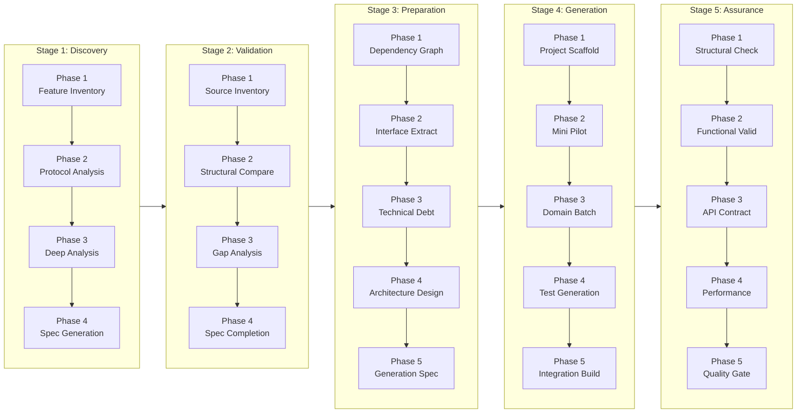

# Pipeline Flow Overview

**Version**: 1.0.0
**Last Updated**: 2026-01-16

---

## 1. Stage-to-Stage Data Flow



---

## 2. Phase-by-Phase Input/Output Table

### Stage 1: Discovery

| Phase | Skill | Input | Output | Next Consumer |
|-------|-------|-------|--------|---------------|
| **1** | `s1-01-discovery-feature-inventory` | Legacy source code (`hallain/`) | `stage1-outputs/phase1/feature-inventory.yaml` | Phase 2 |
| **2** | `s1-02-discovery-miplatform-protocol` | Phase 1 inventory | `stage1-outputs/phase2/protocol-analysis.yaml` | Phase 3 |
| **3** | `s1-03-discovery-deep-analysis` | Phase 1+2 outputs | `stage1-outputs/phase3/**/*-analysis.yaml` | Phase 4 |
| **4** | `s1-04-discovery-spec-generation` | Phase 3 analysis files | `stage1-outputs/phase4/**/main.yaml` + `api-specs/` | Stage 2 Phase 2 |

### Stage 2: Validation

| Phase | Skill | Input | Output | Next Consumer |
|-------|-------|-------|--------|---------------|
| **1** | `s2-01-validation-source-inventory` | Legacy source code | `stage2-outputs/phase1/source-inventory.yaml` | Phase 2 |
| **2** | `s2-02-validation-structural-comparison` | Stage 1 specs + Phase 1 inventory | `stage2-outputs/phase2/comparison-report.yaml` | Phase 3 |
| **3** | `s2-03-validation-gap-analysis` | Phase 2 comparison | `stage2-outputs/phase3/gap-analysis.yaml` | Phase 4 |
| **4** | `s2-04-validation-spec-completion` | Phase 3 gaps | `stage1-outputs/phase4/**/main.yaml` (updated) | Stage 3 |

### Stage 3: Preparation

| Phase | Skill | Input | Output | Next Consumer |
|-------|-------|-------|--------|---------------|
| **1** | `s3-01-preparation-dependency-graph` | Stage 1 specs | `stage3-outputs/phase1/dependency-graph.yaml` | Phase 2 |
| **2** | `s3-02-preparation-interface-extraction` | Phase 1 graph | `stage3-outputs/phase2/interfaces.yaml` | Phase 3 |
| **3** | `s3-03-preparation-technical-debt` | Stage 1 specs | `stage3-outputs/phase3/technical-debt.yaml` | Phase 4 |
| **4** | `s3-04-preparation-architecture-design` | All Stage 3 outputs | `stage3-outputs/phase4/architecture-design.yaml` | Phase 5 |
| **5** | `s3-05-preparation-generation-spec` | Phase 4 architecture | `stage3-outputs/phase5/generation-spec.yaml` | Stage 4 |

### Stage 4: Generation

| Phase | Skill | Input | Output | Next Consumer |
|-------|-------|-------|--------|---------------|
| **1** | `s4-01-generation-project-scaffold` | Architecture design | `next-hallain/` (project structure) | Phase 2 |
| **2** | `s4-02-generation-mini-pilot` | Sample specs (6 features) | Generated code + validation report | Phase 3 |
| **3** | `s4-03-generation-domain-batch` | All specs | Generated Java + MyBatis files | Phase 4 |
| **4** | `s4-04-generation-test-generation` | Generated code | Test files | Phase 5 |
| **5** | `s4-05-generation-integration-build` | All generated code | Build artifacts + integration report | Stage 5 |

### Stage 5: Assurance

| Phase | Skill | Input | Output | Next Consumer |
|-------|-------|-------|--------|---------------|
| **1** | `s5-01-assurance-structural-check` | Generated code | `stage5-outputs/phase1/structural-report.yaml` | Phase 2 |
| **2** | `s5-02-assurance-functional-validation` | Generated code + specs | `stage5-outputs/phase2/functional-report.yaml` | Phase 3 |
| **3** | `s5-03-assurance-api-contract-test` | Generated APIs | `stage5-outputs/phase3/api-contract-report.yaml` | Phase 4 |
| **4** | `s5-04-assurance-performance-baseline` | Generated code | `stage5-outputs/phase4/performance-report.yaml` | Phase 5 |
| **5** | `s5-05-assurance-quality-gate` | All Phase outputs | `stage5-outputs/phase5/quality-gate-report.yaml` | Final Approval |

---

## 3. Data Flow Diagram

```
┌─────────────────────────────────────────────────────────────────────────────┐
│                            LEGACY SOURCE                                     │
│                          (hallain/ - 8,377 files)                           │
└────────────────────────────────┬────────────────────────────────────────────┘
                                 │
                                 ▼
┌─────────────────────────────────────────────────────────────────────────────┐
│                         STAGE 1: DISCOVERY                                   │
│  ┌──────────────┐    ┌──────────────┐    ┌──────────────┐    ┌───────────┐ │
│  │ Phase 1      │───▶│ Phase 2      │───▶│ Phase 3      │───▶│ Phase 4   │ │
│  │ Feature      │    │ Protocol     │    │ Deep         │    │ Spec      │ │
│  │ Inventory    │    │ Analysis     │    │ Analysis     │    │ Generation│ │
│  └──────────────┘    └──────────────┘    └──────────────┘    └───────────┘ │
│         │                                                           │       │
│         ▼                                                           ▼       │
│  feature-inventory.yaml                                    main.yaml (per   │
│  (912 features)                                            feature)         │
└─────────────────────────────────────────────────────────────────────────────┘
                                 │
                                 ▼
┌─────────────────────────────────────────────────────────────────────────────┐
│                        STAGE 2: VALIDATION                                   │
│  ┌──────────────┐    ┌──────────────┐    ┌──────────────┐    ┌───────────┐ │
│  │ Phase 1      │───▶│ Phase 2      │───▶│ Phase 3      │───▶│ Phase 4   │ │
│  │ Source       │    │ Structural   │    │ Gap          │    │ Spec      │ │
│  │ Inventory    │    │ Comparison   │    │ Analysis     │    │ Completion│ │
│  └──────────────┘    └──────────────┘    └──────────────┘    └───────────┘ │
│         │                   │                   │                   │       │
│         ▼                   ▼                   ▼                   ▼       │
│  source-inventory.yaml  comparison.yaml    gaps.yaml         specs updated │
└─────────────────────────────────────────────────────────────────────────────┘
                                 │
                                 ▼
┌─────────────────────────────────────────────────────────────────────────────┐
│                       STAGE 3: PREPARATION                                   │
│  ┌──────────────┐    ┌──────────────┐    ┌──────────────┐    ┌───────────┐ │
│  │ Phase 1      │───▶│ Phase 2      │───▶│ Phase 3      │───▶│ Phase 4   │ │
│  │ Dependency   │    │ Interface    │    │ Technical    │    │ Arch      │ │
│  │ Graph        │    │ Extraction   │    │ Debt         │    │ Design    │ │
│  └──────────────┘    └──────────────┘    └──────────────┘    └───────────┘ │
│                                                                     │       │
│                                                                     ▼       │
│                                                         generation-spec.yaml│
└─────────────────────────────────────────────────────────────────────────────┘
                                 │
                                 ▼
┌─────────────────────────────────────────────────────────────────────────────┐
│                        STAGE 4: GENERATION                                   │
│  ┌──────────────┐    ┌──────────────┐    ┌──────────────┐    ┌───────────┐ │
│  │ Phase 1      │───▶│ Phase 2      │───▶│ Phase 3      │───▶│ Phase 4-5 │ │
│  │ Project      │    │ Mini         │    │ Domain       │    │ Test &    │ │
│  │ Scaffold     │    │ Pilot        │    │ Batch        │    │ Integration│
│  └──────────────┘    └──────────────┘    └──────────────┘    └───────────┘ │
│         │                                       │                           │
│         ▼                                       ▼                           │
│  next-hallain/                          Generated code                      │
│  (Spring Boot project)                  (912 features)                      │
└─────────────────────────────────────────────────────────────────────────────┘
                                 │
                                 ▼
┌─────────────────────────────────────────────────────────────────────────────┐
│                         STAGE 5: ASSURANCE                                   │
│  ┌──────────────┐    ┌──────────────┐    ┌──────────────┐    ┌───────────┐ │
│  │ Phase 1      │───▶│ Phase 2      │───▶│ Phase 3-4    │───▶│ Phase 5   │ │
│  │ Structural   │    │ Functional   │    │ API & Perf   │    │ Quality   │ │
│  │ Check        │    │ Validation   │    │ Validation   │    │ Gate      │ │
│  └──────────────┘    └──────────────┘    └──────────────┘    └───────────┘ │
│                                                                     │       │
│                                                                     ▼       │
│                                                     QUALITY GATE APPROVED   │
└─────────────────────────────────────────────────────────────────────────────┘
```

---

## 4. `.choisor/config.yaml` 핵심 설정 해설

```yaml
# ============================================================================
# 현재 상태 관리
# ============================================================================
current:
  stage: "stage4"      # 현재 작업 중인 Stage (stage1-5)
  phase: "phase3"      # 현재 작업 중인 Phase

# ============================================================================
# Phase Gate 제어
# ============================================================================
phase_gate:
  max_allowed_phase: "phase3"  # 진행 가능한 최대 Phase
  auto_to_max: false           # 자동으로 max_allowed까지 진행 여부

# ============================================================================
# 작업 범위 필터
# ============================================================================
work_scope:
  enabled_domains: [cm, pa, mm]  # 처리할 도메인 (null = 전체)
  # cm(28), pa(309), mm(110), eb(109), sc(101), sm(64)...

# ============================================================================
# 경로 설정
# ============================================================================
paths:
  source: "hallain/"                              # Legacy 소스 위치
  specs: "work/specs/"                            # 산출물 저장 위치
  stage4:
    specs_input: "work/specs/stage1-outputs/phase3"  # Stage 4 입력
    java_output: "next-hallain/src/main/java"        # Java 출력
    resources_output: "next-hallain/src/main/resources/mapper"  # MyBatis

# ============================================================================
# Stage 정의 및 Skill 매핑
# ============================================================================
stages:
  stage1:
    name: "Discovery"
    status: "complete"
    phases: ["phase1", "phase2", "phase3", "phase4"]
    skills:
      phase1: "s1-01-discovery-feature-inventory"
      phase2: "s1-02-discovery-miplatform-protocol"
      phase3: "s1-03-discovery-deep-analysis"
      phase4: "s1-04-discovery-spec-generation"
```

---

## 5. 산출물 파일 위치 및 용도

### 5.1 Stage 1 산출물

```
work/specs/stage1-outputs/
├── phase1/
│   └── feature-inventory.yaml      ← 전체 Feature 목록 (912개)
│       └── 용도: Phase 2 입력, Stage 2 비교 기준
│
├── phase2/
│   └── protocol-analysis.yaml      ← MiPlatform 프로토콜 분석
│       └── 용도: Dataset 구조 이해
│
├── phase3/
│   └── {domain}/
│       └── {feature}/
│           └── *-analysis.yaml     ← 5-layer 심층 분석
│               └── 용도: Phase 4 스펙 생성 입력
│
└── phase4/
    └── {domain}/
        └── {feature}/
            ├── main.yaml           ← 완성된 Feature 스펙
            └── api-spec.yaml       ← OpenAPI 스펙
                └── 용도: Stage 4 코드 생성 입력
```

### 5.2 Stage 2 산출물

```
work/specs/stage2-outputs/
├── phase1/
│   └── source-inventory.yaml       ← Ground Truth (소스 직접 파싱)
│
├── phase2/
│   └── comparison-report.yaml      ← Stage 1 vs Source 비교
│
├── phase3/
│   └── gap-analysis.yaml           ← 누락/불일치 목록
│
└── phase4/
    └── completion-log.yaml         ← 보완 작업 로그
```

### 5.3 Stage 4 산출물

```
next-hallain/
├── src/main/java/com/halla/
│   └── {domain}/
│       ├── controller/             ← REST Controller
│       ├── service/                ← Service Layer
│       └── vo/                     ← Value Objects
│
└── src/main/resources/mapper/
    └── {domain}/
        └── *.xml                   ← MyBatis Mapper
```

---

## 6. Critical Path 식별

### 6.1 재작업 발생 주요 원인

```
┌─────────────────────────────────────────────────────────────────────────────┐
│                      REWORK TRIGGER POINTS                                   │
├─────────────────────────────────────────────────────────────────────────────┤
│                                                                              │
│  Stage 1 Phase 1에서 Controller 누락                                         │
│       │                                                                      │
│       └─▶ Stage 2에서 발견 → Stage 1 Phase 3-4 재작업 필요                   │
│                                                                              │
├─────────────────────────────────────────────────────────────────────────────┤
│                                                                              │
│  Stage 1 Phase 3에서 SP 호출 패턴 미식별                                      │
│       │                                                                      │
│       └─▶ Stage 4에서 코드 생성 실패 → Phase 3 재분석 필요                   │
│                                                                              │
├─────────────────────────────────────────────────────────────────────────────┤
│                                                                              │
│  Stage 3 Phase 4에서 Naming Convention 미확정                                │
│       │                                                                      │
│       └─▶ Stage 4 코드 생성 후 전체 rename 필요                              │
│                                                                              │
└─────────────────────────────────────────────────────────────────────────────┘
```

### 6.2 예방 체크리스트

| Stage | 검증 항목 | 미검증 시 영향 |
|-------|----------|----------------|
| **1.1** | 모든 Controller 식별 완료 | Stage 2에서 재발견 → 재작업 |
| **1.3** | SP 호출 패턴 100% 식별 | Stage 4 코드 생성 실패 |
| **1.3** | Dynamic SQL 복잡도 평가 | Stage 4 변환 오류 |
| **2.4** | Coverage ≥ 99% 달성 | Stage 4 누락 Feature 발생 |
| **3.4** | Naming Convention ADR 확정 | Stage 4 전체 rename 필요 |

---

## 7. Inter-Stage 계약 (Contracts)

각 Stage 간 데이터 교환 계약은 `.claude/skills/common/inter-stage-contracts.yaml`에 정의됩니다.

```yaml
# Stage 1 → Stage 2 계약
stage1_to_stage2:
  producer: "s1-04-discovery-spec-generation"
  consumer: "s2-02-validation-structural-comparison"
  artifacts:
    - path: "stage1-outputs/phase4/**/main.yaml"
      required_fields:
        - "feature.id"
        - "feature.domain"
        - "feature.endpoints"
        - "data_access.queries"

# Stage 2 → Stage 3 계약
stage2_to_stage3:
  producer: "s2-04-validation-spec-completion"
  consumer: "s3-01-preparation-dependency-graph"
  artifacts:
    - path: "stage1-outputs/phase4/**/main.yaml"
      validation:
        coverage: ">= 99%"

# Stage 3 → Stage 4 계약
stage3_to_stage4:
  producer: "s3-05-preparation-generation-spec"
  consumer: "s4-01-generation-project-scaffold"
  artifacts:
    - path: "stage3-outputs/phase5/generation-spec.yaml"
      required_fields:
        - "architecture.package_structure"
        - "naming_conventions"
        - "transformation_rules"
```

---

**Next:** [01-stage-phase-model.md](01-stage-phase-model.md) - Stage-Phase 계층 구조 상세
