# Workflow Decision Trees

**Version**: 1.1.0
**Last Updated**: 2025-12-15

---

## 1. Overview

이 문서는 Legacy Migration Framework 운영 중 발생하는 주요 의사결정 상황에 대한 Decision Tree를 제공합니다.

### 1.1 Decision Tree 구조

```
[Decision Point]
    │
    ├── Condition A? ─── Yes ──→ [Action A]
    │
    └── No
         │
         ├── Condition B? ─── Yes ──→ [Action B]
         │
         └── No ──→ [Default Action]
```

---

## 2. Phase Gate Decisions

### 2.1 Phase Gate Pass/Fail Decision

```
┌─────────────────────────────────────────────────────────────────────┐
│                    PHASE GATE VALIDATION                            │
└─────────────────────────────────────────────────────────────────────┘
                              │
                              ▼
                  ┌───────────────────────┐
                  │ All mandatory outputs │
                  │      generated?       │
                  └───────────────────────┘
                        │             │
                       Yes            No
                        │             │
                        ▼             ▼
          ┌─────────────────┐       ┌─────────────────┐
          │ Quality metrics │       │   FAIL: Missing │
          │   met? (>=90%)  │       │     Outputs     │
          └─────────────────┘       └─────────────────┘
                │       │                       │
               Yes      No                      │
                │       │                       ▼
                ▼       ▼                   ┌───────────────────┐
          ┌─────────┐  ┌──────────────────┐ │ Re-execute Phase  │
          │  PASS   │  │ Remediation Rate │ └───────────────────┘
          └─────────┘  │     < 10%?       │
                       └──────────────────┘
                            │        │
                           Yes       No
                            │        │
                            ▼        ▼
                  ┌──────────────┐ ┌───────────────────┐
                  │ CONDITIONAL  │ │ FAIL: Quality     │
                  │    PASS      │ │ Issues Excessive  │
                  └──────────────┘ └───────────────────┘
                         │                  │
                         ▼                  ▼
               ┌──────────────────┐ ┌───────────────────┐
               │ Proceed with     │ │ Root Cause        │
               │ remediation      │ │ Analysis Required │
               │ in next phase    │ └───────────────────┘
               └──────────────────┘
```

**Mermaid 버전:**

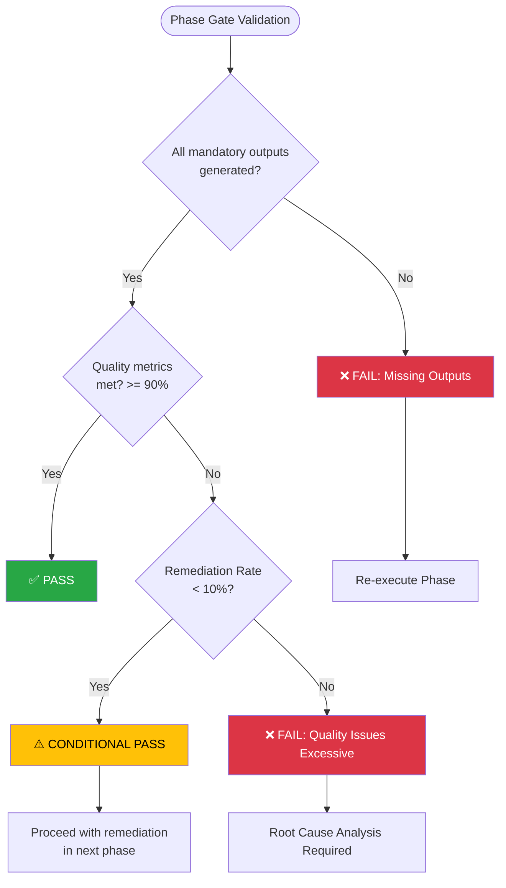

### 2.2 Phase Gate 조건부 통과 처리

```yaml
conditional_pass_handling:
  decision_tree:
    step_1:
      question: "Remediation 가능한 항목인가?"
      yes: "다음 Phase에서 병행 처리"
      no: "step_2"

    step_2:
      question: "Business-critical 항목인가?"
      yes: "즉시 수정 후 재검증"
      no: "step_3"

    step_3:
      question: "마감 일정 여유가 있는가?"
      yes: "현재 Phase에서 수정"
      no: "Risk로 등록 후 진행"
```

**Mermaid 버전:**

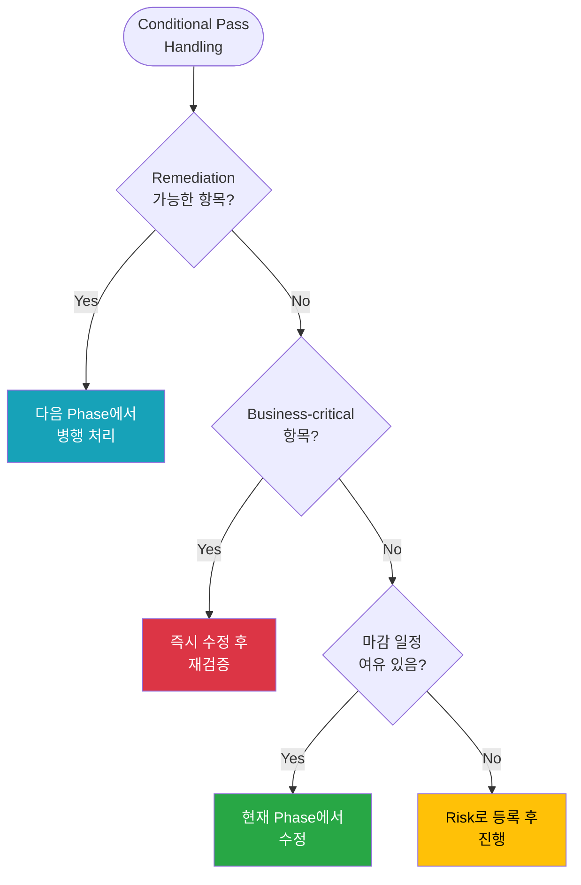

---

## 3. Complexity Assessment Decisions

### 3.1 Feature Complexity Classification

```
┌─────────────────────────────────────────────────────────────────────┐
│               FEATURE COMPLEXITY CLASSIFICATION                     │
└─────────────────────────────────────────────────────────────────────┘
                              │
                              ▼
                  ┌───────────────────────┐
                  │  Stored Procedure     │
                  │     or Trigger?       │
                  └───────────────────────┘
                        │           │
                       Yes          No
                        │           │
                        ▼           │
                  ┌─────────┐       │
                  │  HIGH   │       │
                  │ (Force) │       │
                  └─────────┘       │
                                    ▼
                  ┌───────────────────────┐
                  │   Cross-domain        │
                  │   dependencies?       │
                  └───────────────────────┘
                        │           │
                       Yes          No
                        │           │
                        ▼           │
                  ┌─────────┐       │
                  │  HIGH   │       │
                  │ (Force) │       │
                  └─────────┘       │
                                    ▼
                  ┌───────────────────────┐
                  │  Calculate Score      │
                  │  (5 dimensions)       │
                  └───────────────────────┘
                              │
                              ▼
              ┌───────────────────────────────┐
              │         Score >= 70?          │
              └───────────────────────────────┘
                    │                 │
                   Yes                No
                    │                 │
                    ▼                 ▼
              ┌─────────┐    ┌──────────────────┐
              │  HIGH   │    │  Score >= 40?    │
              └─────────┘    └──────────────────┘
                                   │        │
                                  Yes       No
                                   │        │
                                   ▼        ▼
                             ┌─────────┐ ┌─────────┐
                             │ MEDIUM  │ │   LOW   │
                             └─────────┘ └─────────┘
```

**Mermaid 버전:**

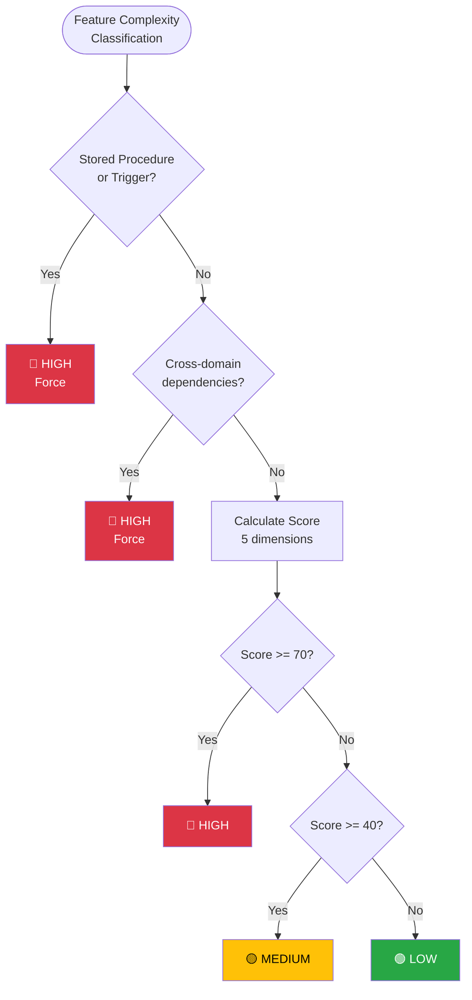

### 3.2 AI Model Selection

```
┌─────────────────────────────────────────────────────────────────────┐
│                    AI MODEL SELECTION                               │
└─────────────────────────────────────────────────────────────────────┘
                              │
                              ▼
                  ┌───────────────────────┐
                  │ Complexity Tier?      │
                  └───────────────────────┘
                    │       │       │
                   HIGH   MEDIUM   LOW
                    │       │       │
                    ▼       ▼       ▼
              ┌───────┐ ┌───────┐ ┌───────┐
              │ Opus  │ │Sonnet │ │ Haiku │
              └───────┘ └───────┘ └───────┘
                    │       │       │
                    ▼       ▼       ▼
         ┌─────────────────────────────────────┐
         │        Cost Constraint?             │
         └─────────────────────────────────────┘
                    │               │
                   Yes              No
                    │               │
                    ▼               ▼
         ┌─────────────────┐  ┌─────────────────┐
         │ Downgrade:      │  │ Use selected    │
         │ Opus→Sonnet     │  │ model as-is     │
         │ Sonnet→Haiku    │  └─────────────────┘
         └─────────────────┘
                    │
                    ▼
         ┌─────────────────────────────────────┐
         │     Quality Fallback Enabled?       │
         └─────────────────────────────────────┘
                    │               │
                   Yes              No
                    │               │
                    ▼               ▼
         ┌─────────────────┐  ┌─────────────────┐
         │ Monitor quality │  │ Accept quality  │
         │ Auto-upgrade if │  │ trade-off       │
         │ validation fails│  └─────────────────┘
         └─────────────────┘
```

**Mermaid 버전:**

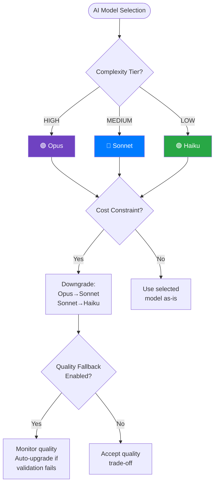

---

## 4. Validation Decisions

### 4.1 Spec Validation Decision

```
┌─────────────────────────────────────────────────────────────────────┐
│                    SPEC VALIDATION DECISION                         │
└─────────────────────────────────────────────────────────────────────┘
                              │
                              ▼
                  ┌───────────────────────┐
                  │  Validation Score?    │
                  └───────────────────────┘
                    │       │       │
                 >=95     85-94   <85
                    │       │       │
                    ▼       ▼       ▼
              ┌───────┐ ┌───────────┐ ┌──────────┐
              │ PASS  │ │ WARNING   │ │  FAIL    │
              └───────┘ └───────────┘ └──────────┘
                    │       │               │
                    ▼       ▼               ▼
         ┌──────────┐  ┌────────────┐  ┌────────────────┐
         │ Proceed  │  │ Review     │  │ Root Cause     │
         │ to next  │  │ low-score  │  │ Analysis       │
         │ phase    │  │ items      │  └────────────────┘
         └──────────┘  └────────────┘         │
                             │                ▼
                             ▼        ┌────────────────────┐
                    ┌────────────────┐│ Re-analysis from   │
                    │ Manual review  ││ Phase 2 required?  │
                    │ sufficient?    │└────────────────────┘
                    └────────────────┘                │       │
                          │      │                   Yes      No
                         Yes     No                   │       │
                          │      │                    ▼       ▼
                          ▼      ▼              ┌─────────┐ ┌─────────────┐
                    ┌──────────┐ ┌────────────┐ │ Re-run  │ │ Targeted    │
                    │ Document │ │ Escalate   │ │ Phase 2 │ │ Remediation │
                    │ & proceed│ │ to lead    │ └─────────┘ └─────────────┘
                    └──────────┘ └────────────┘
```

**Mermaid 버전:**

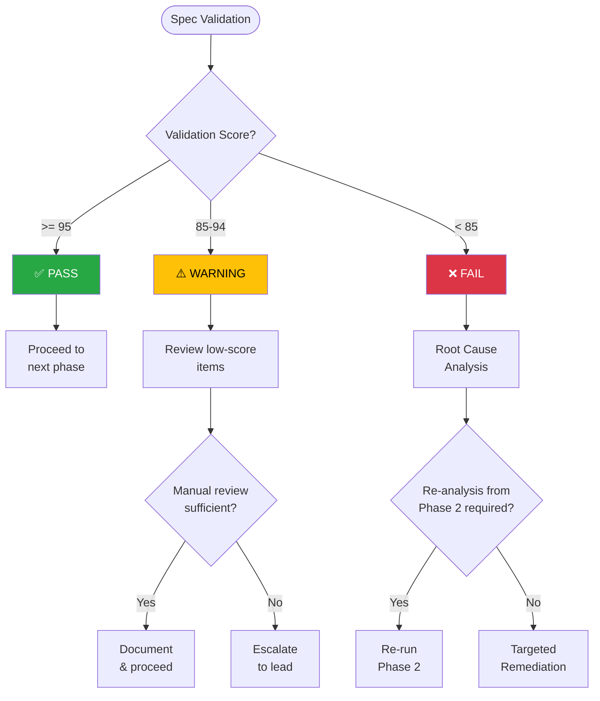

### 4.2 Functional Validation Decision

```
┌─────────────────────────────────────────────────────────────────────┐
│               FUNCTIONAL VALIDATION DECISION                        │
└─────────────────────────────────────────────────────────────────────┘
                              │
                              ▼
                  ┌───────────────────────┐
                  │  Total Score >= 70?   │
                  │  AND Critical = 0?    │
                  └───────────────────────┘
                        │           │
                       Yes          No
                        │           │
                        ▼           ▼
                  ┌─────────┐ ┌───────────────────┐
                  │  PASS   │ │ Critical Issues?  │
                  └─────────┘ └───────────────────┘
                        │           │       │
                        │          Yes      No
                        │           │       │
                        ▼           ▼       ▼
         ┌──────────────┐  ┌─────────────┐ ┌─────────────────┐
         │ Proceed to   │  │ Immediate   │ │ Score >= 50?    │
         │ Phase 3      │  │ Fix Required│ └─────────────────┘
         └──────────────┘  └─────────────┘       │       │
                                  │             Yes      No
                                  ▼              │       │
                           ┌────────────┐        ▼       ▼
                           │ Identify   │  ┌─────────┐ ┌────────────┐
                           │ critical   │  │ Minor   │ │ Major      │
                           │ gaps       │  │ Remed.  │ │ Rework     │
                           └────────────┘  └─────────┘ └────────────┘
                                  │              │           │
                                  ▼              ▼           ▼
                           ┌────────────┐  ┌─────────┐ ┌────────────┐
                           │ Generate   │  │ Apply   │ │ Return to  │
                           │ remediation│  │ quick   │ │ Stage 4    │
                           │ spec       │  │ fixes   │ │ Phase 3    │
                           └────────────┘  └─────────┘ └────────────┘
```

**Mermaid 버전:**

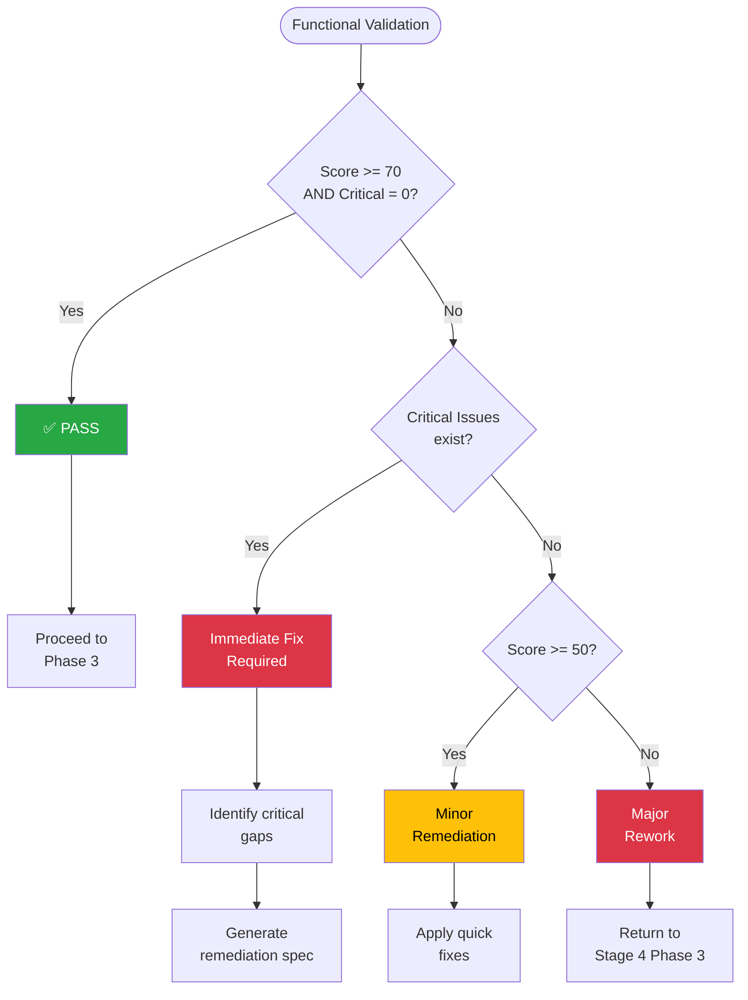

---

## 5. Error Handling Decisions

### 5.1 Task Failure Decision

```
┌─────────────────────────────────────────────────────────────────────┐
│                    TASK FAILURE HANDLING                            │
└─────────────────────────────────────────────────────────────────────┘
                              │
                              ▼
                  ┌───────────────────────┐
                  │   Failure Type?       │
                  └───────────────────────┘
            │           │           │           │
        Timeout    API Error   Validation   Unknown
            │           │         Error         │
            ▼           ▼           │           ▼
    ┌───────────┐ ┌───────────┐     │    ┌───────────┐
    │ Retry     │ │ Check API │     │    │ Log &     │
    │ count < 3?│ │ status    │     │    │ Escalate  │
    └───────────┘ └───────────┘     │    └───────────┘
       │     │          │           │
      Yes    No         ▼           ▼
       │     │    ┌───────────┐ ┌───────────────┐
       ▼     ▼    │ Rate      │ │ Data issue?   │
  ┌──────┐ ┌────────┐│ limited?  │ └───────────────┘
  │Retry │ │Escalate││           │      │       │
  │ with │ │        │└───────────┘     Yes      No
  │backoff│└────────┘    │    │         │       │
  └──────┘        │     Yes   No        ▼       ▼
                  ▼      │    │   ┌─────────┐ ┌────────┐
           ┌──────────┐  ▼    ▼   │ Fix     │ │ Logic  │
           │ Wait &   │┌────────┐ │ input   │ │ review │
           │ retry    ││Escalate│ │ data    │ │required│
           └──────────┘└────────┘ └─────────┘ └────────┘
```

**Mermaid 버전:**

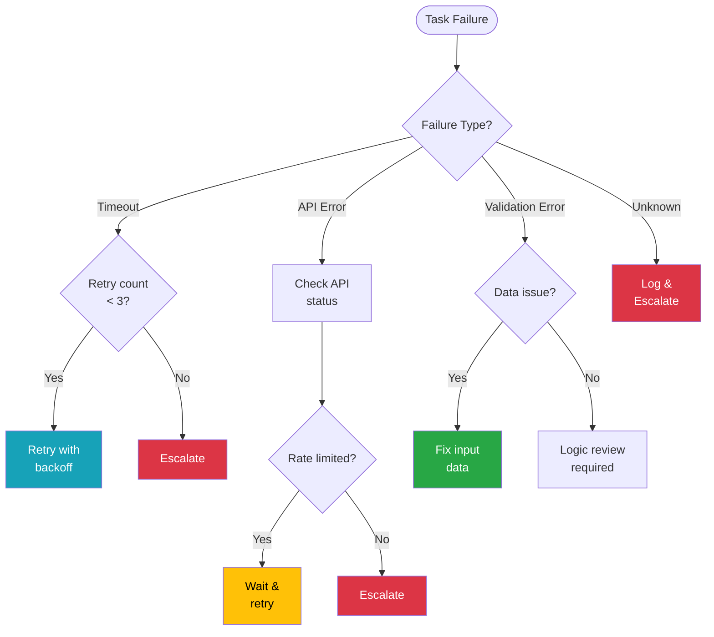

### 5.2 Session Recovery Decision

```
┌─────────────────────────────────────────────────────────────────────┐
│                   SESSION RECOVERY DECISION                         │
└─────────────────────────────────────────────────────────────────────┘
                              │
                              ▼
                  ┌───────────────────────┐
                  │ Session terminated    │
                  │ unexpectedly?         │
                  └───────────────────────┘
                        │           │
                       Yes          No
                        │           │
                        ▼           ▼
          ┌─────────────────┐   ┌─────────────────┐
          │ Last checkpoint │   │ Normal          │
          │ available?      │   │ completion      │
          └─────────────────┘   └─────────────────┘
                │       │
               Yes      No
                │       │
                ▼       ▼
    ┌───────────────┐ ┌───────────────────┐
    │ Checkpoint    │ │ Progress lost?    │
    │ < 1 hour old? │ └───────────────────┘
    └───────────────┘       │         │
          │      │         Yes        No
         Yes     No         │         │
          │      │          ▼         ▼
          ▼      ▼    ┌───────────┐ ┌───────────────┐
    ┌─────────┐ ┌──────────┐│ Re-start │ │ Clean start   │
    │ Resume  │ │ Evaluate ││ task from│ │ (no recovery) │
    │ from    │ │ re-start ││ beginning│ └───────────────┘
    │checkpoint│ │ cost     │└───────────┘
    └─────────┘ └──────────┘
```

**Mermaid 버전:**

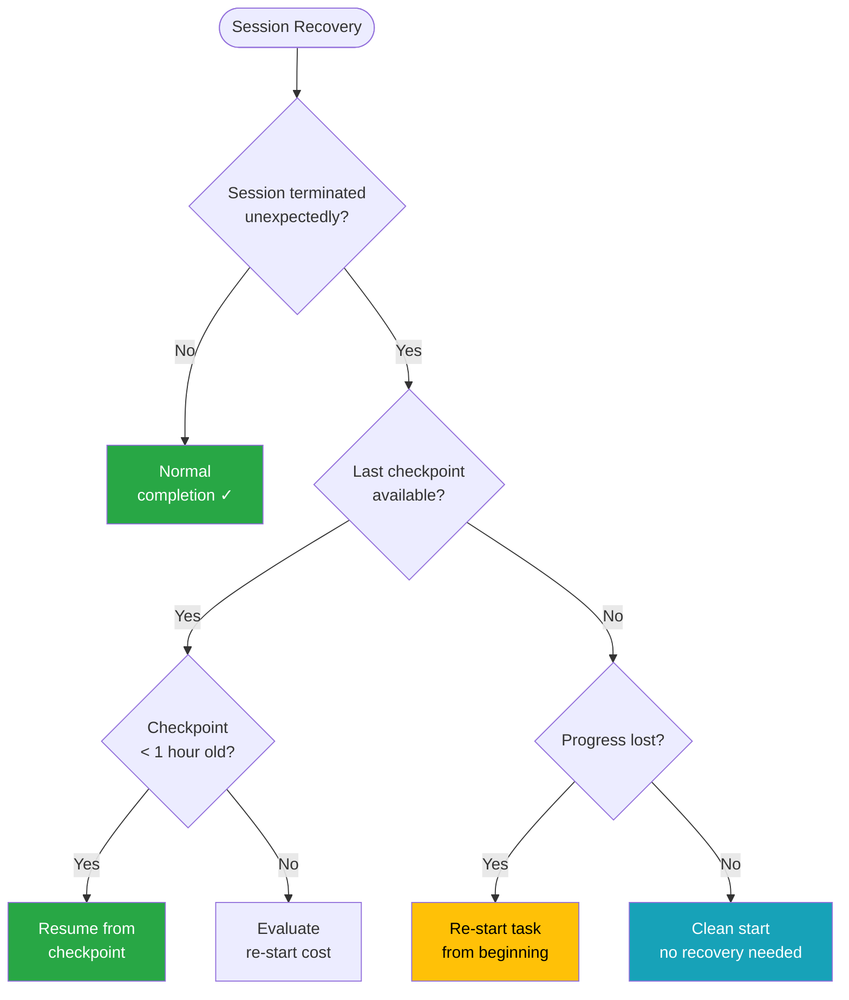

---

## 6. Migration Strategy Decisions

### 6.1 Migration Approach Selection

```
┌─────────────────────────────────────────────────────────────────────┐
│              MIGRATION APPROACH SELECTION                           │
└─────────────────────────────────────────────────────────────────────┘
                              │
                              ▼
                  ┌───────────────────────┐
                  │ Business Logic        │
                  │ Complexity?           │
                  └───────────────────────┘
                    │       │       │
                  Simple  Medium  Complex
                    │       │       │
                    ▼       │       ▼
          ┌─────────────┐   │  ┌─────────────────┐
          │ Code        │   │  │ Spec-First      │
          │ Translation │   │  │ Approach        │
          │ possible?   │   │  │ (Mandatory)     │
          └─────────────┘   │  └─────────────────┘
              │      │      │
             Yes     No     │
              │      │      │
              ▼      ▼      ▼
       ┌──────────┐ ┌────────────────┐
       │REHOSTING │ │ Test Coverage  │
       │          │ │ Available?     │
       └──────────┘ └────────────────┘
                          │       │
                         Yes      No
                          │       │
                          ▼       ▼
                   ┌──────────┐ ┌───────────────┐
                   │REFACTORING│ │RE-PLATFORMING│
                   └──────────┘ └───────────────┘
```

**Mermaid 버전:**

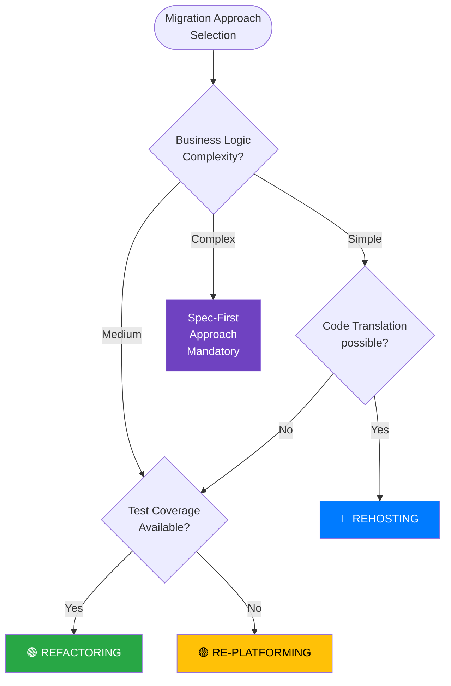

### 6.2 Rollback Decision

```
┌─────────────────────────────────────────────────────────────────────┐
│                    ROLLBACK DECISION                                │
└─────────────────────────────────────────────────────────────────────┘
                              │
                              ▼
                  ┌───────────────────────┐
                  │ Stage 5 Quality Gate  │
                  │ Status?               │
                  └───────────────────────┘
                    │       │       │
               APPROVED CONDITIONAL REJECTED
                    │       │       │
                    ▼       ▼       ▼
           ┌──────────┐ ┌─────────────┐ ┌────────────────┐
           │ Proceed  │ │ Critical    │ │ Severity of    │
           │ to deploy│ │ issues      │ │ rejection?     │
           └──────────┘ │ count?      │ └────────────────┘
                        └─────────────┘    │       │
                           │    │       Blocker  Critical
                          <5   >=5        │       │
                           │    │         ▼       ▼
                           ▼    ▼    ┌─────────┐ ┌──────────┐
                     ┌─────────┐ ┌─────────┐│ Full    │ │ Partial  │
                     │ Accept  │ │ Review  ││ Rollback│ │ Rollback │
                     │ with    │ │ needed  ││ to      │ │ affected │
                     │ timeline│ │         ││ Stage 4 │ │ features │
                     └─────────┘ └─────────┘└─────────┘ └──────────┘
```

**Mermaid 버전:**

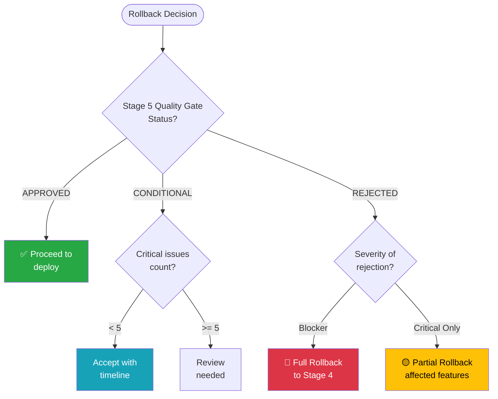

---

## 7. Resource Allocation Decisions

### 7.1 Session Scaling Decision

```
┌─────────────────────────────────────────────────────────────────────┐
│                   SESSION SCALING DECISION                          │
└─────────────────────────────────────────────────────────────────────┘
                              │
                              ▼
                  ┌───────────────────────┐
                  │ Pending Task Count?   │
                  └───────────────────────┘
                    │       │       │
                   >100   20-100   <20
                    │       │       │
                    ▼       ▼       ▼
          ┌─────────────┐ ┌───────┐ ┌───────────────┐
          │ Current     │ │Optimal│ │ Scale down    │
          │ utilization │ │ range │ │ consideration │
          │ check       │ └───────┘ └───────────────┘
          └─────────────┘       │           │
              │      │          │           ▼
            <70%   >=70%        │    ┌─────────────────┐
              │      │          │    │ Idle sessions?  │
              ▼      ▼          │    └─────────────────┘
      ┌───────────┐ ┌────────────┐        │       │
      │ Diagnose  │ │ Scale up   │       Yes      No
      │ bottleneck│ │ sessions   │        │       │
      └───────────┘ └────────────┘        ▼       ▼
                          │        ┌─────────┐ ┌─────────┐
                          ▼        │Terminate│ │ Maintain│
                   ┌─────────────┐ │ idle    │ │ current │
                   │ Max sessions│ │ sessions│ └─────────┘
                   │ reached?    │ └─────────┘
                   └─────────────┘
                        │     │
                       Yes    No
                        │     │
                        ▼     ▼
                ┌──────────┐ ┌────────────┐
                │ Queue    │ │ Add new    │
                │ tasks    │ │ session    │
                └──────────┘ └────────────┘
```

**Mermaid 버전:**

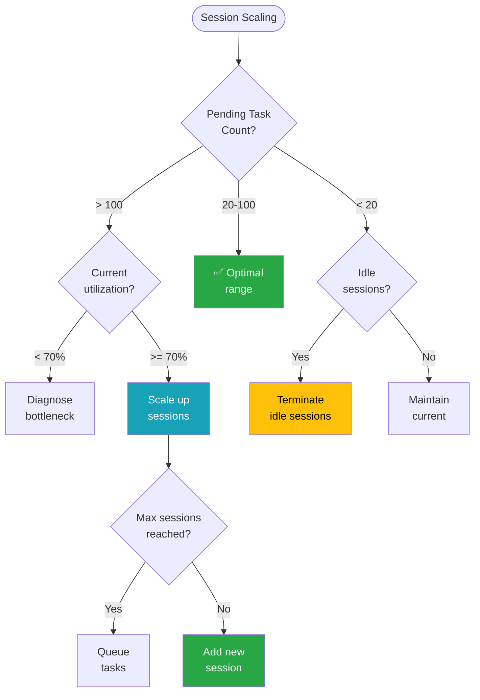

---

## 8. Priority Decisions

### 8.1 Task Priority Assignment

```
┌─────────────────────────────────────────────────────────────────────┐
│                   TASK PRIORITY ASSIGNMENT                          │
└─────────────────────────────────────────────────────────────────────┘
                              │
                              ▼
                  ┌───────────────────────┐
                  │ Domain Type?          │
                  └───────────────────────┘
                    │       │       │       │
               Foundation  Hub    Core  Supporting
                    │       │       │       │
                    ▼       ▼       ▼       ▼
               ┌─────┐  ┌─────┐ ┌─────┐ ┌─────┐
               │ P0  │  │ P1  │ │ P2  │ │ P3  │
               └─────┘  └─────┘ └─────┘ └─────┘
                    │       │       │       │
                    ▼       ▼       ▼       ▼
          ┌─────────────────────────────────────────┐
          │       Cross-domain dependency?          │
          └─────────────────────────────────────────┘
                    │               │
                   Yes              No
                    │               │
                    ▼               ▼
          ┌─────────────────┐ ┌─────────────────┐
          │ Promote priority│ │ Keep assigned   │
          │ (P2→P1, P3→P2) │ │ priority        │
          └─────────────────┘ └─────────────────┘
                    │               │
                    ▼               ▼
          ┌─────────────────────────────────────────┐
          │           Dependency resolved?          │
          └─────────────────────────────────────────┘
                    │               │
                   Yes              No
                    │               │
                    ▼               ▼
          ┌─────────────────┐ ┌─────────────────┐
          │ Execute task    │ │ Wait for        │
          │                 │ │ dependencies    │
          └─────────────────┘ └─────────────────┘
```

**Mermaid 버전:**

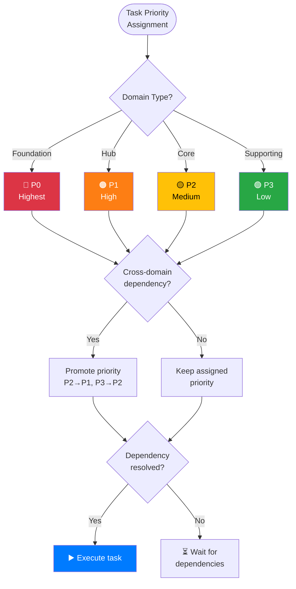

---

## 9. Quality Gate Decisions

### 9.1 Final Quality Gate

```
┌─────────────────────────────────────────────────────────────────────┐
│                   FINAL QUALITY GATE DECISION                       │
└─────────────────────────────────────────────────────────────────────┘
                              │
                              ▼
                  ┌───────────────────────┐
                  │ Blocker Issues = 0?   │
                  └───────────────────────┘
                        │           │
                       Yes          No
                        │           │
                        ▼           ▼
          ┌─────────────────┐   ┌─────────────────┐
          │ Critical < 5?   │   │    REJECTED     │
          └─────────────────┘   │  (Fix blockers) │
                │       │       └─────────────────┘
               Yes      No
                │       │
                ▼       ▼
    ┌───────────────┐ ┌─────────────────────┐
    │ Score >= 85%? │ │ Critical < 15?      │
    └───────────────┘ └─────────────────────┘
          │      │           │        │
         Yes     No         Yes       No
          │      │           │        │
          ▼      ▼           ▼        ▼
    ┌──────────┐ ┌──────────┐ ┌──────────┐ ┌──────────┐
    │ APPROVED │ │Score>=70%│ │CONDITIONAL│ │ REJECTED │
    └──────────┘ └──────────┘ │ APPROVED │ └──────────┘
                     │    │   └──────────┘
                    Yes   No
                     │    │
                     ▼    ▼
              ┌──────────┐ ┌──────────┐
              │CONDITIONAL│ │ REJECTED │
              │ APPROVED │ └──────────┘
              └──────────┘
```

**Mermaid 버전:**

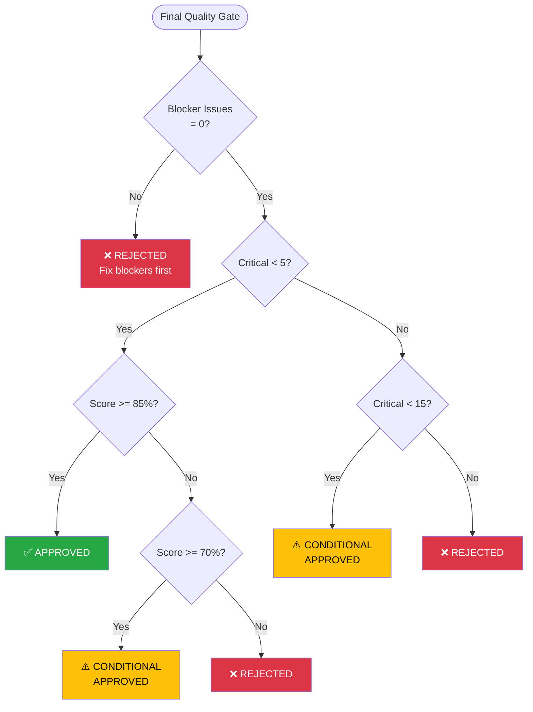

---

## 10. Decision Documentation

### 10.1 Decision Record Template

```yaml
decision_record:
  id: "DEC-{YYYY-MM-DD}-{NNN}"
  decision_tree: "{tree_name}"
  decision_point: "{node_id}"

  context:
    stage: "{stage}"
    phase: "{phase}"
    task: "{task_id}"

  inputs:
    - key: "{input_name}"
      value: "{input_value}"

  path_taken:
    - node: "{node_1}"
      condition: "{condition}"
      result: "{yes|no}"
    - node: "{node_2}"
      condition: "{condition}"
      result: "{yes|no}"

  outcome:
    action: "{selected_action}"
    rationale: "{why this path}"

  timestamp: "YYYY-MM-DD HH:MM:SS"
  recorded_by: "{system|human}"
```

---

## 11. Mermaid Diagram Rendering

### 11.1 Mermaid 다이어그램 보기

위의 Mermaid 다이어그램을 렌더링하려면:

1. **GitHub/GitLab**: Markdown 파일에서 자동 렌더링
2. **VS Code**: Mermaid Preview 확장 설치
3. **Online Editor**: [mermaid.live](https://mermaid.live) 에서 코드 붙여넣기
4. **Obsidian**: 기본 지원

### 11.2 스타일 가이드

```yaml
mermaid_style_guide:
  colors:
    success: "#28a745"  # Green
    warning: "#ffc107"  # Yellow
    error: "#dc3545"    # Red
    info: "#17a2b8"     # Cyan
    primary: "#007bff"  # Blue

  shapes:
    start_end: "([text])"      # Stadium
    decision: "{text}"         # Diamond
    process: "[text]"          # Rectangle

  arrows:
    normal: "-->"
    labeled: "-->|label|"
```

---

**Next**: [03-SKILL-DEFINITION](../03-SKILL-DEFINITION/01-skill-structure.md)
