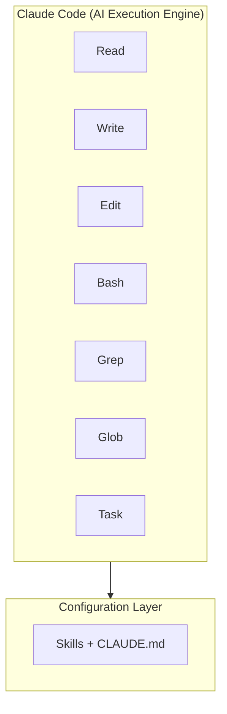
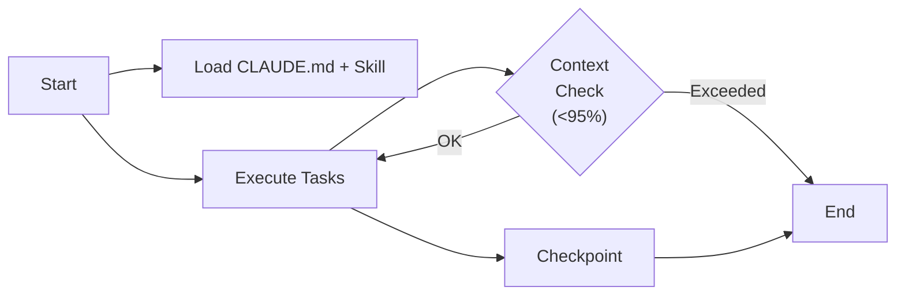

# Claude Code Configuration

**Version**: 1.0.0
**Last Updated**: 2025-12-15

---

## 1. Overview

Claude Code는 Legacy Migration Framework의 핵심 실행 엔진입니다. 이 문서는 마이그레이션 프로젝트에 최적화된 Claude Code 설정 방법을 설명합니다.

### 1.1 Claude Code의 역할

```
┌─────────────────────────────────────────────────────────────────────┐
│                      TOOL ECOSYSTEM                                 │
├─────────────────────────────────────────────────────────────────────┤
│                                                                     │
│   ┌─────────────────────────────────────────────────────────────┐   │
│   │                     Claude Code                             │   │
│   │                    (AI Execution Engine)                    │   │
│   │                                                             │   │
│   │  ┌─────────┐  ┌─────────┐  ┌─────────┐  ┌─────────┐         │   │
│   │  │  Read   │  │  Write  │  │  Edit   │  │  Bash   │         │   │
│   │  └─────────┘  └─────────┘  └─────────┘  └─────────┘         │   │
│   │                                                             │   │
│   │  ┌─────────┐  ┌─────────┐  ┌─────────┐                      │   │
│   │  │  Grep   │  │  Glob   │  │  Task   │  ...                 │   │
│   │  └─────────┘  └─────────┘  └─────────┘                      │   │
│   └─────────────────────────────────────────────────────────────┘   │
│                              │                                      │
│                              ▼                                      │
│   ┌─────────────────────────────────────────────────────────────┐   │
│   │                    Skills + CLAUDE.md                       │   │
│   │                  (Configuration Layer)                      │   │
│   └─────────────────────────────────────────────────────────────┘   │
│                                                                     │
└─────────────────────────────────────────────────────────────────────┘
```



---

## 2. Project Configuration

### 2.1 CLAUDE.md 구조

```yaml
claude_md_structure:
  location: "${PROJECT_ROOT}/CLAUDE.md"

  sections:
    project_identity:
      purpose: "프로젝트 정체성 정의"
      contents:
        - "project_name"
        - "purpose"
        - "codebase location"
        - "workspace"
        - "quality_priority"

    workflow_overview:
      purpose: "Stage-Phase 구조 정의"
      contents:
        - "Stage 다이어그램"
        - "Phase 흐름"
        - "output 경로"

    system_context:
      purpose: "레거시 시스템 특성"
      contents:
        - "scale (파일 수, 컨트롤러 수)"
        - "architecture pattern"
        - "framework"
        - "naming conventions"

    critical_rules:
      purpose: "필수 준수 규칙"
      contents:
        - "Skill 사용 필수"
        - "의존성 순서"
        - "파일 크기 제한"
        - "4-layer 추적"

    skill_reference:
      purpose: "Skill 목록 및 경로"
      contents:
        - "Stage별 Skill 테이블"
        - "경로 패턴"

    workspace_organization:
      purpose: "디렉토리 구조"
      contents:
        - "source_code location"
        - "skills location"
        - "outputs location"
```

### 2.2 CLAUDE.md 템플릿

```markdown
# CLAUDE.md - {Project Name}

## Project Identity

```yaml
project_name: {프로젝트명}
purpose: {목적}
codebase: {레거시 코드베이스 경로}
workspace: {작업 디렉토리}
quality_priority: "100% business logic preservation > Speed"
```

## Workflow Overview

{Stage-Phase 다이어그램}

## System Context

### Scale
- Total files: {N}
- Controllers: {N}
- Expected endpoints: {N}

### Architecture
- Pattern: {아키텍처 패턴}
- Layers: {레이어 구조}

### Framework
- Web: {웹 프레임워크}
- Persistence: {영속성 프레임워크}

## Critical Rules

### 1. Skill Usage is MANDATORY
{Skill 사용 규칙}

### 2. Dependency Order is SACRED
{의존성 순서 규칙}

## Skill Reference Table

| Stage | Phase | Skill Location | Description |
|-------|-------|----------------|-------------|
| 1 | 1 | `.claude/skills/...` | {설명} |

## Workspace Organization

```yaml
project_root: "{경로}"
source_code:
  location: "{경로}"
skills:
  location: ".claude/skills/"
outputs:
  stage1: "stage1-outputs/"
```

## Quality Standards

{품질 기준}

## Communication Protocols

{커뮤니케이션 규칙}
```

---

## 3. Skills Configuration

### 3.1 Skills Directory Structure

```
.claude/
├── skills/
│   ├── stage1-phase1-feature-inventory/
│   │   ├── SKILL.md
│   │   ├── templates/
│   │   └── examples/
│   ├── stage1-phase2-deep-analysis/
│   │   └── SKILL.md
│   ├── ...
│   ├── common/
│   │   ├── templates/
│   │   └── utilities/
│   └── templates/
│       └── skill-template.md
└── settings.json
```

### 3.2 Skill Registration

```yaml
skill_registration:
  automatic:
    mechanism: "Claude Code가 .claude/skills/ 하위 디렉토리 자동 인식"
    trigger: "SKILL.md 파일 존재"

  manual_override:
    location: "CLAUDE.md의 Skill Reference Table"
    purpose: "명시적 매핑 및 문서화"
```

### 3.3 Skill Invocation

```yaml
skill_invocation:
  methods:
    explicit:
      syntax: "/skill:{skill-name}"
      example: "/skill:stage1-phase2-deep-analysis"

    implicit:
      mechanism: "CLAUDE.md의 규칙에 따라 자동 선택"
      trigger: "Phase 진입 시"

  best_practice: |
    Skill 실행 전 반드시 해당 SKILL.md를 읽고
    methodology를 따라 작업 수행
```

---

## 4. Model Selection

### 4.1 Model Types

```yaml
model_types:
  opus:
    use_case: "고복잡도 분석, 아키텍처 결정"
    characteristics:
      - "최고 수준의 추론 능력"
      - "복잡한 비즈니스 로직 이해"
      - "아키텍처 패턴 인식"
    cost: "High"

  sonnet:
    use_case: "일반적인 분석 및 생성 작업"
    characteristics:
      - "균형 잡힌 성능"
      - "빠른 응답 속도"
      - "적절한 비용"
    cost: "Medium"

  haiku:
    use_case: "단순 작업, 대량 처리"
    characteristics:
      - "빠른 처리 속도"
      - "낮은 비용"
      - "단순 패턴 작업에 적합"
    cost: "Low"
```

### 4.2 Model Selection Matrix

```yaml
model_selection:
  by_complexity:
    high: "opus"
    medium: "sonnet"
    low: "haiku"

  by_task_type:
    architecture_analysis: "opus"
    deep_code_analysis: "opus | sonnet"
    spec_generation: "sonnet"
    code_generation: "sonnet"
    validation: "sonnet"
    batch_processing: "haiku"
    simple_extraction: "haiku"

  by_phase:
    stage1_phase1: "sonnet (inventory extraction)"
    stage1_phase2: "opus (deep analysis)"
    stage1_phase3: "sonnet (spec generation)"
    stage2_phases: "sonnet (validation)"
    stage4_phase3: "sonnet (code generation)"
    stage5_phases: "sonnet (standardization)"
```

---

## 5. Session Management

### 5.1 Session Configuration

```yaml
session_configuration:
  context_management:
    auto_summarization: true
    max_context_budget: "95%"
    checkpoint_interval: "major milestone"

  tool_permissions:
    approved_without_prompt:
      - "Read"
      - "Glob"
      - "Grep"
      - "tree"
      - "git log"
      - "git status"

    require_approval:
      - "Write (new files)"
      - "Edit (existing files)"
      - "Bash (system commands)"
```

### 5.2 Session Lifecycle

```
┌─────────────────────────────────────────────────────────────────────┐
│                     SESSION LIFECYCLE                               │
├─────────────────────────────────────────────────────────────────────┤
│                                                                     │
│   ┌──────────┐     ┌──────────┐     ┌──────────┐     ┌──────────┐ │
│   │  Start   │────▶│ Execute  │────▶│Checkpoint│────▶│  End     │ │
│   │          │     │  Tasks   │     │          │     │          │ │
│   └──────────┘     └────┬─────┘     └──────────┘     └──────────┘ │
│        │                │                                    ▲      │
│        │                │                                    │      │
│        ▼                ▼                                    │      │
│   ┌──────────┐     ┌──────────┐                             │      │
│   │ Load     │     │ Context  │─────────────────────────────┘      │
│   │ CLAUDE.md│     │ Check    │                                     │
│   │ + Skill  │     │ (<95%)   │                                     │
│   └──────────┘     └──────────┘                                     │
│                                                                     │
└─────────────────────────────────────────────────────────────────────┘
```



### 5.3 Context Budget Management

```yaml
context_budget:
  monitoring:
    threshold_warning: "80%"
    threshold_critical: "95%"

  strategies:
    layered_loading:
      description: "필요한 정보만 점진적 로딩"
      implementation:
        - "요약 먼저 로드"
        - "필요 시 상세 정보 로드"
        - "처리 완료 후 언로드"

    selective_retention:
      description: "중요 정보만 유지"
      retain:
        - "현재 작업 관련 데이터"
        - "핵심 컨텍스트"
      release:
        - "완료된 작업 상세"
        - "중간 계산 결과"

  recovery:
    on_budget_exceeded:
      1: "Summarize current state"
      2: "Save checkpoint"
      3: "Start new session with summary"
```

---

## 6. Tool Configuration

### 6.1 File Operations

```yaml
file_operations:
  read:
    default_limit: 2000  # lines
    max_line_length: 2000  # characters
    encoding: "UTF-8"

  write:
    require_read_first: true
    backup_original: false

  edit:
    require_read_first: true
    require_unique_match: true
```

### 6.2 Search Operations

```yaml
search_operations:
  grep:
    supported_modes:
      - "files_with_matches"
      - "content"
      - "count"
    default_mode: "files_with_matches"
    case_sensitive: true  # unless -i specified

  glob:
    supported_patterns:
      - "**/*.java"
      - "src/**/*.xml"
    sorted_by: "modification_time"
```

### 6.3 Bash Operations

```yaml
bash_operations:
  allowed_commands:
    navigation:
      - "ls"
      - "tree"
      - "find"
      - "wc"

    git:
      - "git status"
      - "git log"
      - "git diff"
      - "git branch"

    build:
      - "gradle"
      - "mvn"
      - "npm"

  restricted_commands:
    - "rm -rf"
    - "git push --force"
    - "git reset --hard"

  timeout:
    default: 120000  # 2 minutes
    max: 600000  # 10 minutes
```

---

## 7. Integration Points

### 7.1 Orchestrator Integration

```yaml
orchestrator_integration:
  communication:
    method: "Session spawn/terminate"
    data_exchange: "File-based (outputs directory)"

  control_signals:
    from_orchestrator:
      - "START_TASK"
      - "PAUSE"
      - "RESUME"
      - "TERMINATE"

    to_orchestrator:
      - "TASK_STARTED"
      - "TASK_COMPLETED"
      - "TASK_FAILED"
      - "CHECKPOINT_SAVED"
```

### 7.2 Monitoring Integration

```yaml
monitoring_integration:
  metrics_export:
    location: "stage{N}-outputs/metrics/"
    format: "yaml"
    frequency: "per_task"

  status_reporting:
    location: "stage{N}-outputs/status/"
    update_frequency: "real-time"
```

---

## 8. Best Practices

### 8.1 Configuration Principles

```yaml
configuration_principles:
  clarity:
    - "CLAUDE.md는 명확하고 구체적으로 작성"
    - "모호한 지시 금지"
    - "예시 포함"

  consistency:
    - "프로젝트 전체에서 일관된 규칙"
    - "Skill 간 표준화된 구조"
    - "출력 형식 통일"

  completeness:
    - "모든 Phase에 Skill 매핑"
    - "모든 예외 상황 정의"
    - "복구 절차 문서화"
```

### 8.2 Troubleshooting

```yaml
troubleshooting:
  skill_not_found:
    symptom: "Skill 실행 시 오류"
    causes:
      - "SKILL.md 파일 없음"
      - "경로 오류"
    resolution:
      - "Skill 디렉토리 확인"
      - "SKILL.md 존재 확인"

  context_exceeded:
    symptom: "세션 중단"
    causes:
      - "대량 파일 로딩"
      - "누적 컨텍스트"
    resolution:
      - "layered loading 적용"
      - "checkpoint 후 새 세션"

  model_performance:
    symptom: "품질 저하"
    causes:
      - "부적절한 모델 선택"
      - "복잡한 작업에 haiku 사용"
    resolution:
      - "복잡도 재평가"
      - "모델 업그레이드"
```

---

**Next**: [02-orchestrator-setup.md](02-orchestrator-setup.md)
