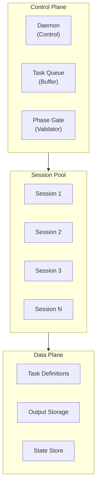
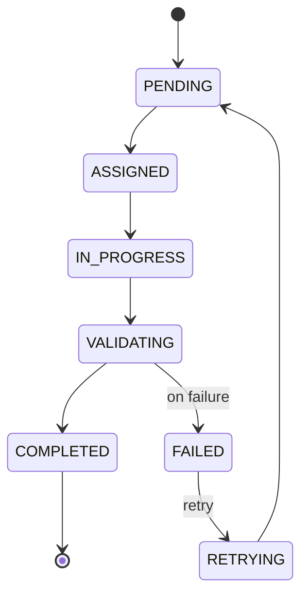
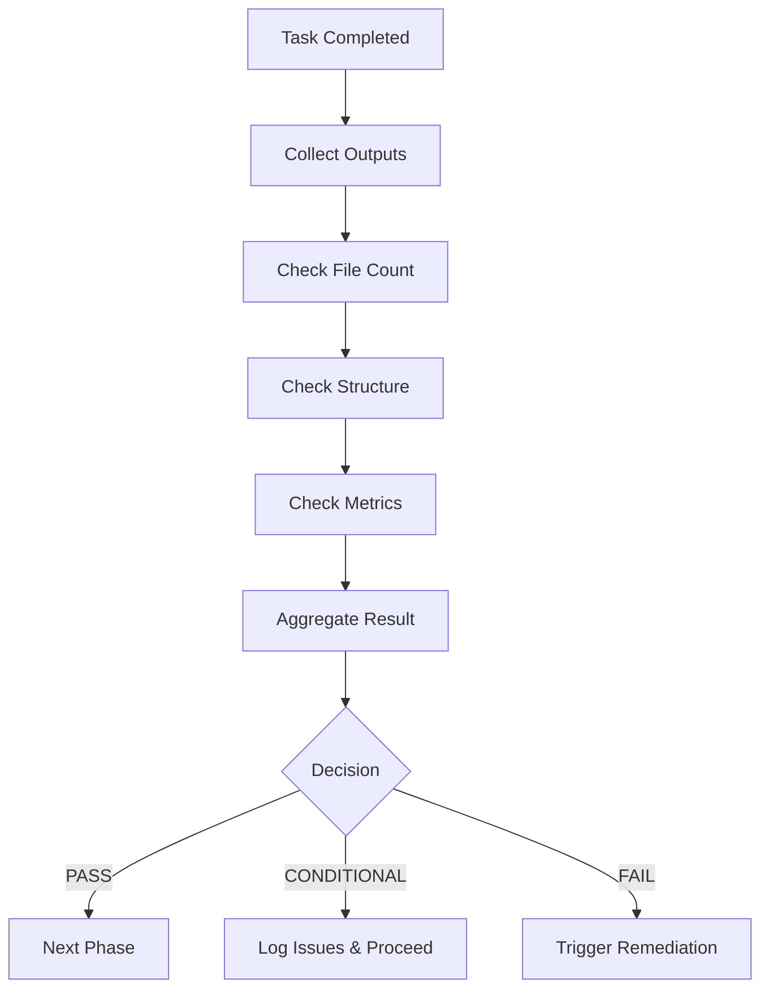

# Orchestrator Setup

**Version**: 1.0.0
**Last Updated**: 2025-12-15

---

## 1. Overview

Orchestrator는 다중 Claude Code 세션을 관리하고 Phase Gate를 제어하는 자동화 계층입니다.

### 1.1 Orchestrator Architecture

```
┌─────────────────────────────────────────────────────────────────────┐
│                      ORCHESTRATOR ARCHITECTURE                      │
├─────────────────────────────────────────────────────────────────────┤
│                                                                     │
│   ┌─────────────────────────────────────────────────────────────┐   │
│   │                    Control Plane                            │   │
│   │  ┌─────────────┐  ┌─────────────┐  ┌─────────────┐          │   │
│   │  │   Daemon    │  │  Task Queue │  │ Phase Gate  │          │   │
│   │  │  (Control)  │  │  (Buffer)   │  │ (Validator) │          │   │
│   │  └──────┬──────┘  └──────┬──────┘  └──────┬──────┘          │   │
│   └─────────┼────────────────┼────────────────┼─────────────────┘   │
│             │                │                │                     │
│   ┌─────────┼────────────────┼────────────────┼─────────────────┐   │
│   │         ▼                ▼                ▼                 │   │
│   │                     Session Pool                            │   │
│   │  ┌─────────┐  ┌─────────┐  ┌─────────┐  ┌─────────┐         │   │
│   │  │Session 1│  │Session 2│  │Session 3│  │Session N│         │   │
│   │  │(Claude) │  │(Claude) │  │(Claude) │  │(Claude) │         │   │
│   │  └─────────┘  └─────────┘  └─────────┘  └─────────┘         │   │
│   └─────────────────────────────────────────────────────────────┘   │
│                                                                     │
│   ┌─────────────────────────────────────────────────────────────┐   │
│   │                    Data Plane                               │   │
│   │  ┌─────────────┐  ┌─────────────┐  ┌─────────────┐          │   │
│   │  │   Task      │  │   Output    │  │   State     │          │   │
│   │  │ Definitions │  │   Storage   │  │   Store     │          │   │
│   │  └─────────────┘  └─────────────┘  └─────────────┘          │   │
│   └─────────────────────────────────────────────────────────────┘   │
│                                                                     │
└─────────────────────────────────────────────────────────────────────┘
```



---

## 2. Orchestrator Types

### 2.1 Simple Orchestrator (Choisor)

```yaml
choisor:
  type: "Session-based orchestrator"
  purpose: "Feature별 Phase 순차 실행"

  features:
    - "Domain 단위 Task 관리"
    - "auto-to-max Phase 연속 실행"
    - "Session 상태 추적"
    - "간단한 CLI 인터페이스"

  architecture:
    daemon: "Background process"
    sessions: "File-based state management"

  use_case:
    - "단일 도메인 처리"
    - "Feature별 순차 Phase 실행"
    - "Stage 5 validation 워크플로우"
```

### 2.2 Advanced Orchestrator

```yaml
advanced_orchestrator:
  type: "Multi-agent orchestrator"
  purpose: "대규모 병렬 처리"

  features:
    - "다중 Claude 세션 동시 관리"
    - "동적 리소스 할당"
    - "Phase Gate 자동 검증"
    - "장애 복구"
    - "우선순위 기반 스케줄링"

  architecture:
    runtime: "Python 3.11+ / asyncio"
    api: "Claude Agent SDK"
    state: "Database-backed"

  use_case:
    - "대규모 프로젝트"
    - "다중 도메인 병렬 처리"
    - "Stage 4 대량 코드 생성"
```

---

## 3. Choisor Setup

### 3.1 Directory Structure

```
# Choisor Config
.choisor/
├── config.yaml                 # Project configuration (defines specs_root)
├── tasks/
│   └── tasks.json              # Task list and states
├── sessions/
│   └── sessions.json           # Session pool state
├── instructions/
│   ├── instruction-{sid}.txt   # Current instruction (Claude reads this)
│   └── logs/
│       └── instruction-{sid}.log  # All instructions history
├── logs/
│   └── session-{sid}.log       # Session output logs
└── commands/                   # Daemon communication
    ├── pending/
    ├── executing/
    └── completed/    

# Choisor Skills
.claude/skills/choisor/
├── SKILL.md              # Skill documentation
├── commands/             # Skill commands (/choisor status, /choisor scan, etc.)
├── daemon/               # Daemon (session pool manager)
├── lib/                  # Core logic (Phase Gate, Priority, Scanner)
├── templates/            # Config Template
└── tools/                # Background Jobs Monitoring Tools
```

### 3.2 Configuration

```yaml
# .claude/skills/choisor/config.yaml
choisor_config:
  daemon:
    port: 8888
    log_level: "INFO"
    auto_start: false

  session:
    max_concurrent: 1  # Single session
    timeout_minutes: 60
    checkpoint_interval: 10

  task:
    batch_size: 1
    retry_count: 3
    retry_delay_seconds: 30

  phase_control:
    auto_to_max: true
    validate_between_phases: true
    stop_on_failure: true
```

### 3.3 Task Definition

```yaml
# Task definition structure
task:
  id: "FEAT-PA-001-S5P1"
  feature_id: "FEAT-PA-001"
  domain: "PA"
  stage: 5
  phase: 1
  skill: "stage5-phase1-structural-standardization"

  status: "pending"  # pending, in_progress, completed, failed
  priority: 2        # P2

  dependencies:
    - "FEAT-PA-001-S4P3"  # Stage 4 Phase 3 completed

  inputs:
    - path: "backend/src/main/java/com/halla/pa/..."
      type: "source_code"

  outputs:
    - path: "stage5-outputs/phase1/PA/FEAT-PA-001/"
      type: "validation_report"

  metadata:
    created_at: "2025-12-15T10:00:00Z"
    assigned_at: null
    completed_at: null
```

### 3.4 Commands

```bash
# Scan for new tasks
/choisor scan

# Show current status
/choisor status

# Run single task
/choisor run FEAT-PA-001

# Run domain with auto-to-max
/choisor run-domain PA --auto-to-max

# Pause execution
/choisor pause

# Resume execution
/choisor resume
```

---

## 4. Advanced Orchestrator Setup
- 주:
  - 보완 필요
  - Agentic Orchestration 필요시 활용
  - 추가 토큰 사용 소모로 비용 발생

### 4.1 Project Structure

```
orchestrator/
├── src/
│   ├── __init__.py
│   ├── main.py               # Entry point
│   ├── config.py             # Configuration
│   ├── daemon.py             # Background daemon
│   ├── session_pool.py       # Session management
│   ├── task_queue.py         # Task queue
│   ├── phase_gate.py         # Phase Gate controller
│   ├── scheduler.py          # Task scheduler
│   └── models/
│       ├── task.py
│       ├── session.py
│       └── state.py
├── tests/
│   └── ...
├── config/
│   ├── default.yaml
│   └── production.yaml
├── requirements.txt
└── pyproject.toml
```

### 4.2 Core Components

#### Session Pool

```python
# session_pool.py (conceptual)
class SessionPool:
    """Manages multiple Claude Code sessions."""

    def __init__(self, max_sessions: int = 5):
        self.max_sessions = max_sessions
        self.active_sessions: Dict[str, Session] = {}
        self.available_sessions: Queue[Session] = Queue()

    async def acquire(self) -> Session:
        """Acquire an available session."""
        if self.available_sessions.empty():
            if len(self.active_sessions) < self.max_sessions:
                session = await self._create_session()
            else:
                session = await self.available_sessions.get()
        else:
            session = await self.available_sessions.get()

        self.active_sessions[session.id] = session
        return session

    async def release(self, session: Session):
        """Release a session back to the pool."""
        del self.active_sessions[session.id]
        await self.available_sessions.put(session)
```

#### Task Queue

```python
# task_queue.py (conceptual)
class TaskQueue:
    """Priority-based task queue."""

    def __init__(self):
        self.queue: PriorityQueue[Task] = PriorityQueue()
        self.in_progress: Dict[str, Task] = {}

    def enqueue(self, task: Task):
        """Add task to queue with priority."""
        self.queue.put((task.priority, task.created_at, task))

    def dequeue(self) -> Optional[Task]:
        """Get highest priority task."""
        if self.queue.empty():
            return None
        _, _, task = self.queue.get()
        self.in_progress[task.id] = task
        return task

    def complete(self, task_id: str, status: TaskStatus):
        """Mark task as completed."""
        task = self.in_progress.pop(task_id)
        task.status = status
```

#### Phase Gate Controller

```python
# phase_gate.py (conceptual)
class PhaseGateController:
    """Controls Phase Gate validation."""

    def __init__(self, config: PhaseGateConfig):
        self.config = config

    async def validate(self, phase_output: PhaseOutput) -> GateResult:
        """Validate Phase Gate conditions."""
        checks = []

        # Check file count
        file_check = await self._check_file_count(phase_output)
        checks.append(file_check)

        # Check quality metrics
        quality_check = await self._check_quality(phase_output)
        checks.append(quality_check)

        # Determine result
        if all(c.passed for c in checks):
            return GateResult(status="PASS", checks=checks)
        elif any(c.critical_failure for c in checks):
            return GateResult(status="FAIL", checks=checks)
        else:
            return GateResult(status="CONDITIONAL_PASS", checks=checks)
```

### 4.3 Configuration

```yaml
# config/production.yaml
orchestrator:
  name: "legacy-migration-orchestrator"
  version: "1.0.0"

daemon:
  host: "0.0.0.0"
  port: 8080
  workers: 4

session_pool:
  max_sessions: 5
  session_timeout_minutes: 60
  idle_timeout_minutes: 10
  model_default: "sonnet"

task_queue:
  max_queue_size: 1000
  priority_levels: 4  # P0-P3
  retry_policy:
    max_retries: 3
    backoff_seconds: [30, 60, 120]

phase_gate:
  validation_timeout_minutes: 5
  required_checks:
    - "file_count"
    - "structural_compliance"
    - "quality_metrics"

scheduler:
  strategy: "priority_first"
  batch_size: 10
  poll_interval_seconds: 5

monitoring:
  metrics_export: true
  metrics_path: "/metrics"
  log_level: "INFO"

storage:
  type: "file"  # or "database"
  path: "./data"
```

---

## 5. Task Lifecycle

### 5.1 Task States

```
┌─────────────────────────────────────────────────────────────────────┐
│                       TASK LIFECYCLE                                │
├─────────────────────────────────────────────────────────────────────┤
│                                                                     │
│   ┌─────────┐     ┌──────────┐     ┌───────────┐     ┌──────────┐   │
│   │ PENDING │────▶│ ASSIGNED │────▶│IN_PROGRESS│────▶│VALIDATING│   │
│   └─────────┘     └──────────┘     └───────────┘     └────┬─────┘   │
│        ▲                                                  │         │
│        │                                                  ▼         │
│        │         ┌──────────┐                      ┌───────────┐    │
│        └─────────│  FAILED  │◀─────────────────────│ COMPLETED │    │
│                  └──────────┘     (on failure)     └───────────┘    │
│                       │                                             │
│                       │ (retry)                                     │
│                       ▼                                             │
│                  ┌──────────┐                                       │
│                  │ RETRYING │                                       │
│                  └──────────┘                                       │
│                                                                     │
└─────────────────────────────────────────────────────────────────────┘
```



### 5.2 State Transitions

```yaml
state_transitions:
  pending_to_assigned:
    trigger: "Session acquired"
    action: "Update task state, record assignment time"

  assigned_to_in_progress:
    trigger: "Session starts execution"
    action: "Update state, start timer"

  in_progress_to_validating:
    trigger: "Task execution completed"
    action: "Trigger Phase Gate validation"

  validating_to_completed:
    trigger: "Phase Gate PASS"
    action: "Mark complete, release session"

  validating_to_failed:
    trigger: "Phase Gate FAIL"
    action: "Record failure, check retry policy"

  failed_to_retrying:
    trigger: "Retry count < max"
    action: "Schedule retry with backoff"

  retrying_to_pending:
    trigger: "Retry scheduled"
    action: "Re-queue task"
```

---

## 6. Phase Gate Integration

### 6.1 Gate Configuration

```yaml
phase_gates:
  stage1_phase1:
    name: "Feature Inventory Gate"
    conditions:
      file_count:
        minimum: 5
        required_files:
          - "api-endpoints-raw.txt"
          - "feature-inventory.yaml"
      metrics:
        endpoint_count: ">= expected * 0.95"

  stage1_phase2:
    name: "Deep Analysis Gate"
    conditions:
      per_feature:
        required_files:
          - "summary.yaml"
          - "api-endpoints/*.yaml"
      metrics:
        layer_coverage: ">= 95%"

  stage5_phase2:
    name: "Functional Validation Gate"
    conditions:
      score:
        minimum: 70
        critical_count: 0
```

### 6.2 Gate Validation Flow

```
┌─────────────────────────────────────────────────────────────────────┐
│                    PHASE GATE VALIDATION                            │
├─────────────────────────────────────────────────────────────────────┤
│                                                                     │
│   ┌──────────────────┐                                              │
│   │ Task Completed   │                                              │
│   └────────┬─────────┘                                              │
│            │                                                        │
│            ▼                                                        │
│   ┌──────────────────┐                                              │
│   │ Collect Outputs  │                                              │
│   └────────┬─────────┘                                              │
│            │                                                        │
│            ▼                                                        │
│   ┌──────────────────┐     ┌──────────────────┐                     │
│   │ Check File Count │────▶│ Check Structure  │                     │
│   └────────┬─────────┘     └────────┬─────────┘                     │
│            │                        │                               │
│            ▼                        ▼                               │
│   ┌──────────────────┐     ┌──────────────────┐                     │
│   │ Check Metrics    │────▶│ Aggregate Result │                     │
│   └────────┬─────────┘     └────────┬─────────┘                     │
│            │                        │                               │
│            ▼                        ▼                               │
│   ┌────────────────────────────────────────────┐                    │
│   │                 Decision                   │                    │
│   │  ┌─────┐     ┌────────────┐     ┌──────┐   │                    │
│   │  │PASS │     │CONDITIONAL │     │ FAIL │   │                    │
│   │  └──┬──┘     └─────┬──────┘     └──┬───┘   │                    │
│   └─────┼──────────────┼───────────────┼───────┘                    │
│         │              │               │                            │
│         ▼              ▼               ▼                            │
│   ┌──────────┐  ┌────────────┐  ┌────────────┐                      │
│   │ Next     │  │ Log Issues │  │ Trigger    │                      │
│   │ Phase    │  │ Proceed    │  │ Remediation│                      │
│   └──────────┘  └────────────┘  └────────────┘                      │
│                                                                     │
└─────────────────────────────────────────────────────────────────────┘
```



---

## 7. Error Handling

### 7.1 Error Types

```yaml
error_types:
  session_errors:
    timeout:
      cause: "Session execution exceeded limit"
      recovery: "Terminate, restart with checkpoint"

    crash:
      cause: "Session terminated unexpectedly"
      recovery: "Check logs, retry from checkpoint"

  task_errors:
    validation_failure:
      cause: "Phase Gate not passed"
      recovery: "Analyze failure, remediate, retry"

    dependency_missing:
      cause: "Required input not available"
      recovery: "Wait for dependency, retry"

  system_errors:
    resource_exhaustion:
      cause: "No available sessions"
      recovery: "Wait for session, scale up"

    storage_failure:
      cause: "Cannot write outputs"
      recovery: "Check storage, retry"
```

### 7.2 Recovery Strategies

```yaml
recovery_strategies:
  retry:
    max_attempts: 3
    backoff: "exponential"
    backoff_base: 30  # seconds

  checkpoint_recovery:
    trigger: "Session crash or timeout"
    procedure:
      1: "Load last checkpoint"
      2: "Resume from checkpoint state"
      3: "Continue execution"

  escalation:
    trigger: "Max retries exceeded"
    actions:
      - "Log failure with details"
      - "Notify operator"
      - "Mark task as BLOCKED"
```

---

## 8. Monitoring Integration

### 8.1 Metrics

```yaml
orchestrator_metrics:
  task_metrics:
    - name: "tasks_pending"
      type: "gauge"
      description: "Number of pending tasks"

    - name: "tasks_in_progress"
      type: "gauge"
      description: "Number of in-progress tasks"

    - name: "tasks_completed_total"
      type: "counter"
      description: "Total completed tasks"

    - name: "task_duration_seconds"
      type: "histogram"
      description: "Task execution duration"

  session_metrics:
    - name: "sessions_active"
      type: "gauge"
      description: "Number of active sessions"

    - name: "session_utilization"
      type: "gauge"
      description: "Session pool utilization %"

  phase_gate_metrics:
    - name: "phase_gate_pass_rate"
      type: "gauge"
      description: "Phase Gate pass rate %"
```

### 8.2 Logging

```yaml
logging_config:
  format: "%(asctime)s - %(name)s - %(levelname)s - %(message)s"

  levels:
    orchestrator: "INFO"
    session_pool: "INFO"
    task_queue: "DEBUG"
    phase_gate: "INFO"

  handlers:
    console:
      enabled: true
      level: "INFO"

    file:
      enabled: true
      path: "logs/orchestrator.log"
      rotation: "daily"
      retention: 30  # days
```

---

**Next**: [03-monitoring-dashboard.md](03-monitoring-dashboard.md)
