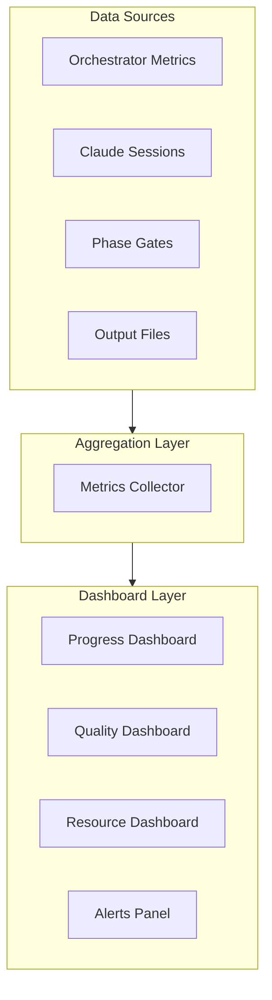

# Monitoring and Dashboard

**Version**: 1.0.0
**Last Updated**: 2025-12-15

---

## 1. Overview

효과적인 마이그레이션 프로젝트 운영을 위한 모니터링 및 대시보드 시스템을 설명합니다.

### 1.1 Monitoring Architecture

```
┌─────────────────────────────────────────────────────────────────────┐
│                    MONITORING ARCHITECTURE                          │
├─────────────────────────────────────────────────────────────────────┤
│                                                                     │
│   ┌────────────────────────────────────────────────────────────┐    │
│   │                    Data Sources                            │    │
│   │  ┌─────────┐  ┌─────────┐  ┌─────────┐  ┌─────────┐        │    │
│   │  │Orchestr.│  │ Claude  │  │ Phase   │  │ Output  │        │    │
│   │  │ Metrics │  │ Sessions│  │ Gates   │  │ Files   │        │    │
│   │  └────┬────┘  └────┬────┘  └────┬────┘  └────┬────┘        │    │
│   └───────┼────────────┼────────────┼────────────┼─────────────┘    │
│           │            │            │            │                  │
│           ▼            ▼            ▼            ▼                  │
│   ┌─────────────────────────────────────────────────────────────┐   │
│   │                  Aggregation Layer                          │   │
│   │  ┌─────────────────────────────────────────────────────────┐│   │
│   │  │              Metrics Collector                          ││   │
│   │  └─────────────────────────────────────────────────────────┘│   │
│   └─────────────────────────────────────────────────────────────┘   │
│                              │                                      │
│                              ▼                                      │
│   ┌─────────────────────────────────────────────────────────────┐   │
│   │                    Dashboard Layer                          │   │
│   │  ┌─────────┐  ┌─────────┐  ┌─────────┐  ┌─────────┐         │   │
│   │  │Progress │  │ Quality │  │Resource │  │ Alerts  │         │   │
│   │  │Dashboard│  │Dashboard│  │Dashboard│  │ Panel   │         │   │
│   │  └─────────┘  └─────────┘  └─────────┘  └─────────┘         │   │
│   └─────────────────────────────────────────────────────────────┘   │
│                                                                     │
└─────────────────────────────────────────────────────────────────────┘
```



---

## 2. Key Metrics

### 2.1 Progress Metrics

```yaml
progress_metrics:
  feature_progress:
    name: "Feature Progress"
    formula: "completed_features / total_features * 100"
    unit: "percent"
    granularity:
      - "overall"
      - "by_stage"
      - "by_phase"
      - "by_domain"

  task_throughput:
    name: "Task Throughput"
    formula: "tasks_completed / time_elapsed"
    unit: "tasks/hour"
    trend: true

  phase_completion:
    name: "Phase Completion Rate"
    formula: "completed_phases / total_phases"
    unit: "percent"
    by_stage: true

  estimated_completion:
    name: "Estimated Completion"
    formula: "remaining_tasks / average_throughput"
    unit: "hours"
    confidence_interval: true
```

### 2.2 Quality Metrics

```yaml
quality_metrics:
  phase_gate_pass_rate:
    name: "Phase Gate Pass Rate"
    formula: "passed_gates / total_gates * 100"
    unit: "percent"
    threshold:
      healthy: ">= 90%"
      warning: "80-89%"
      critical: "< 80%"

  validation_score:
    name: "Average Validation Score"
    source: "Stage 5 Phase 2"
    unit: "points"
    target: ">= 70"

  remediation_rate:
    name: "Remediation Success Rate"
    formula: "successful_remediations / total_remediations"
    unit: "percent"

  spec_coverage:
    name: "Specification Coverage"
    formula: "covered_endpoints / total_endpoints"
    unit: "percent"
    target: ">= 99%"
```

### 2.3 Resource Metrics

```yaml
resource_metrics:
  session_utilization:
    name: "Session Utilization"
    formula: "active_sessions / max_sessions * 100"
    unit: "percent"
    optimal_range: "70-90%"

  session_health:
    name: "Session Health"
    indicators:
      - "active_count"
      - "idle_count"
      - "error_count"

  api_usage:
    name: "API Usage"
    metrics:
      - "requests_per_hour"
      - "tokens_consumed"
      - "cost_estimate"

  queue_depth:
    name: "Task Queue Depth"
    metrics:
      - "pending_tasks"
      - "average_wait_time"
```

---

## 3. Dashboard Components

### 3.1 Progress Dashboard

```yaml
progress_dashboard:
  layout:
    rows: 3
    columns: 4

  panels:
    overall_progress:
      position: [0, 0, 2, 2]
      type: "gauge"
      title: "Overall Progress"
      metric: "feature_progress.overall"
      thresholds:
        - value: 0
          color: "red"
        - value: 50
          color: "yellow"
        - value: 80
          color: "green"

    stage_breakdown:
      position: [2, 0, 2, 2]
      type: "stacked_bar"
      title: "Progress by Stage"
      metrics:
        - "stage1_progress"
        - "stage2_progress"
        - "stage3_progress"
        - "stage4_progress"
        - "stage5_progress"

    domain_heatmap:
      position: [0, 2, 3, 1]
      type: "heatmap"
      title: "Domain Status"
      dimensions:
        x: "domains"
        y: "stages"
      color: "completion_percent"

    throughput_trend:
      position: [3, 2, 1, 1]
      type: "line_chart"
      title: "Throughput Trend"
      metric: "task_throughput"
      time_range: "24h"
```

### 3.2 Quality Dashboard

```yaml
quality_dashboard:
  panels:
    gate_pass_rate:
      type: "gauge"
      title: "Phase Gate Pass Rate"
      metric: "phase_gate_pass_rate"

    validation_scores:
      type: "histogram"
      title: "Validation Score Distribution"
      metric: "validation_score"
      buckets: [50, 60, 70, 80, 90, 100]

    critical_issues:
      type: "stat"
      title: "Critical Issues"
      metric: "critical_issue_count"
      color_mode: "background"
      thresholds:
        - value: 0
          color: "green"
        - value: 1
          color: "yellow"
        - value: 5
          color: "red"

    remediation_status:
      type: "pie"
      title: "Remediation Status"
      metrics:
        - "pending_remediations"
        - "in_progress_remediations"
        - "completed_remediations"

    spec_coverage_trend:
      type: "line_chart"
      title: "Spec Coverage Over Time"
      metric: "spec_coverage"
```

### 3.3 Resource Dashboard

```yaml
resource_dashboard:
  panels:
    session_pool:
      type: "stat_grid"
      title: "Session Pool"
      metrics:
        - name: "Active"
          metric: "sessions_active"
        - name: "Idle"
          metric: "sessions_idle"
        - name: "Max"
          metric: "sessions_max"

    utilization_gauge:
      type: "gauge"
      title: "Pool Utilization"
      metric: "session_utilization"

    api_costs:
      type: "stat"
      title: "API Cost (Today)"
      metric: "daily_api_cost"
      unit: "USD"

    queue_status:
      type: "bar_chart"
      title: "Queue Status"
      metrics:
        - "pending_tasks"
        - "in_progress_tasks"
        - "completed_tasks"
```

---

## 4. Alerting

### 4.1 Alert Rules

```yaml
alert_rules:
  high_failure_rate:
    name: "High Failure Rate"
    condition: "phase_gate_fail_rate > 20%"
    duration: "5m"
    severity: "critical"
    notification:
      - "email"
      - "slack"

  low_throughput:
    name: "Low Throughput"
    condition: "task_throughput < 5 tasks/hour"
    duration: "30m"
    severity: "warning"
    notification:
      - "slack"

  session_exhaustion:
    name: "Session Exhaustion"
    condition: "session_utilization >= 100%"
    duration: "10m"
    severity: "warning"
    notification:
      - "slack"

  critical_issue_detected:
    name: "Critical Issue"
    condition: "new_critical_issue == true"
    duration: "0m"
    severity: "critical"
    notification:
      - "email"
      - "slack"
      - "pagerduty"

  stalled_progress:
    name: "Stalled Progress"
    condition: "feature_progress_delta == 0"
    duration: "1h"
    severity: "warning"
    notification:
      - "slack"
```

### 4.2 Notification Channels

```yaml
notification_channels:
  email:
    type: "email"
    recipients:
      - "team-lead@company.com"
      - "migration-team@company.com"
    template: "alert_email.html"

  slack:
    type: "slack"
    webhook_url: "${SLACK_WEBHOOK_URL}"
    channel: "#migration-alerts"
    template: |
      *[{{ severity }}] {{ alert_name }}*
      {{ message }}
      Time: {{ timestamp }}

  pagerduty:
    type: "pagerduty"
    integration_key: "${PAGERDUTY_KEY}"
    severity_mapping:
      critical: "critical"
      warning: "warning"
```

---

## 5. Reporting

### 5.1 Daily Report

```yaml
daily_report:
  schedule: "09:00 KST"
  recipients: ["migration-team@company.com"]

  sections:
    summary:
      title: "Daily Summary"
      metrics:
        - "features_completed_today"
        - "tasks_completed_today"
        - "phase_gates_passed_today"

    progress:
      title: "Progress Update"
      content:
        - "overall_progress_percent"
        - "progress_vs_target"
        - "domains_completed"

    quality:
      title: "Quality Status"
      content:
        - "phase_gate_pass_rate"
        - "average_validation_score"
        - "critical_issues_count"

    blockers:
      title: "Current Blockers"
      content:
        - "failed_tasks"
        - "pending_decisions"

    plan:
      title: "Today's Plan"
      content:
        - "scheduled_tasks"
        - "target_completions"
```

### 5.2 Weekly Report

```yaml
weekly_report:
  schedule: "Monday 10:00 KST"
  recipients: ["stakeholders@company.com"]

  sections:
    executive_summary:
      title: "Executive Summary"
      metrics:
        - "weekly_progress"
        - "milestone_status"
        - "risk_assessment"

    achievements:
      title: "Week's Achievements"
      content:
        - "completed_domains"
        - "features_migrated"
        - "quality_improvements"

    challenges:
      title: "Challenges Faced"
      content:
        - "major_issues"
        - "resolutions"
        - "lessons_learned"

    next_week:
      title: "Next Week's Focus"
      content:
        - "planned_domains"
        - "key_milestones"
        - "resource_needs"

    metrics_trends:
      title: "Trend Analysis"
      charts:
        - "progress_over_time"
        - "quality_trend"
        - "throughput_trend"
```

---

## 6. Data Collection

### 6.1 Metrics Collection

```yaml
metrics_collection:
  sources:
    orchestrator:
      type: "prometheus"
      endpoint: "http://localhost:8080/metrics"
      interval: "15s"

    output_files:
      type: "file_watcher"
      paths:
        - "stage*-outputs/**/status.yaml"
        - "stage*-outputs/**/report.yaml"
      interval: "1m"

    phase_gates:
      type: "event_stream"
      source: "orchestrator"
      events:
        - "gate_passed"
        - "gate_failed"

  aggregation:
    interval: "1m"
    retention: "30d"
```

### 6.2 Log Collection

```yaml
log_collection:
  sources:
    orchestrator_logs:
      path: "logs/orchestrator/*.log"
      format: "json"

    session_logs:
      path: "logs/sessions/*.log"
      format: "text"

    validation_logs:
      path: "stage5-outputs/**/validation.log"
      format: "yaml"

  processing:
    parser: "structured"
    enrichment:
      - "add_hostname"
      - "parse_timestamps"
    filters:
      - "level >= INFO"

  storage:
    type: "elasticsearch"
    index_pattern: "migration-logs-*"
    retention: "90d"
```

---

## 7. Status Files

### 7.1 PROJECT_STATUS.md

```markdown
# Project Status

**Last Updated**: YYYY-MM-DD HH:MM:SS
**Updated By**: {system|human}

## Overall Progress

| Stage | Completed | Total | Progress |
|-------|-----------|-------|----------|
| Stage 1 | X | Y | Z% |
| Stage 2 | X | Y | Z% |
| Stage 3 | X | Y | Z% |
| Stage 4 | X | Y | Z% |
| Stage 5 | X | Y | Z% |

**Total**: X / Y features (Z%)

## Current Status

- **Active Stage**: Stage X
- **Active Phase**: Phase Y
- **Active Domain**: {domain}

## Quality Metrics

- Phase Gate Pass Rate: X%
- Average Validation Score: Y points
- Critical Issues: Z

## Recent Activities

| Time | Activity | Status |
|------|----------|--------|
| HH:MM | {description} | {status} |

## Blockers

{List of current blockers if any}

## Next Steps

1. {next step 1}
2. {next step 2}
```

### 7.2 Domain Status Files

```yaml
# stage{N}-outputs/status/{DOMAIN}-status.yaml
domain_status:
  domain: "{DOMAIN}"
  last_updated: "YYYY-MM-DDTHH:MM:SSZ"

  progress:
    total_features: N
    completed: N
    in_progress: N
    pending: N
    failed: N

  current_phase:
    stage: N
    phase: N
    features_in_phase: N

  quality:
    validation_scores:
      average: N
      min: N
      max: N
    critical_issues: N
    remediation_pending: N

  recent_completions:
    - feature_id: "FEAT-{DOMAIN}-NNN"
      completed_at: "YYYY-MM-DDTHH:MM:SSZ"
      validation_score: N
```

---

## 8. Implementation Guide

### 8.1 Simple File-based Dashboard

```yaml
simple_dashboard:
  approach: "Markdown + YAML status files"

  components:
    status_generator:
      language: "Python/Shell"
      function: "Scan outputs, generate status files"
      schedule: "Every 5 minutes"

    markdown_dashboard:
      location: "PROJECT_STATUS.md"
      format: "Markdown tables"
      auto_update: true

  advantages:
    - "No external dependencies"
    - "Version controlled"
    - "Simple to implement"

  limitations:
    - "No real-time updates"
    - "Limited visualization"
```

### 8.2 Web-based Dashboard

```yaml
web_dashboard:
  approach: "Web application with real-time updates"

  technology_stack:
    backend:
      - "Python FastAPI"
      - "WebSocket for real-time"
    frontend:
      - "React/Vue"
      - "Chart.js/D3.js"
    storage:
      - "SQLite/PostgreSQL"

  features:
    - "Real-time progress tracking"
    - "Interactive charts"
    - "Drill-down capabilities"
    - "Alert notifications"

  deployment:
    - "Local server"
    - "Container (Docker)"
```

### 8.3 Metrics Script Example

```python
# status_collector.py (conceptual)
import yaml
from pathlib import Path
from datetime import datetime

def collect_status():
    """Collect status from output directories."""
    status = {
        'last_updated': datetime.now().isoformat(),
        'stages': {}
    }

    for stage in range(1, 6):
        stage_path = Path(f'stage{stage}-outputs')
        if stage_path.exists():
            status['stages'][f'stage{stage}'] = collect_stage_status(stage_path)

    return status

def collect_stage_status(stage_path):
    """Collect status for a single stage."""
    # Count completed features
    completed = len(list(stage_path.glob('**/status.yaml')))

    # Count validation reports
    validations = list(stage_path.glob('**/validation-report.yaml'))

    return {
        'completed_features': completed,
        'validation_count': len(validations),
        'last_activity': get_last_modified(stage_path)
    }

def generate_dashboard():
    """Generate markdown dashboard."""
    status = collect_status()

    with open('PROJECT_STATUS.md', 'w') as f:
        f.write(format_dashboard(status))
```

---

**Next**: [04-history-viewer.md](04-history-viewer.md)
