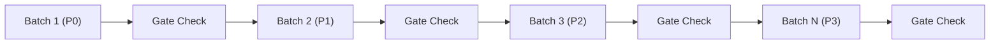
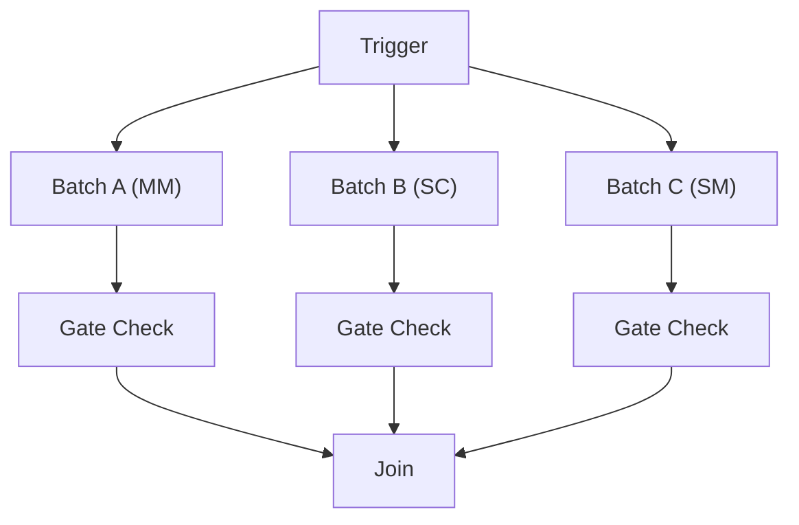
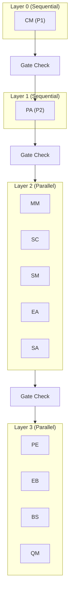

# Batch Processing Patterns

**Version**: 1.0.0
**Last Updated**: 2025-12-15

---

## 1. Overview

대규모 마이그레이션 프로젝트에서 효율적인 배치 처리 패턴을 설명합니다.

### 1.1 Batch Processing 필요성

```yaml
batch_processing_rationale:
  scale:
    - "900+ Features 처리"
    - "5,800+ API Endpoints"
    - "11개 도메인"

  benefits:
    - "체계적인 진행 관리"
    - "리소스 효율화"
    - "품질 일관성 확보"
    - "위험 분산"

  challenges:
    - "의존성 관리"
    - "장애 복구"
    - "진행률 추적"
```

---

## 2. Batch Strategies

### 2.1 Domain-based Batching

```yaml
domain_batching:
  description: "도메인 단위로 배치 구성"

  strategy:
    unit: "Domain"
    order: "Priority-based (P0 → P1 → P2 → P3)"

  execution_flow:
    1: "P0 Domains (Foundation: common, am)"
    2: "P1 Domains (Hub: CM)"
    3: "P2 Domains (Core: PA → MM, SC, SM, EA, SA)"
    4: "P3 Domains (Supporting: PE, EB, BS, QM)"

  advantages:
    - "도메인 간 의존성 존중"
    - "팀별 책임 분리 가능"
    - "도메인 단위 검증"

  disadvantages:
    - "대규모 도메인 병목"
    - "도메인 간 대기 시간"
```

### 2.2 Priority-based Batching

```yaml
priority_batching:
  description: "우선순위 기반 배치 구성"

  priority_definition:
    P0:
      criteria: "Foundation 모듈"
      examples: ["common", "am"]
      sequence: "First, sequential"

    P1:
      criteria: "Hub 역할, 다른 도메인에서 참조"
      examples: ["CM"]
      sequence: "After P0, sequential"

    P2:
      criteria: "Core 비즈니스"
      examples: ["PA", "MM", "SC", "SM", "EA", "SA"]
      sequence: "After P1, PA first then parallel"

    P3:
      criteria: "Supporting 기능"
      examples: ["PE", "EB", "BS", "QM"]
      sequence: "After P2, parallel"

  execution_rules:
    - "같은 Priority 내에서는 병렬 가능"
    - "상위 Priority 완료 후 하위 시작"
    - "의존성 있는 경우 예외"
```

### 2.3 Complexity-based Batching

```yaml
complexity_batching:
  description: "복잡도 기반 배치 구성"

  tiers:
    high:
      batch_size: 5
      model: "opus"
      timeout: "2 hours"

    medium:
      batch_size: 10
      model: "sonnet"
      timeout: "1 hour"

    low:
      batch_size: 20
      model: "haiku"
      timeout: "30 minutes"

  advantages:
    - "리소스 최적화"
    - "처리 시간 예측 가능"
    - "비용 효율성"
```

### 2.4 Phase-based Batching

```yaml
phase_batching:
  description: "Phase 단위 배치"

  strategy:
    per_feature:
      phases: [1, 2, 3]  # Stage 5
      mode: "sequential within feature"

    system_level:
      phases: [4, 5]  # Stage 5
      mode: "after all features complete phases 1-3"

  auto_to_max:
    description: "Feature 내 Phase 연속 실행"
    flow: "Phase 1 → Phase 2 → Phase 3 (per feature)"
    benefit: "컨텍스트 재사용, 효율성"
```

---

## 3. Batch Execution Patterns

### 3.1 Sequential Batch Pattern

```
┌───────────────────────────────────────────────────────────────────┐
│                    SEQUENTIAL BATCH PATTERN                       │
├───────────────────────────────────────────────────────────────────┤
│                                                                   │
│   ┌─────────┐     ┌─────────┐     ┌─────────┐     ┌─────────┐     │
│   │ Batch 1 │────▶│ Batch 2 │────▶│ Batch 3 │────▶│ Batch N │     │
│   │ (P0)    │     │ (P1)    │     │ (P2)    │     │ (P3)    │     │
│   └────┬────┘     └────┬────┘     └────┬────┘     └────┬────┘     │
│        │               │               │               │          │
│        ▼               ▼               ▼               ▼          │
│   [Gate Check]    [Gate Check]    [Gate Check]    [Gate Check]    │
│                                                                   │
└───────────────────────────────────────────────────────────────────┘

Usage:
- P0 → P1 → P2 의존성 있는 경우
- Foundation 모듈 먼저 처리 필요시
- 순차적 검증이 필요한 경우
```



### 3.2 Parallel Batch Pattern

```
┌──────────────────────────────────────────────────┐
│               PARALLEL BATCH PATTERN             │
├──────────────────────────────────────────────────┤
│                                                  │
│                    ┌─────────┐                   │
│                    │ Trigger │                   │
│                    └────┬────┘                   │
│          ┌──────────────┼──────────────┐         │
│          │              │              │         │
│          ▼              ▼              ▼         │
│    ┌─────────┐    ┌─────────┐    ┌─────────┐     │
│    │ Batch A │    │ Batch B │    │ Batch C │     │
│    │  (MM)   │    │  (SC)   │    │  (SM)   │     │
│    └────┬────┘    └────┬────┘    └────┬────┘     │
│         │              │              │          │
│         ▼              ▼              ▼          │
│    [Gate Check]   [Gate Check]   [Gate Check]    │
│         │              │              │          │
│         └──────────────┼──────────────┘          │
│                        ▼                         │
│                   ┌─────────┐                    │
│                   │  Join   │                    │
│                   └─────────┘                    │
│                                                  │
└──────────────────────────────────────────────────┘

Usage:
- 의존성 없는 도메인 동시 처리
- 리소스 활용률 극대화
- 처리 시간 단축
```



### 3.3 Hybrid Batch Pattern

```
┌─────────────────────────────────────────────────────┐
│                HYBRID BATCH PATTERN                 │
├─────────────────────────────────────────────────────┤
│                                                     │
│   Layer 0 (Sequential):                             │
│   ┌─────────┐     ┌─────────┐                       │
│   │   CM    │────▶│  Gate   │                       │
│   │  (P1)   │     │  Check  │                       │
│   └─────────┘     └────┬────┘                       │
│                        │                            │
│   Layer 1 (Sequential): ▼                           │
│   ┌─────────┐     ┌─────────┐                       │
│   │   PA    │────▶│  Gate   │                       │
│   │  (P2)   │     │  Check  │                       │
│   └─────────┘     └────┬────┘                       │
│                        │                            │
│   Layer 2 (Parallel):  ▼                            │
│   ┌─────┐ ┌─────┐ ┌─────┐ ┌─────┐ ┌─────┐           │
│   │ MM  │ │ SC  │ │ SM  │ │ EA  │ │ SA  │           │
│   └──┬──┘ └──┬──┘ └──┬──┘ └──┬──┘ └──┬──┘           │
│      └───────┴───────┴───────┴───────┘              │
│                      │                              │
│                      ▼                              │
│   Layer 3 (Parallel):                               │
│   ┌─────┐ ┌─────┐ ┌─────┐ ┌─────┐                   │
│   │ PE  │ │ EB  │ │ BS  │ │ QM  │                   │
│   └─────┘ └─────┘ └─────┘ └─────┘                   │
│                                                     │
└─────────────────────────────────────────────────────┘
```



---

## 4. Batch Configuration

### 4.1 Batch Definition

```yaml
batch_definition:
  batch_id: "BATCH-{STAGE}-{PHASE}-{DOMAIN}"

  metadata:
    stage: 5
    phase: 2
    domain: "PA"
    priority: 2

  tasks:
    - task_id: "FEAT-PA-001-S5P2"
    - task_id: "FEAT-PA-002-S5P2"
    # ... more tasks

  configuration:
    max_parallel: 5
    timeout_per_task: 3600  # seconds
    retry_policy:
      max_retries: 3
      backoff: "exponential"

  dependencies:
    requires:
      - "BATCH-S5-P1-PA"  # Phase 1 must be complete

  gate:
    type: "phase_gate"
    conditions:
      pass_rate: ">= 90%"
      critical_issues: 0
```

### 4.2 Batch Size Guidelines

```yaml
batch_size_guidelines:
  factors:
    complexity:
      high: "5-10 tasks per batch"
      medium: "10-20 tasks per batch"
      low: "20-50 tasks per batch"

    resource_availability:
      sessions_available: "batch_size <= sessions * 2"

    risk_tolerance:
      conservative: "smaller batches, more checkpoints"
      aggressive: "larger batches, faster completion"

  recommendations:
    stage_1_phase_2:
      batch_unit: "domain"
      reason: "Deep analysis needs context continuity"

    stage_4_phase_3:
      batch_unit: "complexity_tier"
      reason: "Model selection optimization"

    stage_5_phases:
      batch_unit: "feature"
      reason: "Per-feature phase progression"
```

---

## 5. Checkpointing

### 5.1 Checkpoint Strategy

```yaml
checkpoint_strategy:
  types:
    task_checkpoint:
      trigger: "After each task completion"
      content:
        - "task_status"
        - "output_files"
        - "metrics"

    batch_checkpoint:
      trigger: "After batch completion"
      content:
        - "all_task_statuses"
        - "aggregated_metrics"
        - "gate_result"

    session_checkpoint:
      trigger: "Before session timeout"
      content:
        - "session_state"
        - "pending_work"

  storage:
    location: "stage{N}-outputs/checkpoints/"
    format: "yaml"
    retention: "until batch completion"
```

### 5.2 Checkpoint File Structure

```yaml
# checkpoint.yaml
checkpoint:
  id: "CP-{timestamp}"
  batch_id: "BATCH-S5-P2-PA"
  created_at: "2025-12-15T10:30:00Z"

  progress:
    total_tasks: 100
    completed: 45
    in_progress: 5
    pending: 50

  completed_tasks:
    - id: "FEAT-PA-001-S5P2"
      status: "completed"
      score: 85
      output_path: "stage5-outputs/phase2/PA/FEAT-PA-001/"

  in_progress_tasks:
    - id: "FEAT-PA-046-S5P2"
      started_at: "2025-12-15T10:25:00Z"
      session_id: "session-123"

  pending_tasks:
    - id: "FEAT-PA-051-S5P2"
    # ... more

  metrics:
    average_score: 82
    pass_rate: 0.91
    average_duration: 1200  # seconds
```

---

## 6. Batch Monitoring

### 6.1 Progress Tracking

```yaml
progress_tracking:
  real_time:
    metrics:
      - "tasks_completed"
      - "tasks_in_progress"
      - "tasks_pending"
      - "estimated_completion"

    update_frequency: "per task completion"

  aggregated:
    metrics:
      - "batch_progress_percent"
      - "pass_rate"
      - "average_duration"

    update_frequency: "every 5 minutes"
```

### 6.2 Batch Status Report

```markdown
# Batch Status: BATCH-S5-P2-PA

**Status**: IN_PROGRESS
**Started**: 2025-12-15 09:00:00
**Elapsed**: 2h 30m

## Progress

| Status | Count | Percentage |
|--------|-------|------------|
| Completed | 45 | 45% |
| In Progress | 5 | 5% |
| Pending | 50 | 50% |

## Quality

- Pass Rate: 91%
- Average Score: 82 points
- Critical Issues: 2

## Performance

- Average Task Duration: 20 min
- Throughput: 18 tasks/hour
- Estimated Completion: 2h 47m

## Issues

| Task | Issue | Severity |
|------|-------|----------|
| FEAT-PA-023 | SQL mismatch | Critical |
| FEAT-PA-037 | Missing endpoint | Critical |
```

---

## 7. Batch Operations

### 7.1 Starting a Batch

```yaml
batch_start:
  pre_checks:
    - "Dependencies satisfied"
    - "Resources available"
    - "Gate conditions defined"

  procedure:
    1: "Load batch definition"
    2: "Validate prerequisites"
    3: "Initialize checkpoint"
    4: "Start task distribution"

  command_example: |
    /choisor run-batch BATCH-S5-P2-PA
```

### 7.2 Pausing a Batch

```yaml
batch_pause:
  triggers:
    manual: "Operator request"
    automatic:
      - "High failure rate (> 30%)"
      - "Critical issue detected"
      - "Resource exhaustion"

  procedure:
    1: "Stop new task assignments"
    2: "Wait for in-progress tasks"
    3: "Save checkpoint"
    4: "Update batch status to PAUSED"

  command_example: |
    /choisor pause BATCH-S5-P2-PA
```

### 7.3 Resuming a Batch

```yaml
batch_resume:
  procedure:
    1: "Load last checkpoint"
    2: "Validate checkpoint integrity"
    3: "Resume pending tasks"
    4: "Update batch status to IN_PROGRESS"

  command_example: |
    /choisor resume BATCH-S5-P2-PA
```

### 7.4 Aborting a Batch

```yaml
batch_abort:
  procedure:
    1: "Terminate all in-progress tasks"
    2: "Save final checkpoint"
    3: "Mark batch as ABORTED"
    4: "Generate abort report"

  cleanup:
    - "Release sessions"
    - "Archive outputs"
    - "Notify stakeholders"

  command_example: |
    /choisor abort BATCH-S5-P2-PA --reason "Critical blocking issue"
```

---

## 8. Best Practices

### 8.1 Batch Design Principles

```yaml
design_principles:
  right_sizing:
    - "너무 크지 않게: 장애 영향 최소화"
    - "너무 작지 않게: 오버헤드 최소화"
    - "도메인 경계 존중"

  clear_boundaries:
    - "배치 간 의존성 명확화"
    - "입출력 명세 정의"
    - "Gate 조건 사전 정의"

  observability:
    - "진행률 추적 가능"
    - "품질 메트릭 수집"
    - "문제 조기 발견"
```

### 8.2 Common Pitfalls

```yaml
common_pitfalls:
  oversized_batches:
    problem: "장애 시 대규모 재작업"
    solution: "적절한 크기로 분할"

  ignored_dependencies:
    problem: "순서 오류로 인한 실패"
    solution: "의존성 그래프 사전 분석"

  missing_checkpoints:
    problem: "장애 시 복구 불가"
    solution: "정기적 체크포인트"

  no_gate_validation:
    problem: "품질 문제 누적"
    solution: "배치 완료 시 Gate 검증"
```

---

**Next**: [02-parallel-execution.md](02-parallel-execution.md)
