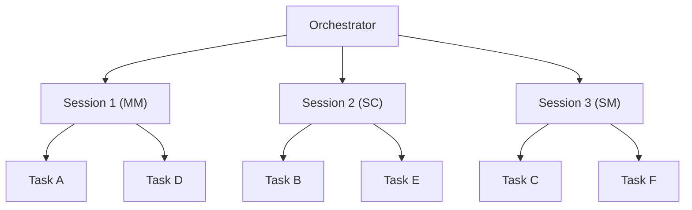
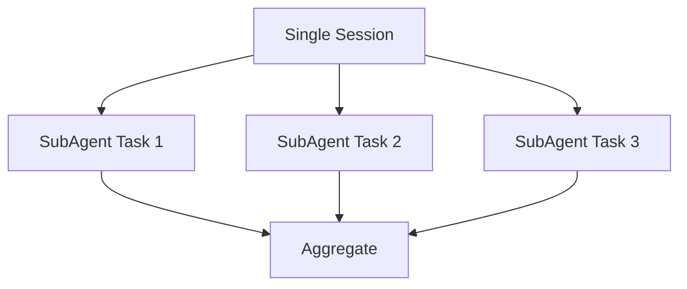
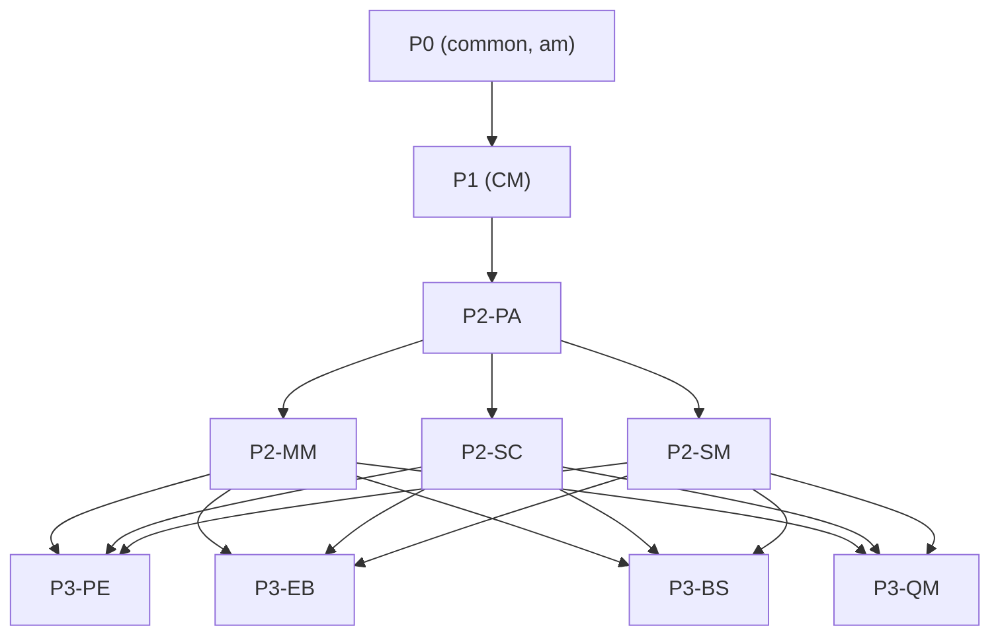
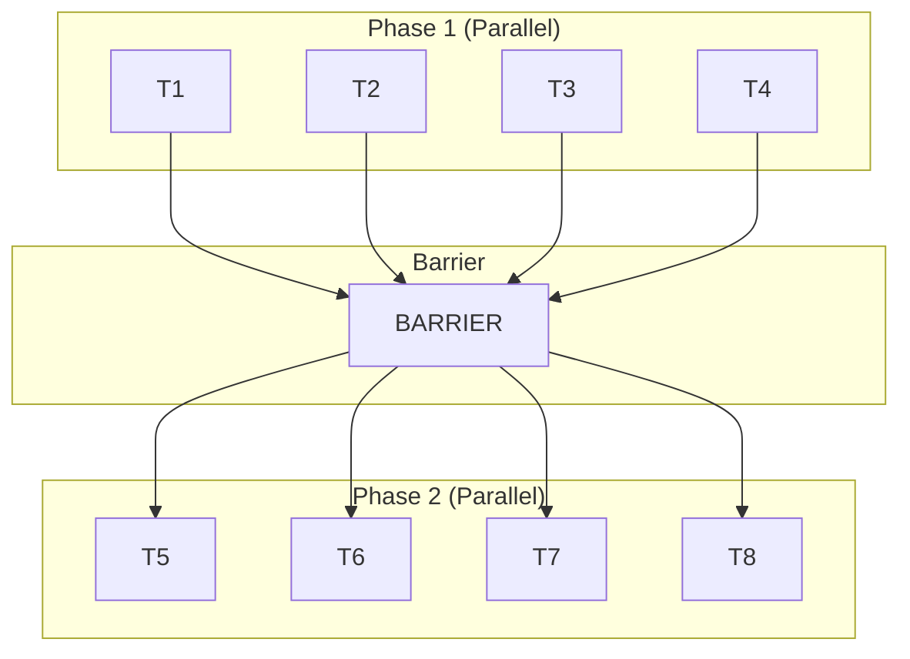
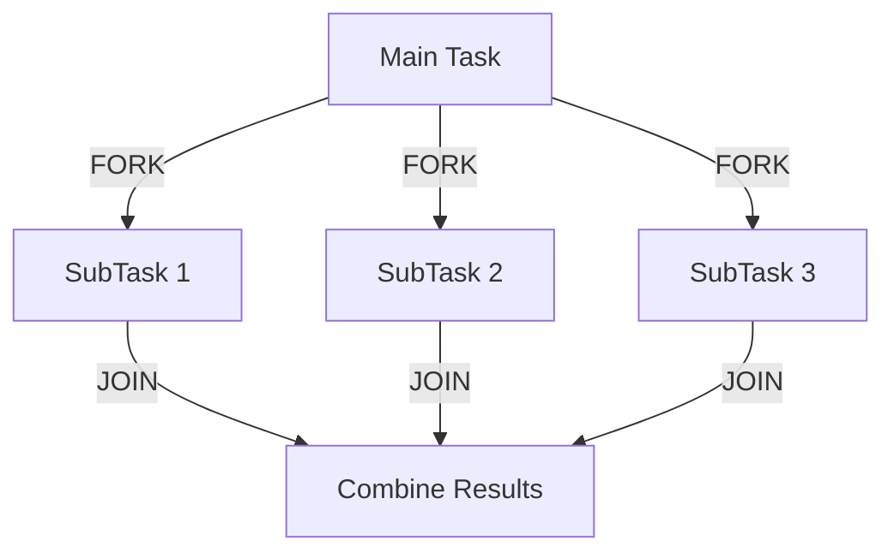
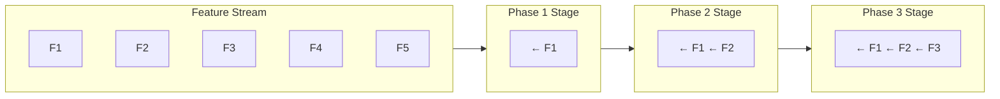

# Parallel Execution Patterns

**Version**: 1.0.0
**Last Updated**: 2025-12-15

---

## 1. Overview

다중 세션을 활용한 병렬 실행 전략과 패턴을 설명합니다.

### 1.1 Parallelization Goals

```yaml
parallelization_goals:
  primary:
    - "처리 시간 단축"
    - "리소스 활용률 극대화"

  secondary:
    - "장애 격리"
    - "확장성 확보"

  constraints:
    - "의존성 순서 보장"
    - "일관성 유지"
    - "품질 기준 충족"
```

---

## 2. Parallelization Levels

### 2.1 Session-level Parallelism

```
┌─────────────────────────────────────────────────────────────────────┐
│                   SESSION-LEVEL PARALLELISM                         │
├─────────────────────────────────────────────────────────────────────┤
│                                                                     │
│   ┌─────────────────────────────────────────────────────────────┐   │
│   │                    Orchestrator                             │   │
│   └─────────────────────────┬───────────────────────────────────┘   │
│              ┌──────────────┼──────────────┐                        │
│              │              │              │                        │
│              ▼              ▼              ▼                        │
│        ┌─────────┐    ┌─────────┐    ┌─────────┐                    │
│        │Session 1│    │Session 2│    │Session 3│                    │
│        │  (MM)   │    │  (SC)   │    │  (SM)   │                    │
│        └────┬────┘    └────┬────┘    └────┬────┘                    │
│             │              │              │                         │
│        ┌────┴────┐    ┌────┴────┐    ┌────┴────┐                    │
│        │ Task A  │    │ Task B  │    │ Task C  │                    │
│        │ Task D  │    │ Task E  │    │ Task F  │                    │
│        │ ...     │    │ ...     │    │ ...     │                    │
│        └─────────┘    └─────────┘    └─────────┘                    │
│                                                                     │
└─────────────────────────────────────────────────────────────────────┘

Description:
- 각 세션이 독립적인 도메인/배치 처리
- 세션 간 상태 공유 없음
- 최대 동시 세션 수로 제한
```



### 2.2 Task-level Parallelism

```
┌─────────────────────────────────────────────────────────────┐
│                    TASK-LEVEL PARALLELISM                   │
├─────────────────────────────────────────────────────────────┤
│                                                             │
│   ┌─────────────────────────────────────────────────────┐   │
│   │                    Single Session                   │   │
│   └─────────────────────────┬───────────────────────────┘   │
│                             │                               │
│              ┌──────────────┼──────────────┐                │
│              │              │              │                │
│              ▼              ▼              ▼                │
│        ┌─────────┐    ┌─────────┐    ┌─────────┐            │
│        │ SubAgent│    │ SubAgent│    │ SubAgent│            │
│        │  Task 1 │    │  Task 2 │    │  Task 3 │            │
│        └────┬────┘    └────┬────┘    └────┬────┘            │
│             │              │              │                 │
│             └──────────────┼──────────────┘                 │
│                            ▼                                │
│                     ┌─────────────┐                         │
│                     │  Aggregate  │                         │
│                     └─────────────┘                         │
│                                                             │
└─────────────────────────────────────────────────────────────┘

Description:
- 단일 세션 내 SubAgent 활용
- 컨텍스트 공유 가능
- 작은 독립 작업에 적합
```



### 2.3 Domain-level Parallelism

```yaml
domain_parallelism:
  description: "의존성 없는 도메인 동시 처리"

  eligible_domains:
    layer_2:
      domains: ["MM", "SC", "SM", "EA", "SA"]
      prerequisite: "PA 완료"
      max_parallel: 5

    layer_3:
      domains: ["PE", "EB", "BS", "QM"]
      prerequisite: "Layer 2 완료"
      max_parallel: 4

  scheduling:
    strategy: "round_robin | least_loaded | priority"
    load_balancing: true
```

---

## 3. Dependency Management

### 3.1 Dependency Graph

```
┌──────────────────────────────────────────────────────────────┐
│                     DEPENDENCY GRAPH                         │
├──────────────────────────────────────────────────────────────┤
│                                                              │
│                    ┌───────────┐                             │
│                    │   P0      │                             │
│                    │(common,am)│                             │
│                    └────┬──────┘                             │
│                         │                                    │
│                         ▼                                    │
│                    ┌──────────┐                              │
│                    │   P1     │                              │
│                    │   (CM)   │                              │
│                    └────┬─────┘                              │
│                         │                                    │
│                         ▼                                    │
│                    ┌──────────┐                              │
│                    │  P2-PA   │                              │
│                    │   (PA)   │                              │
│                    └────┬─────┘                              │
│          ┌──────────────┼──────────────┐                     │
│          │              │              │                     │
│          ▼              ▼              ▼                     │
│    ┌─────────┐    ┌──────────┐    ┌──────────┐               │
│    │ P2-MM   │    │ P2-SC    │    │ P2-SM    │ ...           │
│    └────┬────┘    └─────┬────┘    └────┬─────┘               │
│         └───────────────┼──────────────┘                     │
│                         ▼                                    │
│    ┌──────────┐  ┌──────────┐  ┌──────────┐  ┌──────────┐    │
│    │ P3-PE    │  │ P3-EB    │  │ P3-BS    │  │ P3-QM    │    │
│    └──────────┘  └──────────┘  └──────────┘  └──────────┘    │
│                                                              │
└──────────────────────────────────────────────────────────────┘
```



### 3.2 Dependency Resolution

```yaml
dependency_resolution:
  types:
    hard_dependency:
      description: "반드시 선행 작업 완료 필요"
      example: "P0 → P1 → P2"
      enforcement: "Queue blocked until satisfied"

    soft_dependency:
      description: "권장되지만 필수는 아님"
      example: "Same domain, different phases"
      enforcement: "Warning logged"

  resolution_algorithm:
    1: "Build dependency graph"
    2: "Topological sort"
    3: "Identify parallelizable groups"
    4: "Schedule by layer"

  conflict_handling:
    circular_dependency:
      detection: "Graph traversal"
      action: "Error and halt"

    missing_dependency:
      detection: "Validation check"
      action: "Wait or skip with warning"
```

---

## 4. Session Pool Management

### 4.1 Pool Configuration

```yaml
session_pool:
  size:
    minimum: 1
    maximum: 10
    default: 5

  scaling:
    mode: "auto | manual"
    auto_scaling:
      scale_up_threshold: "queue_depth > 20"
      scale_down_threshold: "idle_time > 10m"

  session_lifecycle:
    max_duration: 3600  # seconds
    idle_timeout: 600   # seconds
    health_check_interval: 60  # seconds
```

### 4.2 Session Allocation

```yaml
session_allocation:
  strategies:
    round_robin:
      description: "순환 할당"
      use_case: "균등 부하 분산"

    least_loaded:
      description: "가장 여유있는 세션에 할당"
      use_case: "부하 불균형 시"

    affinity:
      description: "같은 도메인은 같은 세션"
      use_case: "컨텍스트 재사용"

    priority:
      description: "우선순위 높은 작업 우선 할당"
      use_case: "중요 작업 보장"

  implementation:
    request_session:
      1: "Check available sessions"
      2: "Apply allocation strategy"
      3: "Reserve session"
      4: "Assign task"

    release_session:
      1: "Complete task"
      2: "Update session state"
      3: "Return to pool"
```

---

## 5. Synchronization Patterns

### 5.1 Barrier Synchronization

```
┌────────────────────────────────────────────────────────────────────┐
│                   BARRIER SYNCHRONIZATION                          │
├────────────────────────────────────────────────────────────────────┤
│                                                                    │
│   Phase 1 (Parallel):                                              │
│   ┌─────┐  ┌─────┐  ┌─────┐  ┌─────┐                               │
│   │ T1  │  │ T2  │  │ T3  │  │ T4  │                               │
│   └──┬──┘  └──┬──┘  └──┬──┘  └──┬──┘                               │
│      │        │        │        │                                  │
│      ▼        ▼        ▼        ▼                                  │
│   ═══════════════════════════════════════                          │
│                   BARRIER                                          │
│   ═══════════════════════════════════════                          │
│      │        │        │        │                                  │
│      ▼        ▼        ▼        ▼                                  │
│   Phase 2 (Parallel):                                              │
│   ┌─────┐  ┌─────┐  ┌─────┐  ┌─────┐                               │
│   │ T5  │  │ T6  │  │ T7  │  │ T8  │                               │
│   └─────┘  └─────┘  └─────┘  └─────┘                               │
│                                                                    │
└────────────────────────────────────────────────────────────────────┘

Usage:
- Phase Gate 검증 시점
- 다음 Phase 시작 전 모든 작업 완료 확인
```



### 5.2 Fork-Join Pattern

```
┌────────────────────────────────────────────────────────────────────┐
│                      FORK-JOIN PATTERN                             │
├────────────────────────────────────────────────────────────────────┤
│                                                                    │
│                    ┌─────────┐                                     │
│                    │  Main   │                                     │
│                    │  Task   │                                     │
│                    └────┬────┘                                     │
│                         │ FORK                                     │
│          ┌──────────────┼──────────────┐                           │
│          │              │              │                           │
│          ▼              ▼              ▼                           │
│    ┌─────────┐    ┌─────────┐    ┌─────────┐                       │
│    │ SubTask │    │ SubTask │    │ SubTask │                       │
│    │    1    │    │    2    │    │    3    │                       │
│    └────┬────┘    └────┬────┘    └────┬────┘                       │
│         │              │              │                            │
│         └──────────────┼──────────────┘                            │
│                        │ JOIN                                      │
│                        ▼                                           │
│                   ┌─────────┐                                      │
│                   │ Combine │                                      │
│                   │ Results │                                      │
│                   └─────────┘                                      │
│                                                                    │
└────────────────────────────────────────────────────────────────────┘

Usage:
- 대규모 도메인 분할 처리
- 독립적 서브태스크 병렬 실행
- 결과 통합
```



### 5.3 Pipeline Pattern

```
┌───────────────────────────────────────────────────────────────────┐
│                      PIPELINE PATTERN                             │
├───────────────────────────────────────────────────────────────────┤
│                                                                   │
│   Feature Stream:                                                 │
│   ┌────┐ ┌────┐ ┌────┐ ┌────┐ ┌────┐                              │
│   │ F1 │ │ F2 │ │ F3 │ │ F4 │ │ F5 │ ...                          │
│   └──┬─┘ └──┬─┘ └──┬─┘ └──┬─┘ └──┬─┘                              │
│      │      │      │      │      │                                │
│      ▼      ▼      ▼      ▼      ▼                                │
│   ┌────────────────────────────────────┐                          │
│   │           Phase 1 Stage            │ ← F1                     │
│   └────────────────────────────────────┘                          │
│      │                                                            │
│      ▼                                                            │
│   ┌────────────────────────────────────┐                          │
│   │           Phase 2 Stage            │ ← F1    ← F2             │
│   └────────────────────────────────────┘                          │
│      │                                                            │
│      ▼                                                            │
│   ┌────────────────────────────────────┐                          │
│   │           Phase 3 Stage            │ ← F1    ← F2    ← F3     │
│   └────────────────────────────────────┘                          │
│                                                                   │
└───────────────────────────────────────────────────────────────────┘

Usage:
- Stage 5 Phase 1-2-3 연속 처리
- Feature별 파이프라인
- 처리량 극대화
```



---

## 6. Load Balancing

### 6.1 Load Metrics

```yaml
load_metrics:
  session_load:
    active_tasks: "현재 실행 중인 태스크 수"
    queue_depth: "대기 중인 태스크 수"
    cpu_usage: "세션 CPU 사용률"
    memory_usage: "세션 메모리 사용률"

  task_characteristics:
    complexity: "태스크 복잡도"
    estimated_duration: "예상 소요 시간"
    priority: "우선순위"
```

### 6.2 Balancing Strategies

```yaml
balancing_strategies:
  static:
    description: "사전 정의된 할당"
    implementation:
      - "도메인별 세션 고정 할당"
      - "균등 분배"

  dynamic:
    description: "실시간 부하 기반 할당"
    implementation:
      - "실시간 부하 모니터링"
      - "최소 부하 세션에 할당"
      - "태스크 재분배"

  adaptive:
    description: "학습 기반 최적화"
    implementation:
      - "처리 시간 패턴 학습"
      - "예측 기반 할당"
      - "지속적 최적화"
```

---

## 7. Failure Handling

### 7.1 Failure Isolation

```yaml
failure_isolation:
  session_failure:
    detection: "Heartbeat timeout"
    containment: "세션 내 태스크만 영향"
    recovery: "새 세션에서 재시작"

  task_failure:
    detection: "Task error or timeout"
    containment: "해당 태스크만 영향"
    recovery: "같은/다른 세션에서 재시도"

  system_failure:
    detection: "Multiple session failures"
    containment: "Pause all execution"
    recovery: "System health check, gradual restart"
```

### 7.2 Graceful Degradation

```yaml
graceful_degradation:
  reduced_parallelism:
    trigger: "Session failure"
    action: "Reduce max_sessions, continue"

  priority_focus:
    trigger: "Resource scarcity"
    action: "Focus on high-priority tasks"

  checkpoint_mode:
    trigger: "Instability detected"
    action: "Increase checkpoint frequency"
```

---

## 8. Performance Optimization

### 8.1 Optimization Techniques

```yaml
optimization_techniques:
  context_reuse:
    description: "같은 도메인 태스크를 같은 세션에서 처리"
    benefit: "컨텍스트 로딩 시간 절약"

  batch_io:
    description: "파일 I/O 배치 처리"
    benefit: "I/O 오버헤드 감소"

  pre_fetching:
    description: "다음 태스크 데이터 미리 로드"
    benefit: "대기 시간 감소"

  result_caching:
    description: "공통 결과 캐싱"
    benefit: "중복 계산 방지"
```

### 8.2 Performance Metrics

```yaml
performance_metrics:
  throughput:
    metric: "tasks_per_hour"
    target: ">= 20 tasks/hour"

  latency:
    metric: "average_task_duration"
    target: "<= 30 minutes"

  utilization:
    metric: "session_utilization"
    target: "70-90%"

  efficiency:
    metric: "successful_tasks / total_resources"
    target: ">= 85%"
```

---

## 9. Configuration Examples

### 9.1 Conservative Configuration

```yaml
conservative_config:
  name: "Conservative - Safety First"

  session_pool:
    max_sessions: 3
    scaling: "manual"

  parallelization:
    level: "session"
    max_parallel_tasks: 3

  checkpointing:
    frequency: "every_task"
    retention: "7_days"

  use_case:
    - "초기 Pilot"
    - "높은 안정성 요구"
```

### 9.2 Balanced Configuration

```yaml
balanced_config:
  name: "Balanced - Production Default"

  session_pool:
    max_sessions: 5
    scaling: "auto"

  parallelization:
    level: "session"
    max_parallel_tasks: 5

  checkpointing:
    frequency: "every_batch"
    retention: "3_days"

  use_case:
    - "일반 운영"
    - "균형 잡힌 성능/안정성"
```

### 9.3 Aggressive Configuration

```yaml
aggressive_config:
  name: "Aggressive - Speed Focus"

  session_pool:
    max_sessions: 10
    scaling: "auto"

  parallelization:
    level: "task"
    max_parallel_tasks: 20

  checkpointing:
    frequency: "hourly"
    retention: "1_day"

  use_case:
    - "마감 압박"
    - "안정화된 파이프라인"
```

---

**Next**: [03-error-recovery.md](03-error-recovery.md)
