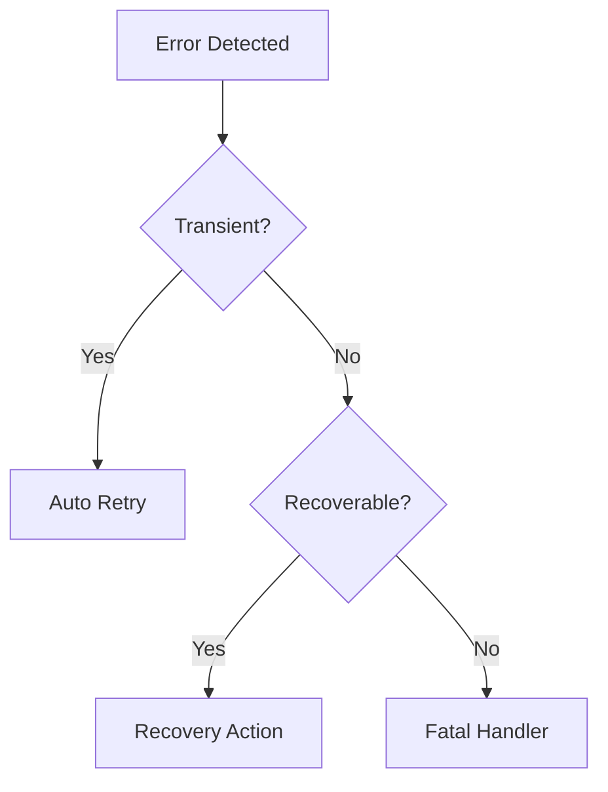
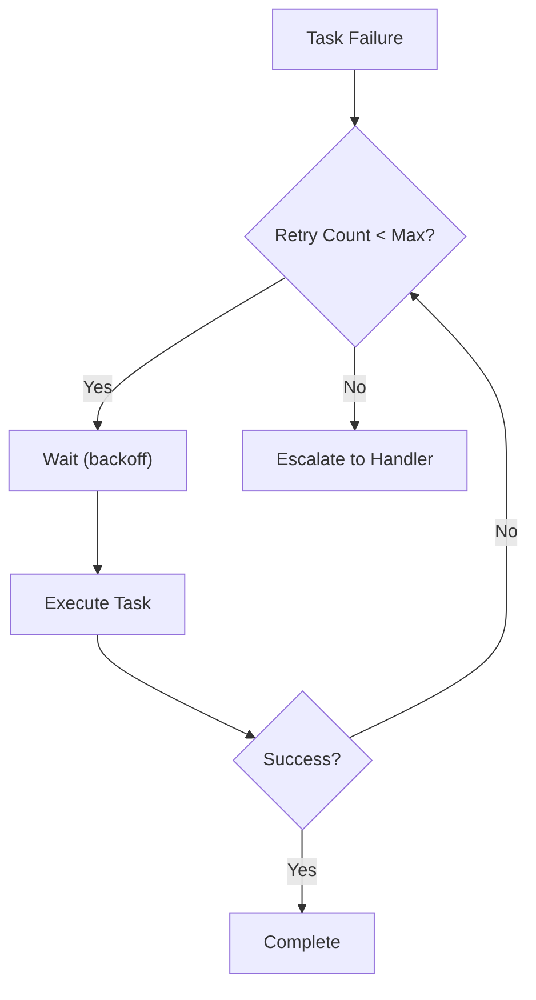
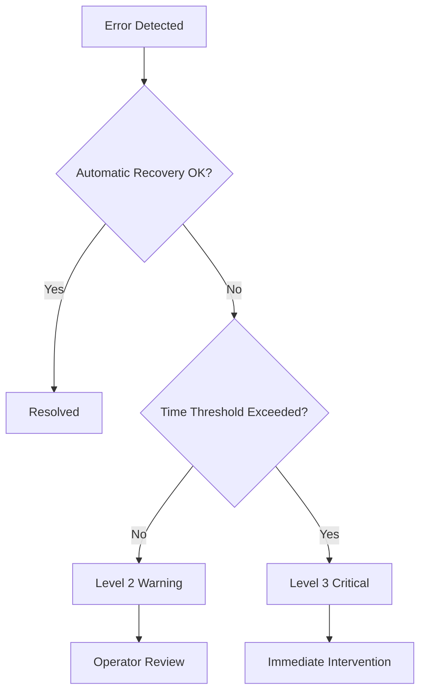

# Error Recovery Patterns

**Version**: 1.0.0
**Last Updated**: 2025-12-15

---

## 1. Overview

마이그레이션 프로젝트에서 발생할 수 있는 다양한 오류 상황과 복구 전략을 설명합니다.

### 1.1 Error Categories

```yaml
error_categories:
  transient:
    description: "일시적 오류, 재시도로 해결"
    examples:
      - "API rate limit"
      - "Network timeout"
      - "Temporary resource unavailability"

  recoverable:
    description: "조치 후 복구 가능"
    examples:
      - "Validation failure"
      - "Missing dependency"
      - "Configuration error"

  fatal:
    description: "즉각적인 개입 필요"
    examples:
      - "Data corruption"
      - "System failure"
      - "Security breach"
```

---

## 2. Error Detection

### 2.1 Detection Mechanisms

```yaml
detection_mechanisms:
  health_checks:
    session_health:
      method: "Heartbeat"
      interval: "30 seconds"
      timeout: "60 seconds"

    task_health:
      method: "Progress monitoring"
      stall_threshold: "10 minutes"

  validation_checks:
    output_validation:
      method: "Schema validation"
      timing: "After task completion"

    quality_checks:
      method: "Metric threshold"
      timing: "At Phase Gate"

  anomaly_detection:
    throughput_anomaly:
      baseline: "historical average"
      threshold: "< 50% of baseline"

    error_rate_anomaly:
      baseline: "< 10%"
      threshold: "> 20%"
```

### 2.2 Error Classification Flow

```
┌────────────────────────────────────────────────────────────────────┐
│                   ERROR CLASSIFICATION FLOW                        │
├────────────────────────────────────────────────────────────────────┤
│                                                                    │
│                    ┌──────────┐                                    │
│                    │  Error   │                                    │
│                    │ Detected │                                    │
│                    └────┬─────┘                                    │
│                         │                                          │
│                         ▼                                          │
│                  ┌─────────────┐                                   │
│                  │ Transient?  │                                   │
│                  └──────┬──────┘                                   │
│                    │         │                                     │
│                   Yes        No                                    │
│                    │         │                                     │
│                    ▼         ▼                                     │
│           ┌──────────┐  ┌─────────────┐                            │
│           │ Auto     │  │ Recoverable?│                            │
│           │ Retry    │  └──────┬──────┘                            │
│           └──────────┘      │       │                              │
│                            Yes      No                             │
│                             │       │                              │
│                             ▼       ▼                              │
│                    ┌──────────┐ ┌──────────┐                       │
│                    │ Recovery │ │  Fatal   │                       │
│                    │ Action   │ │ Handler  │                       │
│                    └──────────┘ └──────────┘                       │
│                                                                    │
└────────────────────────────────────────────────────────────────────┘
```



---

## 3. Retry Strategies

### 3.1 Retry Configuration

```yaml
retry_configuration:
  default_policy:
    max_retries: 3
    initial_delay: 30  # seconds
    max_delay: 300  # seconds
    backoff_multiplier: 2

  by_error_type:
    api_rate_limit:
      max_retries: 5
      initial_delay: 60
      backoff: "exponential"

    network_timeout:
      max_retries: 3
      initial_delay: 10
      backoff: "linear"

    validation_failure:
      max_retries: 2
      initial_delay: 0
      action: "remediate_then_retry"
```

### 3.2 Backoff Strategies

```yaml
backoff_strategies:
  linear:
    formula: "initial_delay + (attempt * increment)"
    example: "30s, 60s, 90s, 120s"

  exponential:
    formula: "initial_delay * (multiplier ^ attempt)"
    example: "30s, 60s, 120s, 240s"

  exponential_with_jitter:
    formula: "exponential + random(0, exponential * 0.1)"
    purpose: "Thundering herd 방지"

  fixed:
    formula: "constant_delay"
    use_case: "Known recovery time"
```

### 3.3 Retry Flow

```
┌─────────────────────────────────────────────────────────────────────┐
│                        RETRY FLOW                                   │
├─────────────────────────────────────────────────────────────────────┤
│                                                                     │
│   ┌──────────┐                                                      │
│   │  Task    │                                                      │
│   │ Failure  │                                                      │
│   └────┬─────┘                                                      │
│        │                                                            │
│        ▼                                                            │
│   ┌──────────────┐                                                  │
│   │ Retry Count  │                                                  │
│   │ < Max?       │                                                  │
│   └──────┬───────┘                                                  │
│      │         │                                                    │
│     Yes        No                                                   │
│      │         │                                                    │
│      ▼         ▼                                                    │
│   ┌─────────┐  ┌────────────┐                                       │
│   │ Wait    │  │ Escalate   │                                       │
│   │(backoff)│  │ to Handler │                                       │
│   └───┬─────┘  └────────────┘                                       │
│       │                                                             │
│       ▼                                                             │
│   ┌──────────┐                                                      │
│   │ Execute  │                                                      │
│   │ Task     │                                                      │
│   └────┬─────┘                                                      │
│        │                                                            │
│        ▼                                                            │
│   ┌──────────┐      ┌──────────┐                                    │
│   │ Success? │─Yes─▶│ Complete │                                    │
│   └────┬─────┘      └──────────┘                                    │
│        │ No                                                         │
│        │                                                            │
│        └──────────▶ (loop back to Retry Count check)                │
│                                                                     │
└─────────────────────────────────────────────────────────────────────┘
```



---

## 4. Recovery Actions

### 4.1 Task Recovery

```yaml
task_recovery:
  validation_failure:
    action: "remediation"
    steps:
      1: "Analyze failure reason"
      2: "Generate remediation spec"
      3: "Apply remediation"
      4: "Re-validate"

  missing_input:
    action: "dependency_resolution"
    steps:
      1: "Identify missing dependency"
      2: "Check if dependency task failed"
      3: "Wait or trigger dependency task"
      4: "Resume when available"

  timeout:
    action: "checkpoint_resume"
    steps:
      1: "Load last checkpoint"
      2: "Resume from checkpoint"
      3: "Increase timeout if needed"
```

### 4.2 Session Recovery

```yaml
session_recovery:
  session_crash:
    detection: "Heartbeat failure"
    steps:
      1: "Terminate crashed session"
      2: "Create new session"
      3: "Load checkpoint"
      4: "Resume tasks"

  context_exhaustion:
    detection: "Context budget > 95%"
    steps:
      1: "Save current state"
      2: "Summarize context"
      3: "Start new session with summary"
      4: "Continue execution"

  model_error:
    detection: "API error response"
    steps:
      1: "Log error details"
      2: "Wait with backoff"
      3: "Retry with same/different model"
```

### 4.3 System Recovery

```yaml
system_recovery:
  orchestrator_failure:
    steps:
      1: "Detect orchestrator down"
      2: "Activate standby (if available)"
      3: "Load system state"
      4: "Resume operations"

  data_corruption:
    steps:
      1: "Detect corruption"
      2: "Identify affected scope"
      3: "Restore from backup"
      4: "Re-process affected items"

  cascading_failure:
    steps:
      1: "Pause all execution"
      2: "Identify root cause"
      3: "Fix root cause"
      4: "Gradual restart"
```

---

## 5. Checkpoint and Resume

### 5.1 Checkpoint Types

```yaml
checkpoint_types:
  task_checkpoint:
    content:
      - "task_id"
      - "current_step"
      - "intermediate_results"
      - "context_state"
    trigger: "Step completion"

  batch_checkpoint:
    content:
      - "completed_tasks"
      - "in_progress_tasks"
      - "pending_tasks"
      - "aggregated_metrics"
    trigger: "Batch boundary"

  system_checkpoint:
    content:
      - "all_batch_states"
      - "session_pool_state"
      - "queue_state"
    trigger: "Scheduled interval"
```

### 5.2 Checkpoint Storage

```yaml
checkpoint_storage:
  location: "stage{N}-outputs/checkpoints/"

  structure:
    task_checkpoints: "tasks/{task_id}/checkpoint.yaml"
    batch_checkpoints: "batches/{batch_id}/checkpoint.yaml"
    system_checkpoint: "system/checkpoint.yaml"

  retention:
    task: "Until task completion + 24h"
    batch: "Until batch completion + 7d"
    system: "Rolling 30 days"

  backup:
    enabled: true
    frequency: "hourly"
    destination: "backup/"
```

### 5.3 Resume Process

```yaml
resume_process:
  task_resume:
    1: "Load task checkpoint"
    2: "Validate checkpoint integrity"
    3: "Restore context state"
    4: "Continue from last step"

  batch_resume:
    1: "Load batch checkpoint"
    2: "Identify incomplete tasks"
    3: "Re-queue pending tasks"
    4: "Resume from checkpoint state"

  system_resume:
    1: "Load system checkpoint"
    2: "Restore orchestrator state"
    3: "Recreate session pool"
    4: "Resume all batches"
```

---

## 6. Remediation Patterns

### 6.1 Validation Failure Remediation

```yaml
validation_remediation:
  low_score:
    threshold: "70-84 points"
    action: "minor_remediation"
    steps:
      1: "Identify low-scoring sections"
      2: "Generate targeted fixes"
      3: "Apply fixes"
      4: "Re-validate"

  critical_failure:
    threshold: "< 70 points"
    action: "major_remediation"
    steps:
      1: "Root cause analysis"
      2: "Return to previous phase"
      3: "Re-process with fixes"
      4: "Full re-validation"

  blocker_issue:
    threshold: "Critical issue count > 0"
    action: "immediate_fix"
    steps:
      1: "Identify blocker"
      2: "Immediate fix"
      3: "Verify fix"
      4: "Continue validation"
```

### 6.2 Gap Remediation

```yaml
gap_remediation:
  missing_endpoint:
    detection: "Stage 2 Phase 3"
    steps:
      1: "Identify missing endpoint"
      2: "Trace in legacy code"
      3: "Generate spec (Stage 1 style)"
      4: "Merge into existing specs"

  incomplete_spec:
    detection: "Spec validation"
    steps:
      1: "Identify missing sections"
      2: "Re-analyze source code"
      3: "Complete spec"
      4: "Re-validate"

  sql_mismatch:
    detection: "Stage 5 Phase 2"
    steps:
      1: "Compare legacy vs generated SQL"
      2: "Identify differences"
      3: "Update generated code"
      4: "Re-validate"
```

---

## 7. Escalation Procedures

### 7.1 Escalation Levels

```yaml
escalation_levels:
  level_1_automatic:
    trigger: "Transient error, max retries not exceeded"
    action: "Automatic retry"
    notification: "None"

  level_2_warning:
    trigger: "Multiple failures, recoverable"
    action: "Pause batch, alert"
    notification: "Slack channel"

  level_3_critical:
    trigger: "Fatal error, blocker issue"
    action: "Halt execution, immediate alert"
    notification: "Email + Slack + PagerDuty"

  level_4_emergency:
    trigger: "System failure, data loss risk"
    action: "Full stop, emergency protocol"
    notification: "All channels + Phone"
```

### 7.2 Escalation Flow

```
┌───────────────────────────────────────────────────────┐
│                     ESCALATION FLOW                   │
├───────────────────────────────────────────────────────┤
│                                                       │
│   ┌──────────┐                                        │
│   │  Error   │                                        │
│   │ Detected │                                        │
│   └────┬─────┘                                        │
│        │                                              │
│        ▼                                              │
│   ┌────────────────┐                                  │
│   │ Automatic      │                                  │
│   │ Recovery OK?   │                                  │
│   └───────┬────────┘                                  │
│       │         │                                     │
│      Yes        No                                    │
│       │         │                                     │
│       ▼         ▼                                     │
│   ┌────────┐  ┌────────────────┐                      │
│   │Resolved│  │ Time Threshold │                      │
│   └────────┘  │ Exceeded?      │                      │
│               └───────┬────────┘                      │
│                   │         │                         │
│                  No         Yes                       │
│                   │         │                         │
│                   ▼         ▼                         │
│           ┌──────────┐  ┌────────────┐                │
│           │ Level 2  │  │ Level 3    │                │
│           │ Warning  │  │ Critical   │                │
│           └────┬─────┘  └─────┬──────┘                │
│                │              │                       │
│                ▼              ▼                       │
│           ┌──────────┐  ┌────────────────┐            │
│           │ Operator │  │ Immediate      │            │
│           │ Review   │  │ Intervention   │            │
│           └──────────┘  └────────────────┘            │
│                                                       │
└───────────────────────────────────────────────────────┘
```



---

## 8. Error Logging and Analysis

### 8.1 Error Log Structure

```yaml
error_log:
  format:
    timestamp: "ISO 8601"
    level: "ERROR | WARNING | CRITICAL"
    error_id: "ERR-{timestamp}-{random}"
    category: "transient | recoverable | fatal"

    context:
      stage: "Stage number"
      phase: "Phase number"
      task_id: "Task identifier"
      session_id: "Session identifier"

    error_details:
      type: "Error type"
      message: "Error message"
      stack_trace: "If available"

    recovery:
      action_taken: "Recovery action"
      result: "success | failure"
      retry_count: "Number of retries"
```

### 8.2 Error Analysis

```yaml
error_analysis:
  metrics:
    error_rate: "errors / total_tasks"
    mttr: "Mean Time To Recovery"
    error_distribution: "by category, type, phase"

  patterns:
    recurring_errors:
      detection: "Same error > 3 times"
      action: "Root cause analysis"

    error_clustering:
      detection: "Multiple errors in short time"
      action: "Investigate common cause"

  reporting:
    daily_summary: "Error count by category"
    weekly_analysis: "Trend and patterns"
    post_mortem: "For critical incidents"
```

---

## 9. Best Practices

### 9.1 Error Prevention

```yaml
error_prevention:
  input_validation:
    - "Validate all inputs before processing"
    - "Check dependencies before task start"

  resource_management:
    - "Monitor resource usage"
    - "Implement rate limiting"

  graceful_handling:
    - "Implement timeouts"
    - "Handle edge cases"

  testing:
    - "Pilot before scale"
    - "Chaos testing for resilience"
```

### 9.2 Recovery Best Practices

```yaml
recovery_best_practices:
  idempotency:
    - "Design tasks to be safely re-runnable"
    - "Use unique identifiers"

  checkpoint_discipline:
    - "Checkpoint at meaningful boundaries"
    - "Validate checkpoint integrity"

  isolation:
    - "Contain failure impact"
    - "Prevent cascade failures"

  documentation:
    - "Document known errors"
    - "Maintain runbooks"
```

---

## 10. Runbook Examples

### 10.1 Session Crash Recovery

```markdown
## Runbook: Session Crash Recovery

**Trigger**: Session heartbeat timeout

**Steps**:

1. **Verify crash**
   ```
   /choisor status --session {session_id}
   ```

2. **Load checkpoint**
   ```
   /choisor checkpoint load --session {session_id}
   ```

3. **Identify affected tasks**
   - Check in-progress tasks
   - Note task IDs

4. **Start new session**
   ```
   /choisor session create
   ```

5. **Resume tasks**
   ```
   /choisor resume --tasks {task_ids}
   ```

6. **Verify recovery**
   - Check task progress
   - Monitor for errors

**Escalation**: If recovery fails twice, escalate to Level 3
```

### 10.2 High Failure Rate Response

```markdown
## Runbook: High Failure Rate (>20%)

**Trigger**: Alert - failure rate exceeds threshold

**Steps**:

1. **Pause execution**
   ```
   /choisor pause --all
   ```

2. **Analyze failures**
   - Review error logs
   - Identify common patterns
   - Check recent changes

3. **Determine root cause**
   - Input data issue?
   - System resource issue?
   - Configuration error?

4. **Apply fix**
   - Document fix
   - Apply to affected items

5. **Test fix**
   - Run on sample (3-5 tasks)
   - Verify success

6. **Resume execution**
   ```
   /choisor resume --all
   ```

7. **Monitor**
   - Watch failure rate
   - Be ready to pause again

**Escalation**: If fix not found in 1 hour, escalate to Level 3
```

---

**Next**: [06-QUALITY-ASSURANCE](../06-QUALITY-ASSURANCE/01-validation-framework.md)
