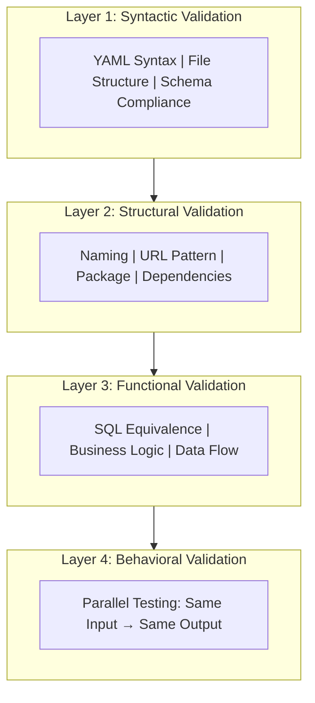
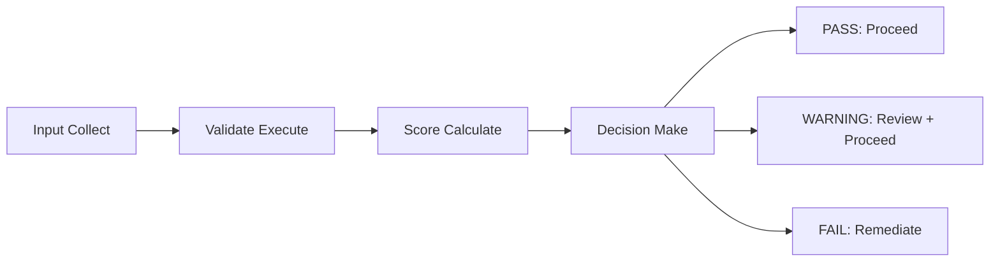

# Validation Framework

**Version**: 1.0.0
**Last Updated**: 2025-12-15

---

## 1. Overview

Legacy Migration Framework의 품질 보증을 위한 검증 프레임워크를 정의합니다.

### 1.1 Validation Philosophy

```yaml
validation_philosophy:
  core_principle: |
    "신규 서비스는 레거시 시스템의 모든 동작을 그대로 보장하여야 한다"
    The new service must guarantee all behaviors of the legacy system.

  approach:
    bidirectional: "Forward extraction + Backward validation"
    continuous: "Every phase has validation"
    multi_level: "Structural + Functional + Behavioral"

  priority:
    1: "100% Business Logic Preservation"
    2: "Traceability (추적 가능성)"
    3: "Consistency (일관성)"
```

### 1.2 Validation Layers

```
┌─────────────────────────────────────────────────────────────────────┐
│                      VALIDATION LAYERS                              │
├─────────────────────────────────────────────────────────────────────┤
│                                                                     │
│   Layer 4: Behavioral Validation                                    │
│   ┌─────────────────────────────────────────────────────────────┐   │
│   │  Parallel Testing: Same Input → Same Output                 │   │
│   └─────────────────────────────────────────────────────────────┘   │
│                              ▲                                      │
│   Layer 3: Functional Validation                                    │
│   ┌─────────────────────────────────────────────────────────────┐   │
│   │  SQL Equivalence | Business Logic | Data Flow               │   │
│   └─────────────────────────────────────────────────────────────┘   │
│                              ▲                                      │
│   Layer 2: Structural Validation                                    │
│   ┌─────────────────────────────────────────────────────────────┐   │
│   │  Naming | URL Pattern | Package | Dependencies              │   │
│   └─────────────────────────────────────────────────────────────┘   │
│                              ▲                                      │
│   Layer 1: Syntactic Validation                                     │
│   ┌─────────────────────────────────────────────────────────────┐   │
│   │  YAML Syntax | File Structure | Schema Compliance           │   │
│   └─────────────────────────────────────────────────────────────┘   │
│                                                                     │
└─────────────────────────────────────────────────────────────────────┘
```



---

## 2. Validation Types

### 2.1 Spec Validation

```yaml
spec_validation:
  purpose: "LLM이 생성한 스펙의 정확성 검증"
  timing: "Stage 1 Phase 3 완료 후"

  approach:
    source: "Legacy 소스코드"
    target: "Generated Specifications"
    method: "LLM-based comparison"

  scoring:
    dimensions:
      layer_1_controller:
        weight: 20
        checks:
          - "Endpoint URL 정확성"
          - "Request dataset 일치"
          - "Response dataset 일치"

      layer_2_task_service:
        weight: 20
        checks:
          - "비즈니스 로직 캡처"
          - "검증 규칙 포함"
          - "계산 로직 정확성"

      layer_3_entity_service:
        weight: 20
        checks:
          - "MyBatis 호출 정확성"
          - "파라미터 매핑"

      layer_4_mybatis:
        weight: 20
        checks:
          - "SQL 구문 정확성"
          - "테이블/컬럼 일치"
          - "동적 조건 포함"

      layer_5_vo:
        weight: 20
        checks:
          - "필드명 일치"
          - "타입 정확성"
          - "DB 매핑"

      cross_layer:
        weight: 20
        checks:
          - "레이어 간 연결 정확성"
          - "데이터 흐름 일관성"

      miplatform:
        weight: 10
        checks:
          - "Dataset 이름 정확성"
          - "필드 매핑"

      business_logic:
        weight: 10
        checks:
          - "비즈니스 규칙 완전성"
          - "엣지 케이스 포함"

    total: 140
    thresholds:
      pass: ">= 95"
      warning: "85-94"
      fail: "< 85"
```

### 2.2 Structural Validation

```yaml
structural_validation:
  purpose: "코드 구조의 일관성 및 표준 준수 검증"
  timing: "Stage 5 Phase 1"

  checks:
    naming_convention:
      controller: "{ScreenId}Controller"
      service: "{ScreenId}Service"
      mapper: "{ScreenId}Mapper"
      vo: "{ScreenId}VO"

    url_pattern:
      format: "/api/{domain}/{screenId}/{operation}"
      example: "/api/pa/PA0101010M/search"

    package_structure:
      controller: "com.halla.{domain}.controller"
      service: "com.halla.{domain}.service"
      mapper: "com.halla.{domain}.mapper"
      vo: "com.halla.{domain}.vo"

    import_validation:
      no_wildcard: true
      organized: true
      no_unused: true
```

### 2.3 Functional Validation

```yaml
functional_validation:
  purpose: "생성된 코드와 레거시 코드의 기능 동등성 검증"
  timing: "Stage 5 Phase 2"

  approach:
    ground_truth: "Legacy codebase (hallain_tft/)"
    target: "Generated code (backend/)"
    method: "Direct code comparison"

  scoring:
    dimensions:
      endpoint_equivalence:
        weight: 25
        checks:
          - "Endpoint 존재 여부"
          - "HTTP 메서드 일치"
          - "URL 패턴 일치"
          - "파라미터 매핑"

      sql_equivalence:
        weight: 40  # 가장 중요
        checks:
          - "SELECT 구문 동등성"
          - "WHERE 조건 동등성"
          - "JOIN 구조 동등성"
          - "동적 SQL 조건 포함"
          - "정렬/페이징 일치"

      business_logic:
        weight: 20
        checks:
          - "검증 로직 존재"
          - "계산 로직 정확성"
          - "조건부 처리"

      data_model:
        weight: 15
        checks:
          - "필드명 일치"
          - "타입 호환성"
          - "매핑 정확성"

    total: 100
    thresholds:
      pass: ">= 70 AND critical = 0"
      warning: "50-69 OR critical > 0"
      fail: "< 50"
```

### 2.4 Integration Validation

```yaml
integration_validation:
  purpose: "전체 시스템 통합 무결성 검증"
  timing: "Stage 5 Phase 4"

  checks:
    build_validation:
      weight: 70
      items:
        - "컴파일 성공"
        - "의존성 해결"
        - "리소스 로딩"

    dependency_validation:
      weight: 30
      items:
        - "모듈 간 의존성"
        - "순환 의존성 없음"
        - "버전 호환성"

    cross_feature:
      weight: 75
      items:
        - "공통 컴포넌트 호환성"
        - "인터페이스 일관성"
        - "데이터 모델 일치"

    runtime:
      weight: 30
      optional: true
      items:
        - "애플리케이션 시작"
        - "기본 엔드포인트 응답"
```

---

## 3. Validation Process

### 3.1 Validation Workflow

```
┌─────────────────────────────────────────────────────────────────────┐
│                     VALIDATION WORKFLOW                             │
├─────────────────────────────────────────────────────────────────────┤
│                                                                     │
│   ┌──────────┐     ┌──────────┐     ┌──────────┐     ┌──────────┐   │
│   │  Input   │────▶│ Validate │────▶│  Score   │────▶│ Decision │   │
│   │  Collect │     │  Execute │     │Calculate │     │  Make    │   │
│   └──────────┘     └──────────┘     └──────────┘     └────┬─────┘   │
│                                                           │         │
│                    ┌──────────────────────────────────────┤         │
│                    │                    │                 │         │
│                    ▼                    ▼                 ▼         │
│              ┌──────────┐        ┌──────────┐      ┌──────────┐     │
│              │   PASS   │        │ WARNING  │      │   FAIL   │     │
│              │ Proceed  │        │ Review + │      │Remediate │     │
│              │          │        │ Proceed  │      │          │     │
│              └──────────┘        └──────────┘      └──────────┘     │
│                                                                     │
└─────────────────────────────────────────────────────────────────────┘
```



### 3.2 Per-Feature Validation

```yaml
per_feature_validation:
  process:
    1_input_collection:
      legacy_source: "hallain_tft/{domain}/"
      generated_code: "backend/src/main/java/com/halla/{domain}/"
      spec_files: "stage1-outputs/phase3/{FEAT-ID}/"

    2_validation_execution:
      structural: "Check naming, patterns"
      functional: "Compare implementations"
      score_each_dimension: true

    3_score_calculation:
      method: "Weighted sum"
      output: "validation-report.yaml"

    4_decision:
      pass: "Proceed to next phase"
      warning: "Log issues, proceed"
      fail: "Trigger remediation"

  output:
    location: "stage5-outputs/phase2/{FEAT-ID}/"
    files:
      - "validation-report.yaml"
      - "score-breakdown.yaml"
      - "issues.yaml"
```

---

## 4. Scoring System

### 4.1 Score Calculation

```yaml
score_calculation:
  method: "Weighted Average"

  formula: |
    total_score = Σ(dimension_score × weight) / Σ(weight)

  example:
    endpoint_equivalence:
      score: 22
      weight: 25
      contribution: 22

    sql_equivalence:
      score: 35
      weight: 40
      contribution: 35

    business_logic:
      score: 18
      weight: 20
      contribution: 18

    data_model:
      score: 12
      weight: 15
      contribution: 12

    total: 87
```

### 4.2 Issue Severity

```yaml
issue_severity:
  blocker:
    definition: "배포 불가능, 즉시 수정 필수"
    examples:
      - "컴파일 에러"
      - "런타임 에러"
      - "데이터 손실 가능성"
    score_impact: "Automatic FAIL"

  critical:
    definition: "심각한 기능 오류"
    examples:
      - "주요 SQL 불일치"
      - "필수 비즈니스 로직 누락"
      - "데이터 타입 불일치"
    score_impact: "-10 per issue"

  major:
    definition: "중요한 차이점"
    examples:
      - "부수적 SQL 차이"
      - "옵셔널 필드 누락"
    score_impact: "-5 per issue"

  minor:
    definition: "사소한 차이점"
    examples:
      - "코드 스타일"
      - "주석 차이"
    score_impact: "-1 per issue"
```

---

## 5. Validation Reports

### 5.1 Feature Validation Report

```yaml
# validation-report.yaml
validation_report:
  feature_id: "FEAT-PA-001"
  screen_id: "PA0101010M"
  domain: "PA"
  validated_at: "2025-12-15T10:30:00Z"

  overall:
    score: 85
    status: "PASS"
    critical_issues: 0
    major_issues: 2
    minor_issues: 5

  dimensions:
    endpoint_equivalence:
      score: 23
      max: 25
      issues:
        - severity: "minor"
          description: "URL case mismatch"

    sql_equivalence:
      score: 38
      max: 40
      issues:
        - severity: "major"
          description: "Missing ORDER BY clause"
          location: "search query"

    business_logic:
      score: 16
      max: 20
      issues:
        - severity: "major"
          description: "Validation rule incomplete"
          location: "validateInput()"

    data_model:
      score: 13
      max: 15
      issues: []

  files_checked:
    controller: "PA0101010MController.java"
    service: "PA0101010MService.java"
    mapper: "PA0101010MMapper.xml"
    vo: "PA0101010MVO.java"

  legacy_reference:
    controller: "hallain_tft/.../Pa0101010MController.java"
    mapper: "hallain_tft/.../Pa0101010M_SQL.xml"
```

### 5.2 Domain Summary Report

```yaml
# domain-summary.yaml
domain_summary:
  domain: "PA"
  summary_date: "2025-12-15"

  progress:
    total_features: 200
    validated: 150
    passed: 140
    failed: 10
    pass_rate: 93.3%

  quality_metrics:
    average_score: 82
    median_score: 85
    score_distribution:
      "90-100": 45
      "80-89": 60
      "70-79": 35
      "<70": 10

  issue_summary:
    blocker: 0
    critical: 25
    major: 120
    minor: 340

  common_issues:
    - pattern: "Missing ORDER BY"
      count: 15
    - pattern: "Date format mismatch"
      count: 12
    - pattern: "Validation logic incomplete"
      count: 8
```

---

## 6. Validation Tools

### 6.1 Automated Validators

```yaml
automated_validators:
  yaml_validator:
    purpose: "YAML 문법 및 스키마 검증"
    implementation: "Built-in"

  structure_validator:
    purpose: "파일 구조 및 naming 검증"
    implementation: "Rule-based"

  sql_comparator:
    purpose: "SQL 구문 비교"
    implementation: "LLM-assisted"
    features:
      - "구문 정규화"
      - "의미적 동등성 검사"
      - "동적 SQL 분석"

  code_analyzer:
    purpose: "코드 구조 분석"
    implementation: "AST-based + LLM"
```

### 6.2 Manual Review Points

```yaml
manual_review:
  required_at:
    - "Phase Gate critical failures"
    - "Ambiguous business logic"
    - "Cross-domain dependencies"

  review_items:
    - "비즈니스 로직 정확성"
    - "엣지 케이스 처리"
    - "아키텍처 결정"
```

---

## 7. Continuous Validation

### 7.1 Validation at Each Stage

```yaml
stage_validation:
  stage_1:
    phase_1:
      validation: "Inventory completeness"
      gate: "All endpoints extracted"

    phase_2:
      validation: "Analysis completeness"
      gate: "5-layer trace complete"

    phase_3:
      validation: "Spec quality"
      gate: "Spec validation score >= 95"

  stage_2:
    phase_3:
      validation: "Coverage comparison"
      gate: "Missing rate < 5%"

    phase_5:
      validation: "Gap remediation"
      gate: "Coverage >= 99%"

  stage_5:
    phase_1:
      validation: "Structural compliance"
      gate: "All standards met"

    phase_2:
      validation: "Functional equivalence"
      gate: "Score >= 70, critical = 0"

    phase_4:
      validation: "Integration health"
      gate: "Build success, no conflicts"

    phase_5:
      validation: "Final quality gate"
      gate: "APPROVED or CONDITIONALLY_APPROVED"
```

### 7.2 Validation Metrics Tracking

```yaml
metrics_tracking:
  real_time:
    - "Pass rate trend"
    - "Average score trend"
    - "Issue count trend"

  periodic:
    - "Daily summary"
    - "Weekly analysis"
    - "Domain comparison"

  alerts:
    - "Pass rate < 80%"
    - "Critical issues > 5"
    - "Score regression"
```

---

**Next**: [02-phase-gate-criteria.md](02-phase-gate-criteria.md)
