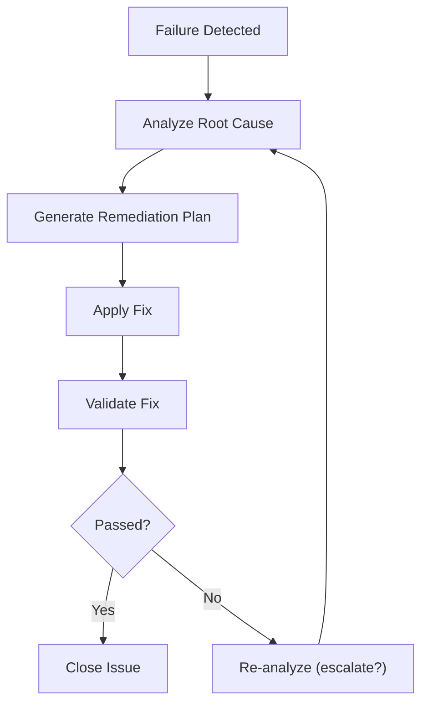

# Remediation Procedures

**Version**: 1.0.0
**Last Updated**: 2025-12-15

---

## 1. Overview

검증 실패 시 문제를 해결하고 품질 기준을 충족시키기 위한 Remediation 절차를 정의합니다.

### 1.1 Remediation Philosophy

```yaml
remediation_philosophy:
  principle_1:
    name: "Root Cause First"
    description: "증상이 아닌 근본 원인 해결"

  principle_2:
    name: "Minimal Change"
    description: "필요한 최소한의 수정만 적용"

  principle_3:
    name: "Preserve Correctness"
    description: "수정 시 다른 부분 손상 방지"

  principle_4:
    name: "Document Everything"
    description: "모든 수정 사항 문서화"
```

---

## 2. Remediation Types

### 2.1 By Severity

```yaml
remediation_by_severity:
  blocker:
    urgency: "Immediate"
    timeline: "< 1 hour"
    escalation: "Automatic to Level 3"
    procedure: "Emergency remediation"

  critical:
    urgency: "High"
    timeline: "< 4 hours"
    escalation: "After 2 hours"
    procedure: "Standard remediation with priority"

  major:
    urgency: "Medium"
    timeline: "< 1 day"
    escalation: "After 1 day"
    procedure: "Batch remediation"

  minor:
    urgency: "Low"
    timeline: "< 1 week"
    escalation: "If accumulates"
    procedure: "Deferred remediation"
```

### 2.2 By Issue Category

```yaml
remediation_by_category:
  spec_issues:
    missing_content:
      cause: "Incomplete analysis"
      action: "Re-analyze source, update spec"

    incorrect_content:
      cause: "Analysis error"
      action: "Compare source, correct spec"

    structure_violation:
      cause: "Format error"
      action: "Restructure to standard"

  code_issues:
    sql_mismatch:
      cause: "SQL generation error"
      action: "Compare legacy SQL, regenerate"

    logic_missing:
      cause: "Business logic not captured"
      action: "Trace source, add logic"

    naming_violation:
      cause: "Convention not followed"
      action: "Rename to standard"

  integration_issues:
    build_failure:
      cause: "Dependency or syntax error"
      action: "Fix compilation error"

    test_failure:
      cause: "Logic or assertion error"
      action: "Fix code or update test"
```

---

## 3. Remediation Process

### 3.1 Standard Remediation Flow

```
┌─────────────────────────────────────────────────────────────────────┐
│                   STANDARD REMEDIATION FLOW                         │
├─────────────────────────────────────────────────────────────────────┤
│                                                                     │
│   ┌──────────┐                                                      │
│   │ Failure  │                                                      │
│   │ Detected │                                                      │
│   └────┬─────┘                                                      │
│        │                                                            │
│        ▼                                                            │
│   ┌──────────────┐                                                  │
│   │   Analyze    │                                                  │
│   │  Root Cause  │                                                  │
│   └──────┬───────┘                                                  │
│          │                                                          │
│          ▼                                                          │
│   ┌──────────────┐                                                  │
│   │   Generate   │                                                  │
│   │ Remediation  │                                                  │
│   │    Plan      │                                                  │
│   └──────┬───────┘                                                  │
│          │                                                          │
│          ▼                                                          │
│   ┌──────────────┐                                                  │
│   │    Apply     │                                                  │
│   │     Fix      │                                                  │
│   └──────┬───────┘                                                  │
│          │                                                          │
│          ▼                                                          │
│   ┌──────────────┐     ┌──────────────┐                             │
│   │  Validate    │────▶│   Passed?    │                             │
│   │    Fix       │     └──────┬───────┘                             │
│   └──────────────┘         │       │                                │
│                           Yes      No                               │
│                            │       │                                │
│                            ▼       ▼                                │
│                     ┌──────────┐ ┌──────────────┐                   │
│                     │  Close   │ │ Re-analyze   │                   │
│                     │  Issue   │ │ (escalate?)  │                   │
│                     └──────────┘ └──────────────┘                   │
│                                                                     │
└─────────────────────────────────────────────────────────────────────┘
```



### 3.2 Remediation Steps

```yaml
remediation_steps:
  1_issue_analysis:
    objective: "문제 정확히 파악"
    activities:
      - "Validation report 분석"
      - "Root cause 식별"
      - "영향 범위 파악"
    output: "Issue analysis document"

  2_plan_creation:
    objective: "수정 계획 수립"
    activities:
      - "수정 방법 결정"
      - "필요 리소스 파악"
      - "예상 시간 추정"
    output: "Remediation plan"

  3_fix_implementation:
    objective: "수정 적용"
    activities:
      - "코드/스펙 수정"
      - "변경 검토"
      - "단위 검증"
    output: "Fixed artifacts"

  4_validation:
    objective: "수정 검증"
    activities:
      - "재검증 실행"
      - "점수 확인"
      - "Side effect 확인"
    output: "Validation result"

  5_documentation:
    objective: "문서화"
    activities:
      - "수정 내용 기록"
      - "Lessons learned"
      - "Knowledge base 업데이트"
    output: "Remediation report"
```

---

## 4. Issue-Specific Remediation

### 4.1 SQL Mismatch Remediation

```yaml
sql_mismatch_remediation:
  issue: "Generated SQL differs from legacy"
  severity: "Critical"

  diagnosis:
    1: "Compare generated vs legacy SQL"
    2: "Identify specific differences"
    3: "Classify difference type"

  difference_types:
    missing_columns:
      fix: "Add missing columns to SELECT"
      verify: "Compare column lists"

    wrong_join:
      fix: "Correct JOIN clause"
      verify: "Compare JOIN conditions"

    missing_where:
      fix: "Add missing WHERE conditions"
      verify: "Compare filter logic"

    order_by_diff:
      fix: "Correct ORDER BY clause"
      verify: "Compare sort order"

    dynamic_sql:
      fix: "Add dynamic conditions"
      verify: "Compare conditional logic"

  procedure:
    1:
      action: "Load legacy SQL"
      source: "hallain_tft/.../XXX_SQL.xml"

    2:
      action: "Load generated SQL"
      source: "backend/.../XXXMapper.xml"

    3:
      action: "Compare side by side"
      tool: "SQL diff tool or manual"

    4:
      action: "Apply corrections"
      target: "Generated mapper"

    5:
      action: "Re-validate"
      method: "Run functional validation"
```

### 4.2 Missing Endpoint Remediation

```yaml
missing_endpoint_remediation:
  issue: "Endpoint in legacy but not in generated"
  severity: "Critical"

  diagnosis:
    1: "Identify missing endpoint URL"
    2: "Find legacy implementation"
    3: "Understand full flow"

  procedure:
    1:
      action: "Trace legacy endpoint"
      path: "Controller → TS → ES → MyBatis"

    2:
      action: "Generate spec (Stage 1 style)"
      output: "NEW_{operation}.yaml"

    3:
      action: "Generate code"
      follow: "Stage 4 patterns"

    4:
      action: "Integrate"
      steps:
        - "Add to existing controller"
        - "Add to service"
        - "Add to mapper"

    5:
      action: "Validate"
      method: "Functional validation"
```

### 4.3 Business Logic Gap Remediation

```yaml
business_logic_remediation:
  issue: "Missing or incorrect business logic"
  severity: "Major to Critical"

  diagnosis:
    1: "Identify missing/wrong logic"
    2: "Find source in legacy code"
    3: "Understand business rule"

  types:
    missing_validation:
      fix: "Add validation method"
      location: "Service layer"

    missing_calculation:
      fix: "Add calculation method"
      location: "Service layer"

    wrong_condition:
      fix: "Correct conditional logic"
      verify: "Compare with legacy"

  procedure:
    1:
      action: "Review legacy TaskService"
      focus: "Business method implementation"

    2:
      action: "Document business rule"
      format: "Pseudo-code or description"

    3:
      action: "Implement in generated code"
      location: "Service class"

    4:
      action: "Add unit test"
      coverage: "Normal + edge cases"

    5:
      action: "Re-validate"
```

### 4.4 Naming Convention Remediation

```yaml
naming_remediation:
  issue: "Names don't follow convention"
  severity: "Minor to Major"
  autofix: true

  diagnosis:
    1: "Identify non-compliant names"
    2: "Determine correct names"

  conventions:
    controller: "{ScreenId}Controller"
    service: "{ScreenId}Service"
    mapper: "{ScreenId}Mapper"
    vo: "{ScreenId}VO"

  procedure:
    1:
      action: "Identify violations"
      tool: "Naming validator"

    2:
      action: "Generate rename map"
      output:
        - "old_name → new_name"

    3:
      action: "Apply renames"
      scope:
        - "File names"
        - "Class names"
        - "References"

    4:
      action: "Update imports"

    5:
      action: "Verify compilation"
```

---

## 5. Batch Remediation

### 5.1 Batch Remediation Strategy

```yaml
batch_remediation:
  trigger: "Multiple similar issues"
  benefit: "Efficiency through pattern-based fixes"

  process:
    1_collect:
      action: "Gather all similar issues"
      grouping: "By issue type"

    2_analyze:
      action: "Find common pattern"
      output: "Pattern description"

    3_develop:
      action: "Create batch fix script/process"
      type: "Automated or guided"

    4_test:
      action: "Test on sample (3-5 items)"
      verify: "Fix works correctly"

    5_apply:
      action: "Apply to all affected items"
      monitor: "Watch for exceptions"

    6_validate:
      action: "Re-validate all fixed items"
      report: "Success rate"
```

### 5.2 Pattern-Based Fixes

```yaml
pattern_fixes:
  missing_order_by:
    pattern: "ORDER BY clause missing"
    detection: "SQL comparison shows no ORDER BY"
    fix:
      method: "Add ORDER BY from legacy"
      automation: "Semi-automated"

  date_format_mismatch:
    pattern: "Date formatting inconsistent"
    detection: "Date format differs from legacy"
    fix:
      method: "Standardize to legacy format"
      automation: "Automated"

  null_handling:
    pattern: "Null checks missing"
    detection: "NullPointerException risk"
    fix:
      method: "Add null checks matching legacy"
      automation: "Template-based"
```

---

## 6. Remediation Documentation

### 6.1 Remediation Report Template

```yaml
# remediation-report.yaml
remediation_report:
  id: "REM-{FEAT-ID}-{NNN}"
  feature_id: "FEAT-PA-001"
  created_at: "2025-12-15T10:00:00Z"
  completed_at: "2025-12-15T12:30:00Z"

  original_issue:
    validation_score: 65
    failed_dimensions:
      - dimension: "sql_equivalence"
        score: 25
        issues:
          - type: "missing_where_condition"
            severity: "critical"
            description: "Dynamic date filter missing"

  root_cause_analysis:
    cause: "Legacy SQL uses dynamic mybatis conditions not captured"
    impact: "Query returns incorrect data range"

  remediation_applied:
    changes:
      - file: "Pa0101010MMapper.xml"
        change_type: "modify"
        description: "Added dynamic where clause for date range"
        diff_reference: "remediation/diff/Pa0101010MMapper.diff"

  validation_result:
    post_score: 88
    status: "PASS"
    dimensions:
      sql_equivalence: 38

  lessons_learned:
    - "Check for <if> tags in legacy MyBatis XML"
    - "Dynamic SQL patterns need explicit capture"

  related_features:
    - "FEAT-PA-002"  # Same pattern applies
    - "FEAT-PA-015"
```

### 6.2 Remediation Log

```yaml
# remediation-log.yaml
remediation_log:
  feature_id: "FEAT-PA-001"

  entries:
    - timestamp: "2025-12-15T10:05:00Z"
      action: "Issue identified"
      details: "SQL mismatch in search query"

    - timestamp: "2025-12-15T10:30:00Z"
      action: "Root cause found"
      details: "Missing dynamic date filter"

    - timestamp: "2025-12-15T11:00:00Z"
      action: "Fix applied"
      details: "Added <if> condition for date range"

    - timestamp: "2025-12-15T12:00:00Z"
      action: "Re-validation"
      details: "Score improved to 88"

    - timestamp: "2025-12-15T12:30:00Z"
      action: "Closed"
      details: "PASS achieved"
```

---

## 7. Remediation Metrics

### 7.1 Key Metrics

```yaml
remediation_metrics:
  mttr:
    name: "Mean Time To Remediate"
    formula: "total_remediation_time / remediation_count"
    target: "< 2 hours for critical"

  first_fix_rate:
    name: "First Fix Success Rate"
    formula: "first_attempt_success / total_remediations"
    target: ">= 80%"

  remediation_backlog:
    name: "Pending Remediations"
    formula: "total_pending"
    target: "< 20"

  recurrence_rate:
    name: "Issue Recurrence Rate"
    formula: "recurring_issues / total_fixed"
    target: "< 5%"
```

### 7.2 Tracking Dashboard

```yaml
remediation_dashboard:
  panels:
    current_status:
      - "Open remediations by severity"
      - "In-progress remediations"
      - "Completed today"

    trends:
      - "MTTR trend"
      - "First fix rate trend"
      - "Backlog trend"

    analysis:
      - "Top issue types"
      - "Issues by domain"
      - "Pattern frequency"
```

---

## 8. Escalation and Support

### 8.1 Escalation Triggers

```yaml
escalation_triggers:
  time_based:
    blocker: "Not resolved in 1 hour"
    critical: "Not resolved in 4 hours"

  attempt_based:
    trigger: "3 fix attempts failed"

  scope_based:
    trigger: "Issue affects > 10 features"

  complexity_based:
    trigger: "Root cause unclear"
```

### 8.2 Support Resources

```yaml
support_resources:
  documentation:
    - "CLAUDE.md - Project rules"
    - "SKILL.md - Phase-specific guidance"
    - "Pattern library - Known issue patterns"

  escalation_contacts:
    technical: "Tech lead"
    domain: "Domain expert"
    architecture: "Architect"

  tools:
    - "Diff viewer for SQL comparison"
    - "Validation re-runner"
    - "Pattern matcher"
```

---

## 9. Prevention Strategies

### 9.1 Proactive Prevention

```yaml
prevention_strategies:
  improved_analysis:
    - "Enhanced pattern detection"
    - "More thorough source tracing"
    - "Edge case identification"

  better_validation:
    - "Earlier validation points"
    - "More comprehensive checks"
    - "Sample-based pre-validation"

  knowledge_sharing:
    - "Pattern library updates"
    - "Lessons learned sessions"
    - "Documentation improvements"
```

### 9.2 Feedback Loop

```yaml
feedback_loop:
  from_remediation:
    - "Update analysis skills"
    - "Enhance validation rules"
    - "Improve generation templates"

  tracking:
    - "Common issue patterns"
    - "Effective fix patterns"
    - "Skill improvement needs"

  implementation:
    cycle: "Weekly review"
    action: "Skill and rule updates"
```

---

**Next**: [07-CASE-STUDIES](../07-CASE-STUDIES/01-hallain-tft-case.md)
