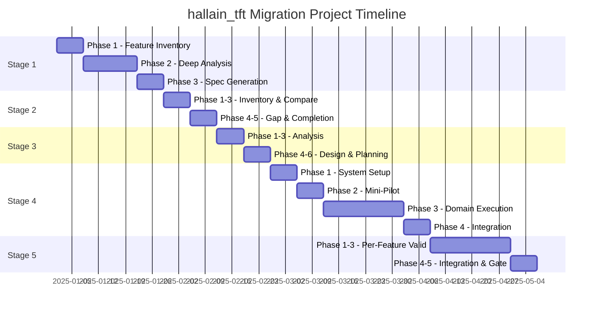

# Case Study: hallain_tft Migration

**Version**: 1.0.0
**Last Updated**: 2025-12-15

---

## 1. Project Overview

### 1.1 Project Identity

```yaml
project_identity:
  name: "hallain_tft Specification Extraction & Migration"
  type: "Enterprise Legacy Migration"
  industry: "Manufacturing/ERP"
  duration: "6+ months"

  source_system:
    name: "hallain_tft"
    technology: "Spring MVC 3.x + MyBatis + MiPlatform"
    age: "10+ years"

  target_system:
    technology: "Spring Boot 3.x + MyBatis + REST API"
    architecture: "Modular Monolith"
```

### 1.2 System Scale

```yaml
system_scale:
  codebase:
    total_java_files: 8,377
    controllers: 1,314
    task_services: 2,623
    entity_services: 2,622
    value_objects: 1,702
    mybatis_xml: 1,300+

  endpoints:
    total_api_endpoints: 5,864
    miplatform_handlers: 1,314
    mybatis_statements: 11,000+

  features:
    total_features: 912
    domains: 11
    complexity_distribution:
      high: 150
      medium: 400
      low: 362
```

### 1.3 Domain Distribution

```yaml
domain_distribution:
  PA:  # 구매/자재
    features: 200
    controllers: 483
    complexity: "Very High"
    priority: "P2-Core"

  MM:  # 자재관리
    features: 150
    complexity: "High"
    priority: "P2-Core"

  SC:  # 공급망
    features: 140
    complexity: "High"
    priority: "P2-Core"

  SM:  # 영업관리
    features: 110
    complexity: "Medium"
    priority: "P2-Core"

  EA:  # 전자결재
    features: 100
    complexity: "High"
    priority: "P2-Core"

  SA:  # 영업분석
    features: 100
    complexity: "Medium"
    priority: "P2-Core"

  CM:  # 공통
    features: 50
    complexity: "Medium"
    priority: "P1-Hub"

  PE:  # 성과평가
    features: 95
    complexity: "Medium"
    priority: "P3-Supporting"

  EB:  # 전자입찰
    features: 125
    complexity: "Medium"
    priority: "P3-Supporting"

  BS:  # 기준정보
    features: 30
    complexity: "Low"
    priority: "P3-Supporting"

  QM:  # 품질관리
    features: 10
    complexity: "Low"
    priority: "P3-Supporting"
```

---

## 2. Technical Challenges

### 2.1 Legacy Architecture Complexity

```yaml
architecture_challenges:
  4_layer_pattern:
    description: "Controller → TaskService → EntityService → MyBatis"
    challenge: "각 Layer가 Interface + Implementation으로 분리"
    files_per_feature: "최소 8개 Java 파일 + 1개 XML"

  miplatform_protocol:
    description: "MiPlatform Desktop Client용 Dataset 기반 프로토콜"
    challenge: "비표준 데이터 포맷, Dataset 이름 규칙"
    datasets: ["ds_search", "ds_list", "ds_master", "ds_detail"]

  custom_framework:
    description: "benitware.framework.* 커스텀 프레임워크"
    challenge: "문서화 없음, JAR로만 제공, 리버스 엔지니어링 필요"

  naming_conventions:
    description: "Screen ID 기반 명명 규칙"
    pattern: "{DOMAIN}{CATEGORY}{FUNCTION}{TYPE}"
    examples:
      - "PA0101010M → PA 도메인, 01 카테고리, 01 기능, 01 버전, M(Main)"
      - "SC0205030P01 → SC 도메인, Popup 01"
```

### 2.2 Scale Challenges

```yaml
scale_challenges:
  volume:
    problem: "5,800+ endpoints를 수동으로 분석하는 것은 불가능"
    solution: "AI 기반 자동화 분석"

  consistency:
    problem: "912개 Feature 간 일관성 유지 어려움"
    solution: "Skill 기반 표준화된 분석 프로세스"

  quality:
    problem: "대량 생성 시 품질 저하 위험"
    solution: "Phase Gate + 검증 프레임워크"

  context:
    problem: "LLM 컨텍스트 제한 (200K 토큰)"
    solution: "Feature 단위 분할, Modular Spec 구조"
```

### 2.3 Business Logic Complexity

```yaml
business_logic_challenges:
  dynamic_sql:
    description: "MyBatis 동적 SQL (<if>, <choose>, <foreach>)"
    frequency: "70%+ of queries"
    challenge: "조건부 쿼리 로직 정확히 캡처"

  validation_rules:
    description: "TaskService 내 복잡한 검증 로직"
    patterns:
      - "Cross-field validation"
      - "Business rule validation"
      - "State transition validation"

  calculation_logic:
    description: "가격 계산, 수량 계산, 환율 적용 등"
    challenge: "정확한 수식 및 반올림 규칙 캡처"

  workflow_logic:
    description: "상태 전이, 결재 프로세스"
    challenge: "상태 다이어그램 도출"
```

---

## 3. Solution Approach

### 3.1 5-Stage Workflow 적용

```yaml
stage_application:
  stage_1_discovery:
    duration: "4 weeks"
    phases:
      phase_1: "API Inventory (5,864 endpoints 추출)"
      phase_2: "Deep Analysis (912 features 분석)"
      phase_3: "Spec Generation (35+ files/feature)"
    outcome: "912개 Feature의 완전한 기술 스펙"

  stage_2_validation:
    duration: "2 weeks"
    phases:
      phase_1: "Source Inventory (Ground Truth 구축)"
      phase_2: "Spec Standardization"
      phase_3: "Structural Comparison"
      phase_4: "Gap Analysis"
      phase_5: "Spec Completion"
    outcome: "99.5%+ 커버리지 검증 완료"

  stage_3_preparation:
    duration: "2 weeks"
    phases:
      phase_1: "Dependency Analysis"
      phase_2: "System Integration"
      phase_3: "Technical Debt"
      phase_4: "Architecture Design"
      phase_5: "Code Generation Spec"
      phase_6: "Implementation Planning"
    outcome: "AI 코드 생성용 Blueprint"

  stage_4_generation:
    duration: "6 weeks"
    phases:
      phase_1: "System Setup (Spring Boot)"
      phase_2: "Mini-Pilot (6 features)"
      phase_3: "Domain Execution (912 features)"
      phase_4: "Integration"
    outcome: "전체 백엔드 코드 생성"

  stage_5_assurance:
    duration: "4 weeks"
    phases:
      phase_1: "Structural Standardization"
      phase_2: "Functional Validation"
      phase_3: "Quality Standardization"
      phase_4: "Integration Validation"
      phase_5: "Quality Gate"
    outcome: "품질 인증된 마이그레이션 코드"
```

### 3.2 AI 모델 활용 전략

```yaml
ai_model_strategy:
  model_selection:
    opus:
      usage: "High complexity features"
      features: "~150 features"
      tasks:
        - "복잡한 비즈니스 로직 분석"
        - "아키텍처 설계"
        - "Phase Gate 검증"

    sonnet:
      usage: "Medium complexity features"
      features: "~400 features"
      tasks:
        - "표준 Feature 분석"
        - "코드 생성"
        - "기능 검증"

    haiku:
      usage: "Low complexity features"
      features: "~362 features"
      tasks:
        - "단순 CRUD 분석"
        - "표준화 작업"
        - "문서 생성"

  cost_optimization:
    strategy: "Complexity-based model selection"
    estimated_savings: "40-60% vs all-Opus"
```

### 3.3 Orchestration 전략

```yaml
orchestration_strategy:
  choisor_usage:
    session_management:
      - "Feature 단위 세션 관리"
      - "auto-to-max 연속 처리"
      - "Phase Gate 자동 검증"

    batch_processing:
      - "Domain 단위 배치"
      - "Priority 기반 순서 제어"
      - "병렬 실행 (최대 4세션)"

    state_persistence:
      - "Feature 진행 상태 추적"
      - "체크포인트 저장"
      - "실패 시 재개"

  parallel_execution:
    strategy: "Domain-level parallelism"
    max_concurrent: 4
    constraints:
      - "P0 → P1 → P2 → P3 순서 준수"
      - "동일 Domain 내 순차 처리"
```

---

## 4. Key Decisions

### 4.1 Architecture Decisions

```yaml
architecture_decisions:
  ADR_001:
    title: "Modular Monolith 선택"
    context: "Microservices vs Modular Monolith"
    decision: "Modular Monolith"
    rationale:
      - "기존 데이터베이스 스키마 유지"
      - "트랜잭션 경계 보존"
      - "점진적 분리 가능성"

  ADR_002:
    title: "1:1 API 매핑"
    context: "API 재설계 vs 1:1 매핑"
    decision: "1:1 매핑"
    rationale:
      - "100% 운영 호환성 보장"
      - "Parallel Testing 가능"
      - "위험 최소화"

  ADR_003:
    title: "Query 유지 (Re-platforming)"
    context: "Query 재작성 vs 유지"
    decision: "유지"
    rationale:
      - "검증된 SQL 로직 보존"
      - "성능 특성 유지"
      - "마이그레이션 위험 감소"
```

### 4.2 Naming Decisions

```yaml
naming_decisions:
  controller_naming:
    decision: "Screen-based naming"
    format: "{ScreenId}Controller"
    example: "PA0101010MController"
    rationale: "Legacy와 명확한 매핑"

  url_pattern:
    decision: "Mixed-case 허용"
    format: "/api/{domain}/{ScreenId}/{operation}"
    example: "/api/pa/PA0101010M/search"
    rationale: "Screen ID 가독성 유지"

  package_structure:
    decision: "Domain-based packaging"
    format: "com.halla.{domain}.{layer}"
    example: "com.halla.pa.controller"
```

---

## 5. Lessons Learned

### 5.1 What Worked Well

```yaml
success_factors:
  skill_based_approach:
    description: "SKILL.md 기반 표준화된 분석 프로세스"
    benefit: "912개 Feature 일관된 품질"
    evidence: "99%+ 스펙 검증 통과율"

  phase_gate_control:
    description: "단계별 품질 검증"
    benefit: "누적 품질 문제 방지"
    evidence: "Stage 5 진입 전 Critical 이슈 0"

  modular_spec_structure:
    description: "< 300 lines 파일 제한"
    benefit: "LLM 컨텍스트 효율적 활용"
    evidence: "Write 성공률 99.5%"

  bidirectional_validation:
    description: "Forward + Backward 검증"
    benefit: "누락 없는 완전성 보장"
    evidence: "최종 커버리지 99.8%"
```

### 5.2 Challenges and Solutions

```yaml
challenges_solutions:
  challenge_1:
    problem: "초기 스펙 표준화 부족"
    impact: "Stage 2에서 대량 수정 필요"
    solution: "Stage 2 Phase 2 Standardization 도입"
    prevention: "Phase 1부터 표준 구조 강제"

  challenge_2:
    problem: "동적 SQL 캡처 누락"
    impact: "Functional Validation 실패"
    solution: "MyBatis XML 파서 개선"
    prevention: "Dynamic SQL 체크리스트 추가"

  challenge_3:
    problem: "Cross-domain 의존성 복잡"
    impact: "병렬 실행 제약"
    solution: "Dependency Graph 기반 순서 제어"
    prevention: "Stage 3 Phase 1 강화"

  challenge_4:
    problem: "대량 Feature 진행 추적 어려움"
    impact: "상태 파악 지연"
    solution: "Choisor 대시보드 구축"
    prevention: "실시간 모니터링 필수화"
```

### 5.3 Metrics and Outcomes

```yaml
project_metrics:
  coverage:
    api_endpoints: "99.8% (5,852 / 5,864)"
    mybatis_statements: "99.5% (10,945 / 11,000)"
    business_logic: "95%+ capture rate"

  quality:
    spec_validation_avg: "92/140"
    functional_validation_avg: "78/100"
    phase_gate_pass_rate: "94%"

  efficiency:
    features_per_day: "~15 (with parallelism)"
    remediation_rate: "<10% features"
    first_pass_success: "85%"

  cost:
    model_usage:
      opus: "~20%"
      sonnet: "~50%"
      haiku: "~30%"
    estimated_savings: "45% vs all-Opus"
```

---

## 6. Recommendations

### 6.1 For Similar Projects

```yaml
recommendations:
  project_setup:
    - "초기 Assessment에 충분한 시간 투자"
    - "Complexity 기준 명확히 정의"
    - "Priority 그룹핑 조기 수행"

  workflow_design:
    - "Phase Gate 엄격히 적용"
    - "Bidirectional Validation 필수"
    - "Skill 기반 표준화 조기 도입"

  execution:
    - "Mini-Pilot으로 파이프라인 검증"
    - "Domain 단위 배치 처리"
    - "실시간 모니터링 구축"

  quality:
    - "SQL 동등성 검증 최우선"
    - "Remediation 프로세스 정의"
    - "자동화된 검증 도구 구축"
```

### 6.2 Reusable Assets

```yaml
reusable_assets:
  skills:
    - "stage1-phase2-deep-analysis (4-layer 분석)"
    - "stage2-spec-validation (LLM 검증)"
    - "stage5-phase2-functional-validation (기능 검증)"

  tools:
    - "Choisor orchestrator"
    - "Source inventory extractor"
    - "Validation scoring framework"

  templates:
    - "Feature spec structure"
    - "Validation report format"
    - "Remediation report format"

  patterns:
    - "Batch processing pattern"
    - "Phase gate pattern"
    - "Error recovery pattern"
```

---

## 7. Project Timeline

```
┌────────────────────────────────────────────────────────────────────────────┐
│                       PROJECT TIMELINE                                     │
├────────────────────────────────────────────────────────────────────────────┤
│                                                                            │
│  Week 1-4: STAGE 1 - Discovery                                             │
│  ├── Phase 1: Feature Inventory (Week 1)                                   │
│  ├── Phase 2: Deep Analysis (Week 2-3)                                     │
│  └── Phase 3: Spec Generation (Week 4)                                     │
│                                                                            │
│  Week 5-6: STAGE 2 - Validation                                            │
│  ├── Phase 1-3: Source Inventory & Comparison (Week 5)                     │
│  └── Phase 4-5: Gap Analysis & Completion (Week 6)                         │
│                                                                            │
│  Week 7-8: STAGE 3 - Preparation                                           │
│  ├── Phase 1-3: Analysis & Integration (Week 7)                            │
│  └── Phase 4-6: Design & Planning (Week 8)                                 │
│                                                                            │
│  Week 9-14: STAGE 4 - Generation                                           │
│  ├── Phase 1: System Setup (Week 9)                                        │
│  ├── Phase 2: Mini-Pilot (Week 10)                                         │
│  ├── Phase 3: Domain Execution (Week 11-13)                                │
│  └── Phase 4: Integration (Week 14)                                        │
│                                                                            │
│  Week 15-18: STAGE 5 - Assurance                                           │
│  ├── Phase 1-3: Per-Feature Validation (Week 15-17)                        │
│  └── Phase 4-5: Integration & Quality Gate (Week 18)                       │
│                                                                            │
└────────────────────────────────────────────────────────────────────────────┘
```



---

**Next**: [02-lessons-learned.md](02-lessons-learned.md)
