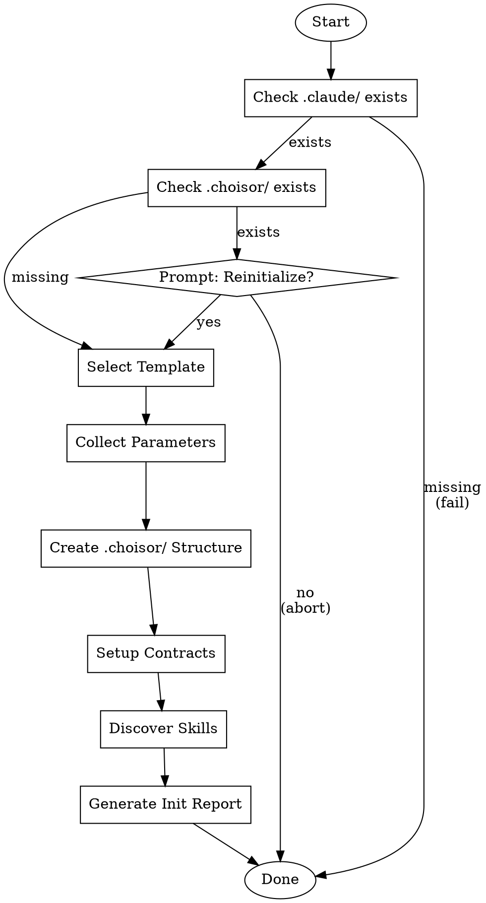

# Choisor Init - Project Initialization

## 1. Overview

### 1.1 Purpose

Initialize Choisor orchestrator for a new project by:
- Validating project structure prerequisites
- Creating `.choisor/` directory with configuration files
- Discovering available skills from `.claude/skills/`
- Setting up inter-stage contract validation

### 1.2 Orchestration Scope

```
┌──────────────────────────────────────────────────────────────────────────┐
│                        Choisor Init Workflow                              │
├──────────────┬──────────────┬──────────────┬──────────────┬──────────────┤
│  Project     │  Template    │  Config      │  Directory   │  Contract    │
│  Validation  │  Selection   │  Collection  │  Scaffolding │  Setup       │
├──────────────┼──────────────┼──────────────┼──────────────┼──────────────┤
│  .claude/    │  spring-     │  name        │  .choisor/   │  inter-stage │
│  exists?     │  migration   │  source_base │  config.yaml │  contracts   │
│  .choisor/   │  custom      │  target_base │  project.yaml│  validation  │
│  exists?     │  hallain-tft │  java_package│  workflow.yaml              │
└──────────────┴──────────────┴──────────────┴──────────────┴──────────────┘
                                      │
                                      ▼
                    ┌──────────────────────────────────────┐
                    │          Skill Discovery             │
                    │  s{stage}-{phase}-*/SKILL.md scan    │
                    └──────────────────────────────────────┘
                                      │
                                      ▼
                    ┌──────────────────────────────────────┐
                    │          Init Report                 │
                    │  Summary of initialized components   │
                    └──────────────────────────────────────┘
```

---

## 2. Prerequisites

### 2.1 State Requirements

| Requirement | Description | Blocking |
|-------------|-------------|----------|
| `.claude/` directory | Claude Code project initialized | Yes |
| Skill definitions | `workbook/03-SKILL-DEFINITION` completed | Yes |
| Source directory | Legacy source code available | No (warning) |

### 2.2 Input Signals

**Trigger conditions:**
- New project needing Choisor orchestration
- Fresh clone of migration project
- Reset/reinitialize existing configuration

**User input required:**
- Template selection (spring-migration / custom / hallain-tft)
- Project name
- Source/target paths
- Java package (for Spring projects)

---

## 3. Methodology

### 3.1 Control Flow



### 3.2 Decision Matrix

| Condition | Result | Action |
|-----------|--------|--------|
| `.choisor/` exists | CONDITIONAL | Prompt for reinitialize confirmation |
| `.claude/skills/` missing | FAIL | Error: "Run claude init first" |
| `source_base` path missing | FAIL | Error: "Source directory required" |
| Skills not found | WARNING | Continue with warning |
| Contracts not found | WARNING | Continue with warning |

### 3.3 Criteria Evaluation

**Validation sequence:**
1. Check `.claude/` directory exists
2. Check `.claude/skills/` directory exists
3. If `.choisor/` exists, confirm reinitialize
4. Validate template selection
5. Validate required parameters (non-empty)
6. Validate source_base path exists (if provided)

---

## 4. Outputs

### 4.1 Generated Structure

```
.choisor/
├── config.yaml           # Runtime configuration
├── project.yaml          # Project properties
├── workflow.yaml         # Workflow definitions
├── README.md             # Generated documentation
├── tasks/
│   └── tasks.json        # Empty task list []
├── sessions/
│   └── sessions.json     # Empty session list []
├── instructions/         # Instruction files (empty)
└── logs/
    ├── sessions/         # Session logs (empty)
    └── instructions/     # Instruction logs (empty)
```

### 4.2 Configuration Files

**config.yaml** - Runtime settings:
- Claude Code session limits
- Phase gate settings
- Parallel execution config
- Priority algorithm

**project.yaml** - Project properties:
- Project name and description
- Feature ID patterns
- Domain mappings
- Path configurations
- Stage definitions

**workflow.yaml** - Workflow definitions:
- Stage progression rules
- Phase dependencies
- Parallel execution pairs

### 4.3 Init Report

```yaml
initialization_report:
  timestamp: "2024-01-20T10:30:00Z"
  project:
    name: "my-project"
    template: "spring-migration"
  validation:
    claude_dir: true
    skills_dir: true
    source_base: true
  skills_discovered:
    count: 23
    stages: [1, 2, 3, 4, 5]
  contracts:
    found: true
    path: ".claude/skills/common/inter-stage-contracts.yaml"
  status: "SUCCESS"
```

---

## 5. Quality Checks

### 5.1 Decision Validation

| Check | Criteria | Action on Fail |
|-------|----------|----------------|
| Directory structure | All required dirs created | Fail with error |
| Config files | Valid YAML syntax | Fail with error |
| Skill discovery | At least 1 skill found | Warning |
| Contract file | File exists | Warning |

### 5.2 Audit Requirements

- Log initialization timestamp
- Record template used
- List all parameters provided
- Document any warnings

---

## 6. Error Handling

### 6.1 Decision Errors

| Error | Cause | Resolution |
|-------|-------|------------|
| `CLAUDE_DIR_MISSING` | `.claude/` not found | Run `claude init` first |
| `SKILLS_DIR_MISSING` | `.claude/skills/` not found | Create skills directory |
| `SOURCE_NOT_FOUND` | `source_base` path invalid | Correct path in project.yaml |
| `TEMPLATE_UNKNOWN` | Invalid template name | Use valid template |
| `PERMISSION_DENIED` | Cannot write to directory | Check filesystem permissions |

### 6.2 Rollback Triggers

If initialization fails after partial creation:
1. Log error details
2. Remove partially created `.choisor/` directory
3. Report failure reason
4. Suggest resolution steps

---

## 7. Examples

### 7.1 Basic Initialization

```bash
# In Claude Code session
/choisor init

# Claude prompts for:
# 1. Template selection (spring-migration recommended)
# 2. Project name
# 3. Source base path
# 4. Target base path
# 5. Java package (for Spring projects)
```

### 7.2 With Template Selection

```bash
/choisor init --template spring-migration

# Or for custom projects
/choisor init --template custom
```

### 7.3 Non-Interactive (All Parameters)

```bash
/choisor init \
  --template spring-migration \
  --name my-project \
  --source-base legacy-src \
  --target-base generated \
  --java-package com/example
```

### 7.4 Reinitialize Existing

```bash
/choisor init --force

# WARNING: This will overwrite existing .choisor/ configuration
# Confirm? [y/N]
```

### 7.5 Sample Output

```
=== Choisor Project Initialization ===

Validating project structure...
  ✓ .claude/ directory found
  ✓ .claude/skills/ directory found
  ⚠ .choisor/ exists (will reinitialize)

Template: spring-migration
Project name: hallain-tft
Source base: hallain
Target base: next-hallain
Java package: com/hallain

Creating .choisor/ structure...
  ✓ config.yaml created
  ✓ project.yaml created
  ✓ workflow.yaml created
  ✓ tasks/tasks.json created
  ✓ sessions/sessions.json created
  ✓ logs/ directories created

Discovering skills...
  Found 23 skills across 5 stages

Setting up contracts...
  ✓ inter-stage-contracts.yaml found

=== Initialization Complete ===

Next steps:
  1. Review .choisor/project.yaml configuration
  2. Run '/choisor scan --stage 1' to discover tasks
  3. Run '/choisor status' to view project status
```

---

## Quick Reference

| Command | Description |
|---------|-------------|
| `/choisor init` | Interactive initialization |
| `/choisor init --template X` | Use specific template |
| `/choisor init --force` | Reinitialize existing |
| `/choisor init --list-templates` | Show available templates |

| Template | Use Case |
|----------|----------|
| `spring-migration` | Spring MVC to Spring Boot migration |
| `custom` | Generic project with minimal config |
| `hallain-tft` | Hallain TFT specific configuration |
