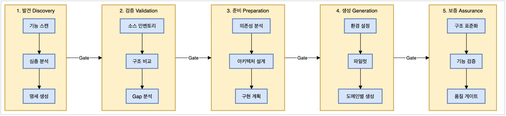
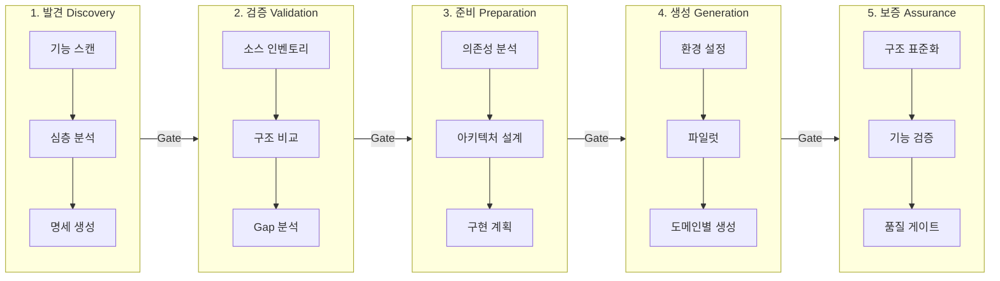
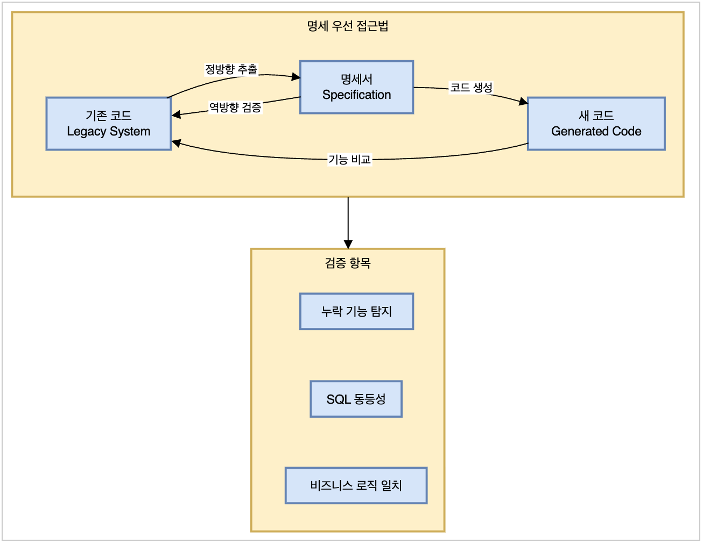
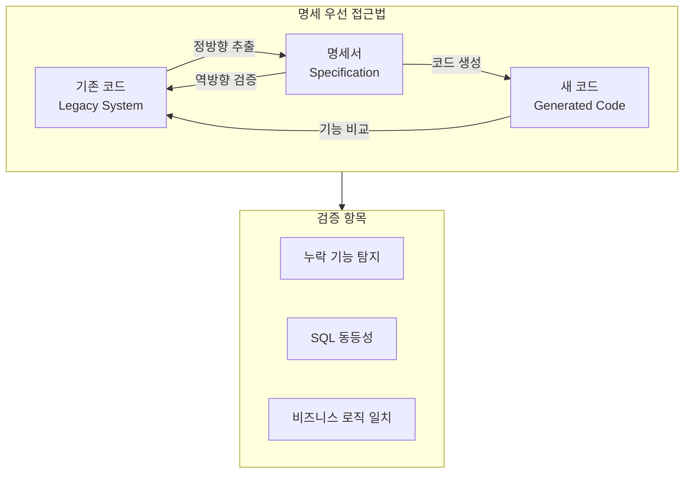

# AIND Migration Workbook 소개

**레거시 시스템을 새로운 시스템으로 안전하게 전환하는 AI 기반 방법론**

---

## 1. 왜 필요한가?

기업의 핵심 업무 시스템은 10년 이상 운영되면서 복잡해집니다.
이런 시스템을 새로운 기술로 전환할 때 가장 중요한 것은 **기존 업무 로직을 100% 보존**하는 것입니다.

| 전통적 방식의 문제 | AIND Migration의 해결책 |
|-------------------|-------------------|
| 사람이 코드를 하나씩 분석 → 느리고 실수 발생 | AI가 자동으로 분석 → 빠르고 일관됨 |
| 암묵적 업무 지식이 문서화되지 않음 | 명세서로 모든 로직을 명시화 |
| 전환 후 "예전에 되던 게 안 됨" 문제 | 양방향 검증으로 누락 방지 |

---

## 2. 핵심 철학

### 명세 우선 (Specification-First)

코드를 바로 변환하지 않습니다. 먼저 **"시스템이 무엇을 하는가"를 완전히 파악**한 후, 그 명세를 기반으로 새 코드를 생성합니다.

```
기존 시스템 → [명세서 추출] → 명세서 → [코드 생성] → 새 시스템
```

### 양방향 검증 (Bidirectional Validation)

한 방향으로만 확인하면 놓치는 부분이 생깁니다.
**정방향(추출)과 역방향(대조)**을 모두 수행하여 누락을 원천 차단합니다.

### AI + 사람 협업

- **AI의 역할**: 분석, 패턴 인식, 코드 생성, 반복 작업
- **사람의 역할**: 업무 로직 확인, 아키텍처 결정, 품질 승인

---

## 3. 전체 프로세스

5단계로 진행되며, 각 단계는 명확한 질문에 답합니다.

| 단계 | 핵심 질문 | 결과물 |
|-----|----------|--------|
| **1. 발견 (DISCOVERY)** | 기존 시스템에 무엇이 있는가? | 기능 목록, API 명세서 |
| **2. 검증 (VALIDATION)** | 명세서가 완전한가? | 검증된 명세서 |
| **3. 준비 (PREPARATION)** | 어떻게 만들 것인가? | 아키텍처 설계, 구현 계획 |
| **4. 생성 (GENERATION)** | 새 시스템 구축! | 동작하는 코드 |
| **5. 보증 (ASSURANCE)** | 제대로 작동하는가? | 품질 인증 완료 |

---

## 4. 프로세스 도식

### Workflow


<details>
<summary>mermaid 다이어그램 펼치기</summary>



</details>

### Assurance Workflow


<details>
<summary>mermaid 다이어그램 펼치기</summary>



</details>

---

## 5. 핵심 구성 요소

| 구성 요소 | 설명 |
|----------|------|
| 📋 평가 프레임워크 | 전환 가능 여부 판단 |
| 📐 워크플로우 설계 | 단계-페이즈-태스크 구조 정의 |
| 🛠️ 스킬 프레임워크 | AI 실행 지침서 (25개 이상) |
| ⚙️ 도구 생태계 | Claude Code, 오케스트레이터, 모니터링 |
| 📦 실행 패턴 | 배치 처리, 병렬 실행, 오류 복구 |
| ✅ 품질 보증 | 4계층 검증, 단계별 게이트, 자동 수정 |

---

## 6. 품질 기준

전환된 시스템은 4가지 차원에서 검증됩니다:

| 검증 차원 | 가중치 | 의미 |
|----------|--------|------|
| SQL 동등성 | 40% | 데이터 조회/저장이 동일하게 동작 |
| API 동등성 | 25% | 외부에서 호출하는 방식이 동일 |
| 비즈니스 로직 | 20% | 업무 규칙이 동일하게 적용 |
| 데이터 모델 | 15% | 데이터 구조가 정확히 매핑 |

**통과 기준**: 70점 이상 + 치명적 이슈 0건

---

## 7. 실제 적용 사례

**hallain_tft 프로젝트** (제조/ERP 시스템)

| 항목 | 규모 |
|-----|------|
| Java 파일 | 8,377개 |
| API 엔드포인트 | 5,864개 |
| 기능 수 | 912개 |
| 도메인 | 11개 |
| 시스템 연식 | 10년 이상 |

이 실제 프로젝트를 통해 검증되고 개선된 방법론입니다.

---

## 8. 기대 효과

| 구분 | 효과 |
|-----|------|
| **안전성** | 기존 업무 로직 100% 보존 |
| **속도** | AI 활용으로 분석/생성 시간 단축 |
| **품질** | 체계적 검증으로 누락/오류 방지 |
| **지식화** | 암묵적 로직을 명시적 명세로 문서화 |
| **재현성** | 표준화된 프로세스로 반복 가능 |

---

## 요약

AIND Migration Workbook은 **"명세 우선, 양방향 검증, AI+사람 협업"** 원칙으로
레거시 시스템을 안전하게 현대화하는 **실전 검증된 방법론**입니다.

5단계 프로세스와 25개 이상의 AI 스킬을 통해
수천 개의 기능을 가진 대규모 시스템도 **체계적이고 안전하게** 전환할 수 있습니다.
